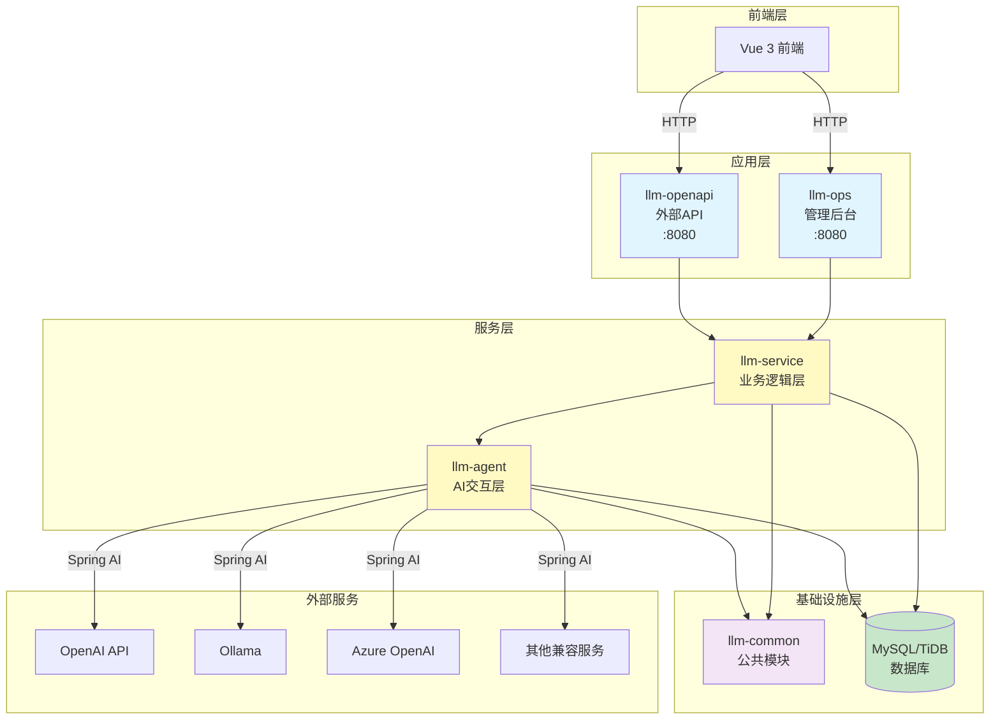
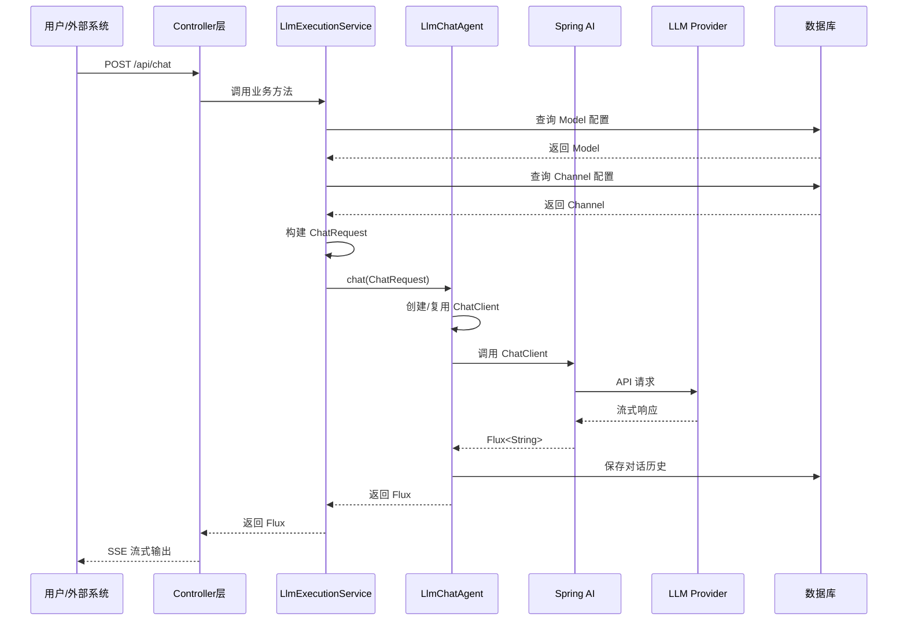
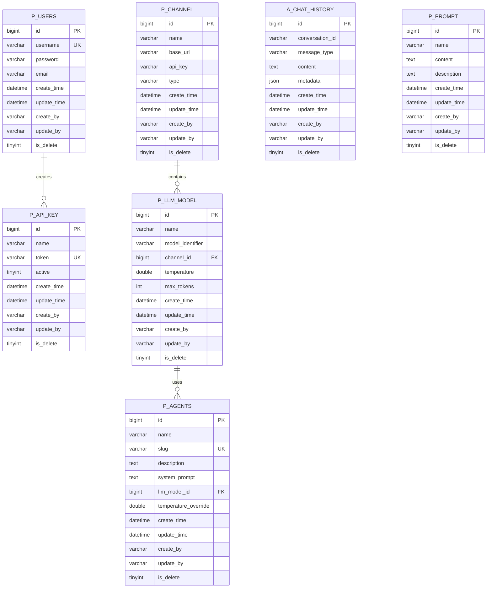

# LLM Manager - 后端服务

基于 Spring Boot 3、Spring AI 和 MyBatis-Plus 的大语言模型管理平台后端服务，采用多模块 Maven 架构，支持多 LLM 提供商的统一管理。

> **⚠️ 重要说明**：
>
> 本项目（`llm-manager-parent`）是**新一代多模块架构**，与旧版 `llm-manager` 后端服务当前共存。
>
> - **llm-manager-parent（新）**：多模块架构，支持 MyBatis-Plus、软删除、对话历史管理等新特性
> - **llm-manager（旧）**：单体架构，使用 Spring Data JPA 和 H2 内存数据库
>
> 待 `llm-manager-parent` 稳定后，将**移除旧版 `llm-manager` 后端服务**，仅保留新架构。
>
> **推荐新项目使用 `llm-manager-parent`**。

## 📋 目录

- [技术架构](#技术架构)
- [模块说明](#模块说明)
- [环境要求](#环境要求)
- [快速启动](#快速启动)
- [配置说明](#配置说明)
- [开发路线图](#开发路线图)
- [常见问题](#常见问题)

## 🏗️ 技术架构

### 核心技术栈

| 技术 | 版本 | 用途 |
|------|------|------|
| Spring Boot | 3.2.5 | 应用框架 |
| Spring AI OpenAI | 1.1.0-M4 | LLM 集成 |
| MyBatis-Plus | 3.5.7 | ORM 框架 |
| MySQL/TiDB | 8.x | 数据库 |
| Java | 21 (最低17) | 编程语言 |
| Sa-Token | 1.37.0 | 认证授权 |
| Lombok | - | 代码简化 |
| Druid | 1.2.23 | 连接池 |

### 系统架构图



### 分层对话流程



### 数据库表结构



**表命名规范**：
- `p_*` - 业务表（llm-service 模块）
- `a_*` - Agent 相关表（llm-agent 模块）

**基础字段**（所有表必备）：
- `create_time` - 创建时间（自动填充）
- `update_time` - 更新时间（自动填充）
- `create_by` - 创建人（自动填充）
- `update_by` - 更新人（自动填充）
- `is_delete` - 软删除标记（0=正常，1=删除）

## 📦 模块说明

### llm-common（公共模块）

**职责**：提供公共基础设施和工具类

**核心组件**：
- `BaseEntity` - 所有实体的基类，包含审计字段
- `MyBatisPlusMetaObjectHandler` - 自动填充时间戳和操作人
- 公共异常、工具类

**依赖**：无业务依赖

**包路径**：`com.llmmanager.common`

### llm-agent（AI 交互层）

**职责**：封装与 AI 模型的交互逻辑

**核心功能**：
- ✅ **Message 抽象层**：统一消息格式（SystemMessage, UserMessage, AssistantMessage）
- ✅ **ChatModel 抽象层**：支持多 LLM 提供商（OpenAiChatModelAdapter）
- ✅ **ChatMemory 管理**：对话历史持久化到 MySQL
- ✅ **LlmChatAgent**：同步/流式对话接口
- ✅ **Tool Layer**：Spring AI 原生 @Tool 注解工具调用
- ⏳ **MCP 支持**：Model Context Protocol（Phase 3）
- ⏳ **Vector Store**：向量存储集成（Phase 3）
- ⏳ **Agent Framework**：ReactAgent 模式（Phase 4）

**依赖**：llm-common

**包路径**：`com.llmmanager.agent`

**子包结构**：
```
com.llmmanager.agent
├── message/          # 消息抽象层
├── model/            # ChatModel 抽象
├── advisor/          # 对话增强（记忆管理）
├── storage/          # 数据持久化
│   ├── entity/       # ChatHistory 实体
│   ├── mapper/       # MyBatis Mapper
│   └── impl/         # 存储实现
├── agent/            # LlmChatAgent 核心类
├── config/           # 配置类（ToolFunctionManager）
├── tools/            # Spring AI 原生工具类
└── dto/              # 请求 DTO
```

### llm-service（业务逻辑层）

**职责**：管理业务实体和编排逻辑

**核心模块**：
- `service.core` - 实体、Mapper、基础 Service（Channel, Model, Agent, ApiKey, User, Prompt）
- `service.orchestration` - `LlmExecutionService` 业务编排

**业务流程**：
1. 获取 Model 和 Channel 配置
2. 构建 `ChatRequest` 对象
3. 调用 `llm-agent` 执行对话
4. 处理业务逻辑（如温度覆盖、模板渲染）

**依赖**：llm-common, llm-agent

**包路径**：`com.llmmanager.service`

### llm-ops（管理后台）

**职责**：提供 Web 管理界面后端支持

**核心 Controllers**：
- `AgentController` - Agent 管理
- `ApiKeyController` - API Key 管理
- `AuthController` - 用户认证
- `ChannelController` - 渠道管理
- `ChatController` - 对话接口（含工具调用）
- `ModelController` - 模型管理
- `PromptController` - 提示词管理
- `ToolController` - 工具管理（获取工具列表）

**端口**：8080

**认证**：Sa-Token（内部用户认证）

**依赖**：llm-service, llm-agent, llm-common

**包路径**：`com.llmmanager.ops`

### llm-openapi（外部 API）

**职责**：提供外部 API 访问接口

**核心组件**：
- `ExternalChatController` - Agent 对话接口
- `ApiKeyAuthFilter` - Bearer Token 认证

**端口**：8080（与 llm-ops 不同路径前缀）

**认证**：ApiKey（Bearer Token）

**依赖**：llm-service, llm-agent, llm-common

**包路径**：`com.llmmanager.openapi`

## 🚀 环境要求

### 必需环境
- **JDK 21**（最低 JDK 17）
- **Maven 3.8+**
- **MySQL 8.x** 或 **TiDB**（推荐 TiDB Serverless 免费版）

### 推荐配置
- 内存：至少 2GB 可用内存
- 磁盘：至少 1GB 可用空间

## 🎯 快速启动

### 1. 配置 JDK 环境

**macOS/Linux**:
```bash
export JAVA_HOME=/Volumes/samsungssd/soft/jdk-21.0.8.jdk/Contents/Home
java -version  # 验证版本
```

**Windows**:
```cmd
set JAVA_HOME=C:\path\to\jdk-21
java -version
```

### 2. 配置数据库

编辑 `llm-ops/src/main/resources/application.yml`：

```yaml
spring:
  datasource:
    url: jdbc:mysql://your-host:4000/llm_manager?useSSL=false
    username: ${DB_USER}
    password: ${DB_PASSWORD}
    driver-class-name: com.mysql.cj.jdbc.Driver
```

**推荐使用 TiDB Serverless**（免费）：
```yaml
spring:
  datasource:
    url: jdbc:mysql://gateway01.ap-southeast-1.prod.aws.tidbcloud.com:4000/llm_manager?sslMode=VERIFY_IDENTITY&enabledTLSProtocols=TLSv1.2,TLSv1.3
    username: your-username.root
    password: your-password
```

### 3. 初始化数据库

执行 SQL 脚本创建表结构：

```bash
mysql -h your-host -u username -p llm_manager < llm-ops/src/main/resources/schema.sql
```

### 4. 编译项目

```bash
cd llm-manager-parent

# 清理并编译所有模块
export JAVA_HOME=/Volumes/samsungssd/soft/jdk-21.0.8.jdk/Contents/Home
mvn clean compile -DskipTests
```

### 5. 启动服务

#### 方式一：Maven 启动（推荐开发环境）

**启动管理后台** (llm-ops):
```bash
cd llm-ops
mvn spring-boot:run
```

**启动外部 API** (llm-openapi):
```bash
cd llm-openapi
mvn spring-boot:run
```

#### 方式二：JAR 包启动（推荐生产环境）

```bash
# 打包
mvn clean package -DskipTests

# 运行 llm-ops
java -jar llm-ops/target/llm-ops-0.0.1-SNAPSHOT.jar

# 运行 llm-openapi
java -jar llm-openapi/target/llm-openapi-0.0.1-SNAPSHOT.jar
```

#### 方式三：IDE 启动

1. 导入项目到 IntelliJ IDEA
2. 设置 Project SDK 为 JDK 21
3. 运行 `LlmOpsApplication.java` 或 `LlmOpenApiApplication.java`

### 6. 访问服务

- **管理后台 API**: http://localhost:8080
- **默认账号**: `admin` / `123456`
- **前端界面**: 需要启动 `llm-manager-ui` 项目（Vue 3）

## 💬 会话历史管理

### 设计理念

**前端控制会话流程，后端负责存储和加载**：
- ✅ **前端决定**：何时开始新对话（生成新 UUID）
- ✅ **前端决定**：何时继续对话（复用 conversationId）
- ✅ **后端职责**：接收 conversationId 并加载/保存历史

### 前端使用方式

#### 生成 conversationId

```javascript
// 生成不含"-"的 UUID
const conversationId = crypto.randomUUID().replace(/-/g, '')
```

#### API 调用

```javascript
// 带历史对话（传递 conversationId）
const url = `/api/chat/${modelId}/stream-flux?conversationId=${conversationId}`

fetch(url, {
  method: 'POST',
  headers: { 'Content-Type': 'text/plain' },
  body: userMessage
})

// 无历史对话（不传 conversationId，性能最优）
const url = `/api/chat/${modelId}/stream-flux`

fetch(url, {
  method: 'POST',
  headers: { 'Content-Type': 'text/plain' },
  body: userMessage
})
```

#### 完整示例

参考 [`FRONTEND_EXAMPLE.md`](./FRONTEND_EXAMPLE.md) 查看完整的 Vue.js 示例代码，包括：
- localStorage 持久化
- 新对话 vs 继续对话
- 流式响应处理
- 自动会话恢复

### 后端实现

#### Controller 层

```java
@PostMapping(value = "/{modelId}/stream-flux", produces = MediaType.TEXT_EVENT_STREAM_VALUE)
public Flux<ServerSentEvent<String>> chatStreamFlux(
        @PathVariable Long modelId,
        @RequestBody String message,
        @RequestParam(required = false) String conversationId) { // conversationId 可选

    return executionService.streamChat(modelId, message, conversationId)
        // ...
}
```

#### Service 层

```java
public Flux<String> streamChat(Long modelId, String userMessage, String conversationId) {
    // 只有前端传入了 conversationId 才启用历史对话
    if (conversationId != null && !conversationId.trim().isEmpty()) {
        // 启用 MemoryAdvisor，加载历史对话
        return executeStreamRequest(model, userMessage, null, temperature, conversationId);
    } else {
        // 不添加 MemoryAdvisor，无数据库查询，性能最优
        return executeStreamRequest(model, userMessage, null, temperature, null);
    }
}
```

#### Agent 层

```java
private ChatClient createChatClient(ChatRequest request, String conversationId) {
    ChatModel chatModel = getOrCreateChatModel(request);
    ChatClient.Builder builder = ChatClient.builder(chatModel);

    // 按需添加 MemoryAdvisor：只有需要历史对话时才添加
    if (conversationId != null && memoryAdvisor != null) {
        builder.defaultAdvisors(memoryAdvisor);
    }

    return builder.build();
}
```

### 性能优化

**问题**: 之前所有请求都自动添加 MemoryAdvisor，导致每次请求都查询数据库（60-220ms 延迟）

**解决方案**:
1. ❌ **移除自动注册**: MemoryAdvisor 不再自动注册到 AdvisorManager
2. ✅ **按需启用**: 只有 `conversationId != null` 时才添加 MemoryAdvisor
3. ✅ **默认快速**: 无 conversationId 时，无数据库查询，性能最优

**性能对比**:
| 场景 | 启用历史 | 数据库查询 | 启动延迟 |
|------|---------|-----------|---------|
| **修改前** | 强制启用 | ✅ 每次查询 | 60-220ms |
| **修改后（带 conversationId）** | 按需启用 | ✅ 查询历史 | ~50ms |
| **修改后（无 conversationId）** | 不启用 | ❌ 无查询 | ~5ms |

### 数据库表结构

```sql
CREATE TABLE a_chat_history (
    id BIGINT AUTO_INCREMENT PRIMARY KEY,
    conversation_id VARCHAR(255) NOT NULL COMMENT '会话ID（前端生成的UUID）',
    message_type VARCHAR(20) NOT NULL COMMENT '消息类型：SYSTEM/USER/ASSISTANT',
    content TEXT NOT NULL COMMENT '消息内容',
    metadata JSON COMMENT '元数据',
    create_time DATETIME DEFAULT CURRENT_TIMESTAMP,
    update_time DATETIME DEFAULT CURRENT_TIMESTAMP ON UPDATE CURRENT_TIMESTAMP,
    create_by VARCHAR(64) DEFAULT 'system',
    update_by VARCHAR(64) DEFAULT 'system',
    is_delete TINYINT DEFAULT 0 COMMENT '逻辑删除：0=正常，1=删除',
    INDEX idx_conversation_id (conversation_id),
    INDEX idx_create_time (create_time)
) ENGINE=InnoDB DEFAULT CHARSET=utf8mb4 COMMENT='对话历史记录表';
```

### 使用场景

#### 场景 1：单次对话（不需要历史）

```bash
# 不传 conversationId
curl -X POST http://localhost:8080/api/chat/1/stream-flux \
  -H "Content-Type: text/plain" \
  -d "你好"

# 后端行为：
# - conversationId = null
# - 不添加 MemoryAdvisor
# - 不查询数据库
# - 性能最优
```

#### 场景 2：连续对话（需要历史）

```bash
# 传递 conversationId
curl -X POST "http://localhost:8080/api/chat/1/stream-flux?conversationId=abc123def456" \
  -H "Content-Type: text/plain" \
  -d "你好"

# 后端行为：
# - conversationId = "abc123def456"
# - 添加 MemoryAdvisor
# - 查询数据库加载历史
# - 支持上下文连续对话
```

#### 场景 3：新对话 vs 继续对话

**前端控制**:
```javascript
// 新对话：生成新的 conversationId
function startNewConversation() {
    conversationId = crypto.randomUUID().replace(/-/g, '')
    messages = []
    localStorage.setItem('conversationId', conversationId)
}

// 继续对话：复用现有 conversationId
function continueConversation() {
    // 保持 conversationId 不变
    // 继续发送消息
}
```

### API 端点

| 端点 | 支持 conversationId | 用途 |
|------|-------------------|------|
| `POST /api/chat/{modelId}/stream-flux` | ✅ 可选 | 流式对话（推荐） |
| `POST /api/chat/{modelId}/stream-with-reasoning` | ✅ 可选 | 流式对话（支持 reasoning） |
| `POST /api/chat/{modelId}/stream` | ✅ 可选 | 流式对话（SseEmitter） |
| `POST /api/chat/{modelId}` | ❌ 不支持 | 同步对话 |

## ⚙️ 配置说明

### 数据源配置

**开发环境**（H2 内存数据库）:
```yaml
spring:
  datasource:
    url: jdbc:h2:mem:llmdb
    driver-class-name: org.h2.Driver
```

**生产环境**（MySQL/TiDB）:
```yaml
spring:
  datasource:
    url: jdbc:mysql://your-host:4000/llm_manager
    username: ${DB_USER}
    password: ${DB_PASSWORD}
    driver-class-name: com.mysql.cj.jdbc.Driver

    # Druid 连接池配置
    druid:
      initial-size: 5
      min-idle: 5
      max-active: 20
      max-wait: 60000
```

### Spring AI 默认配置

```yaml
spring:
  ai:
    openai:
      api-key: ${OPENAI_API_KEY:sk-placeholder}
      base-url: ${OPENAI_BASE_URL:https://api.openai.com}
```

**配置优先级**：Channel 数据库配置 > 环境变量 > application.yml

### MyBatis-Plus 配置

```yaml
mybatis-plus:
  configuration:
    log-impl: org.apache.ibatis.logging.stdout.StdOutImpl  # SQL 日志
  global-config:
    db-config:
      logic-delete-field: isDelete  # 逻辑删除字段
      logic-delete-value: 1         # 删除值
      logic-not-delete-value: 0     # 未删除值
```

### Sa-Token 配置

```yaml
sa-token:
  token-name: satoken
  timeout: 2592000       # 30天（秒）
  is-concurrent: true
  is-share: true
  token-style: uuid
```

## 📅 开发路线图

### ✅ Phase 0：数据库表结构重构（已完成）

**目标**：统一表结构和基础字段

- [x] 创建 `BaseEntity` 基类（create_time, update_time, create_by, update_by, is_delete）
- [x] 实现 MyBatis-Plus 自动填充机制
- [x] 配置逻辑删除（软删除）
- [x] 重构所有表名（p_前缀和a_前缀）
- [x] 更新所有实体类继承 BaseEntity
- [x] 更新所有 Mapper SQL 语句
- [x] 修复应用启动配置（MapperScan）

**成果**：
- 统一的审计日志字段
- 自动时间戳和操作人记录
- 全局软删除支持

---

### ✅ Phase 1：Augmented LLM 基础抽象（已完成）

**目标**：实现 Spring AI Alibaba 的 Augmented LLM 核心抽象

#### llm-agent 模块重构

- [x] **Message 抽象层**
  - [x] `MessageType` 枚举（SYSTEM, USER, ASSISTANT, TOOL）
  - [x] `Message` 基类（content, metadata, timestamp）
  - [x] `SystemMessage`, `UserMessage`, `AssistantMessage` 实现
  - [x] `MessageConverter` - Spring AI 消息转换器

- [x] **ChatModel 抽象层**
  - [x] `ChatModel` 接口（同步/流式对话）
  - [x] `ChatOptions` 配置类（temperature, maxTokens, topP）
  - [x] `ChatResponse` 响应封装
  - [x] `OpenAiChatModelAdapter` - OpenAI 适配器

- ✅ **ChatMemory 管理（Advisor）**
  - [x] `ChatMemoryStore` 接口
  - [x] `ChatMemoryManager` 内存管理器
  - [x] `ChatHistory` 实体（MySQL 存储）
  - [x] `ChatHistoryMapper` - MyBatis-Plus Mapper
  - [x] `ChatMemoryStoreImpl` - MySQL 实现

- [x] **重构 LlmChatAgent**
  - [x] 使用新的 Message 抽象
  - [x] 集成 ChatMemoryManager
  - [x] 支持对话历史上下文
  - [x] **按需启用历史对话**（前端控制 conversationId）

- [x] **性能优化**
  - [x] 移除 MemoryAdvisor 自动注册（避免所有请求都查询数据库）
  - [x] 只有前端传递 conversationId 时才启用历史功能
  - [x] 流式响应优化（60-220ms 启动延迟优化）

**包结构**：
```
llm-agent/src/main/java/com/llmmanager/agent/
├── message/          ✅ Message, MessageType, MessageConverter
├── model/            ✅ ChatModel, ChatOptions, ChatResponse, OpenAiChatModelAdapter
├── advisor/          ✅ ChatMemoryStore, ChatMemoryManager, AdvisorManager
├── storage/          ✅ ChatHistory, ChatHistoryMapper, ChatMemoryStoreImpl
├── agent/            ✅ LlmChatAgent (重构)
├── config/           ✅ ChatMemoryConfig, ToolFunctionManager
├── tools/            ✅ Spring AI 原生工具类
└── dto/              ✅ ChatRequest (请求DTO)
```

---

### ✅ Phase 2：工具调用层（Tool Layer）- 已完成

**目标**：支持 LLM 调用外部工具（Function Calling）

#### 实现方案：Spring AI 原生 @Tool 注解

采用 Spring AI 原生的 `@Tool` 和 `@ToolParam` 注解实现工具调用，而非自定义 Tool 接口。

**优势**：
- ✅ 使用 Spring AI 官方推荐方式
- ✅ 自动解析方法签名生成 JSON Schema
- ✅ LLM 自动决策何时调用工具
- ✅ 与 ChatClient 无缝集成

#### 核心实现

**1. 工具类定义（使用 @Tool 注解）**

```java
@Slf4j
@Component
public class WeatherTools {

    @Tool(description = "获取指定城市的当前天气信息，包括温度、天气状况、湿度等")
    public WeatherResponse getWeather(
            @ToolParam(description = "城市名称，例如：北京、上海、深圳") String city,
            @ToolParam(description = "温度单位，可选值：celsius 或 fahrenheit") String unit) {

        log.info("[WeatherTools] LLM 调用天气工具，城市: {}, 单位: {}", city, unit);
        // 模拟天气数据
        return new WeatherResponse(city, "晴朗", 25.0, "°C", 60, "天气晴好");
    }

    public record WeatherResponse(
        String city, String condition, double temperature,
        String unit, int humidity, String forecast
    ) {}
}
```

**2. ToolFunctionManager - 工具管理器**

```java
@Slf4j
@Component
public class ToolFunctionManager {

    // 存储工具信息：工具名 -> ToolInfo
    private final Map<String, ToolInfo> registeredTools = new ConcurrentHashMap<>();

    public record ToolInfo(
        String name,           // 工具名称（方法名）
        String description,    // 工具描述
        Object beanInstance,   // Bean 实例
        String beanName,       // Bean 名称
        Class<?> beanClass     // Bean 类
    ) {}

    @PostConstruct
    public void discoverTools() {
        // 自动扫描所有带 @Tool 注解的方法
        // 注册到 registeredTools
    }

    // 获取工具对象（供 ChatClient.tools() 使用）
    public Object[] getToolObjects(List<String> toolNames) {
        // 返回 Bean 实例数组
    }

    // 获取所有工具（供前端展示）
    public Map<String, String> getAllTools() {
        // 返回 {工具名 -> 描述}
    }
}
```

**3. LlmChatAgent 集成**

```java
// 如果启用工具，注册工具对象
if (Boolean.TRUE.equals(request.getEnableTools())) {
    Object[] toolObjects = toolFunctionManager.getToolObjects(request.getToolNames());
    if (toolObjects.length > 0) {
        log.info("[LlmChatAgent] 启用工具调用，注册工具数: {}", toolObjects.length);
        promptBuilder.tools(toolObjects);  // 使用 .tools() 传递工具对象
    }
}
```

#### 已实现的工具

| 工具名 | 描述 | 参数 |
|--------|------|------|
| `getWeather` | 获取城市天气信息 | city, unit |
| `calculate` | 执行数学计算 | operation, a, b |

#### API 端点

| 端点 | 方法 | 说明 |
|------|------|------|
| `GET /api/tools` | GET | 获取所有工具列表 |
| `GET /api/tools/{toolName}` | GET | 获取工具详情 |
| `POST /api/chat/{modelId}/stream-flux-with-tools` | POST | 带工具调用的流式对话 |

#### 包结构

```
llm-agent/src/main/java/com/llmmanager/agent/
├── tools/                        # Spring AI 原生工具类
│   ├── WeatherTools.java        # @Tool 天气工具
│   └── CalculatorTools.java     # @Tool 计算器工具
├── config/
│   └── ToolFunctionManager.java # 工具管理器（自动发现 @Tool）
└── agent/
    └── LlmChatAgent.java        # 使用 .tools() 传递工具对象
```

#### 使用示例

```java
// 1. 定义工具类（使用 Spring AI @Tool 注解）
@Component
public class MyTools {
    @Tool(description = "我的工具描述")
    public String myTool(@ToolParam(description = "参数描述") String param) {
        return "结果";
    }
}

// 2. 工具自动发现（启动时 @PostConstruct）
// ToolFunctionManager 会扫描所有 @Tool 注解的方法

// 3. 前端选择工具
// GET /api/tools 获取工具列表，用户选择要使用的工具

// 4. 对话时传递工具名称
// POST /api/chat/{modelId}/stream-flux-with-tools?toolNames=getWeather,calculate

// 5. LLM 自动决策是否调用工具
// 用户："北京今天天气怎么样？"
// -> LLM 识别需要调用 getWeather 工具
// -> 自动执行工具并返回结果
// -> LLM 基于结果生成回复
```

---

### ⏳ Phase 3：MCP 和 Vector Store

**目标**：支持 Model Context Protocol 和向量存储

#### llm-agent 新增组件

- [ ] **MCP 支持**
  - [ ] `McpServer` 接口
  - [ ] `McpResource` - 资源定义
  - [ ] `McpPrompt` - 提示词模板
  - [ ] `McpTool` - MCP 工具

- [ ] **Vector Store**
  - [ ] `VectorStore` 接口
  - [ ] `Document` - 文档抽象
  - [ ] `Embedding` - 向量嵌入
  - [ ] `PgVectorStore` - PostgreSQL pgvector 实现
  - [ ] `MilvusVectorStore` - Milvus 实现

- [ ] **RAG 支持**
  - [ ] `DocumentLoader` - 文档加载器
  - [ ] `TextSplitter` - 文本分割器
  - [ ] `RetrievalAdvisor` - 检索增强

#### llm-service 业务支持

- [ ] `DocumentService` - 文档管理
- [ ] `KnowledgeBaseService` - 知识库管理

#### llm-ops 后台支持

- [ ] `DocumentController` - 文档上传/管理
- [ ] `KnowledgeBaseController` - 知识库管理

**预期效果**：
```java
// Agent 可以检索知识库
Agent: "公司的退款政策是什么？"
-> VectorStore 检索相关文档
-> 将检索结果作为上下文传给 LLM
-> LLM 基于上下文生成回复
```

---

### ⏳ Phase 4：Agent Framework（Agent 框架）

**目标**：实现 ReactAgent 模式和多 Agent 协作

#### llm-agent 新增组件

- [ ] **ReactAgent**
  - [ ] `ReactAgent` - 推理-行动循环
  - [ ] `AgentExecutor` - Agent 执行器
  - [ ] `AgentPlanner` - 任务规划
  - [ ] `AgentMemory` - 长期记忆

- [ ] **Multi-Agent**
  - [ ] `AgentOrchestrator` - Agent 编排器
  - [ ] `AgentCommunication` - Agent 间通信
  - [ ] `AgentChain` - Agent 链式调用

#### llm-service 业务支持

- [ ] `AgentWorkflowService` - 工作流管理
- [ ] `AgentTeamService` - Agent 团队管理

**预期效果**：
```java
// ReactAgent 自主推理和行动
User: "帮我预订明天去上海的机票"
-> Agent 思考：需要知道用户的出发城市
-> Agent 行动：调用 UserProfileTool 获取信息
-> Agent 思考：需要查询航班
-> Agent 行动：调用 FlightSearchTool
-> Agent 思考：需要确认用户选择
-> Agent 行动：返回航班列表让用户选择
```

---

### 📋 其他规划

#### 性能优化

- [ ] ChatClient 缓存优化（基于 LRU）
- [ ] 数据库连接池调优
- [ ] 流式输出背压控制
- [ ] 异步任务队列

#### 安全增强

- [ ] API 访问频率限制
- [ ] SQL 注入防护验证
- [ ] XSS 过滤增强
- [ ] 敏感数据加密存储

#### 可观测性

- [ ] 日志结构化（JSON 格式）
- [ ] Metrics 监控（Prometheus）
- [ ] 分布式追踪（Sleuth）
- [ ] 健康检查端点

#### 部署支持

- [ ] Docker Compose 配置
- [ ] Kubernetes 部署模板
- [ ] CI/CD Pipeline（GitHub Actions）
- [ ] 自动化测试覆盖

## ❓ 常见问题

### Q1: 编译失败，找不到符号错误

**A**: 模块间依赖未正确构建，执行：
```bash
mvn clean install -DskipTests
```

### Q2: 启动失败，找不到 ChatHistoryMapper

**A**: 检查启动类的 `@MapperScan` 是否包含：
```java
@MapperScan({
    "com.llmmanager.service.core.mapper",
    "com.llmmanager.agent.storage.mapper"  // 必须包含
})
```

### Q3: 数据库连接失败

**A**: 检查 `application.yml` 配置：
- 数据库地址和端口是否正确
- 用户名密码是否正确
- 数据库是否已创建（`llm_manager`）
- MySQL 驱动是否正确（8.x 使用 `com.mysql.cj.jdbc.Driver`）

### Q4: Bean 冲突错误（MetaObjectHandler）

**A**: 确保只有 `llm-common` 模块中有 `MyBatisPlusMetaObjectHandler`，删除其他模块的重复实现。

### Q5: 软删除不生效

**A**: 检查：
1. 实体类是否继承 `BaseEntity`
2. `is_delete` 字段是否有 `@TableLogic` 注解
3. MyBatis-Plus 配置是否正确

### Q6: 自动填充字段为 null

**A**: 确认 `MyBatisPlusMetaObjectHandler` 已被 Spring 扫描并注册为 Bean：
```java
@Component  // 必须有此注解
public class MyBatisPlusMetaObjectHandler implements MetaObjectHandler {
    // ...
}
```

### Q7: JDK 版本错误

**A**: 确保使用 JDK 21：
```bash
# macOS/Linux
export JAVA_HOME=/path/to/jdk-21
java -version

# Windows
set JAVA_HOME=C:\path\to\jdk-21
java -version
```

## 📄 许可证

本项目采用 MIT 许可证。

## 📞 联系方式

- 问题反馈：提交 GitHub Issue
- 功能建议：提交 Feature Request

---

**使用模型**: claude-sonnet-4-5-20250929
