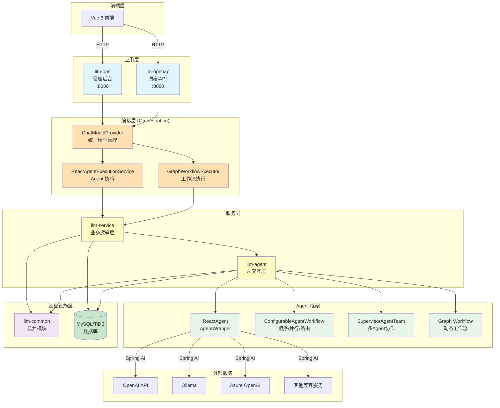
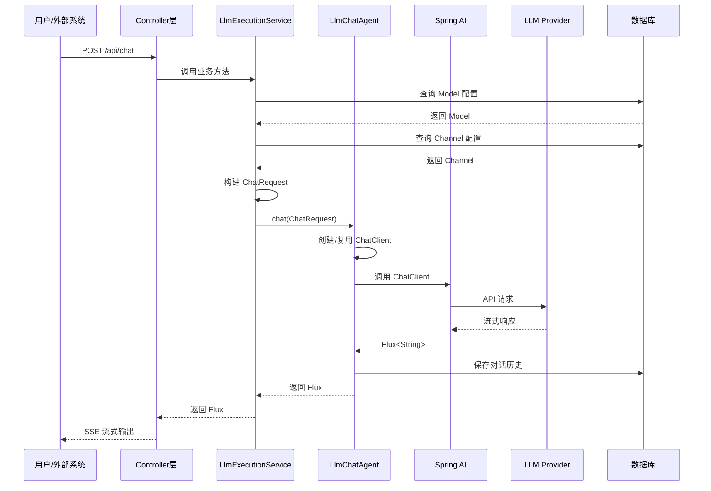
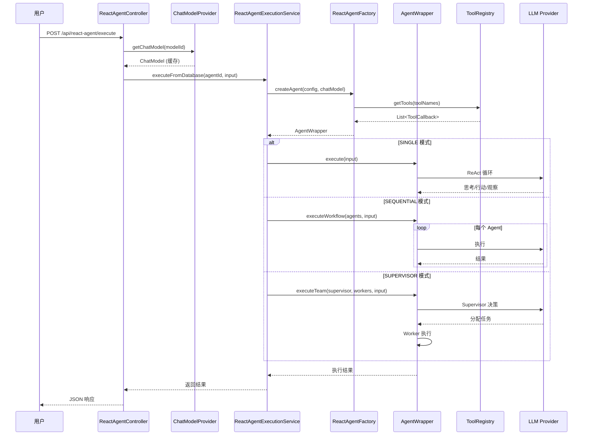
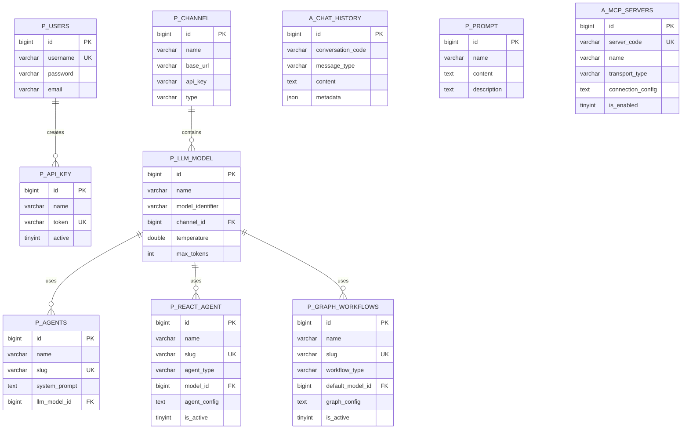
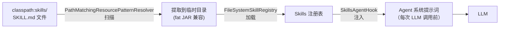

# LLM Manager - 后端服务

基于 Spring Boot 3、Spring AI 和 MyBatis-Plus 的大语言模型管理平台后端服务，采用多模块 Maven 架构，支持多 LLM 提供商的统一管理。

> **⚠️ 重要说明**：
>
> 本项目（`llm-manager-parent`）是**新一代多模块架构**，与旧版 `llm-manager` 后端服务当前共存。
>
> - **llm-manager-parent（新）**：多模块架构，支持 MyBatis-Plus、软删除、对话历史管理等新特性
> - **llm-manager（旧）**：单体架构，使用 Spring Data JPA 和 H2 内存数据库
>
> 待 `llm-manager-parent` 稳定后，将**移除旧版 `llm-manager` 后端服务**，仅保留新架构。
>
> **推荐新项目使用 `llm-manager-parent`**。

## 📋 目录

- [技术架构](#技术架构)
- [模块说明](#模块说明)
- [环境要求](#环境要求)
- [快速启动](#快速启动)
- [配置说明](#配置说明)
- [开发路线图](#开发路线图)
- [常见问题](#常见问题)

## 🏗️ 技术架构

### 核心技术栈

| 技术 | 版本 | 用途 |
|------|------|------|
| Spring Boot | 3.2.5 | 应用框架 |
| Spring AI OpenAI | 1.1.2 | LLM 集成（支持 Reasoning） |
| Spring AI Alibaba | 1.1.2.2 | Agent Framework + Skills |
| MyBatis-Plus | 3.5.7 | ORM 框架 |
| MySQL/TiDB | 8.x | 数据库 |
| Java | 21 (最低17) | 编程语言 |
| Sa-Token | 1.37.0 | 认证授权 |
| Lombok | - | 代码简化 |
| Druid | 1.2.23 | 连接池 |

### 系统架构图


```mermaid
graph TB
    subgraph "前端层"
        UI[Vue 3 前端]
    end

    subgraph "应用层"
        OPS[llm-ops<br/>管理后台<br/>:8080]
        API[llm-openapi<br/>外部API<br/>:8080]
    end

    subgraph "编排层 (Orchestration)"
        ORCH[ChatModelProvider<br/>统一模型管理]
        REACT_EXEC[ReactAgentExecutionService<br/>Agent 执行]
        GRAPH_EXEC[GraphWorkflowExecutor<br/>工作流执行]
    end

    subgraph "服务层"
        SERVICE[llm-service<br/>业务逻辑层]
        AGENT[llm-agent<br/>AI交互层]
    end

    subgraph "Agent 框架"
        REACT[ReactAgent<br/>AgentWrapper]
        WORKFLOW[ConfigurableAgentWorkflow<br/>顺序/并行/路由]
        SUPERVISOR[SupervisorAgentTeam<br/>多Agent协作]
        GRAPH[Graph Workflow<br/>动态工作流]
    end

    subgraph "基础设施层"
        COMMON[llm-common<br/>公共模块]
        DB[(MySQL/TiDB<br/>数据库)]
    end

    subgraph "外部服务"
        OPENAI[OpenAI API]
        OLLAMA[Ollama]
        AZURE[Azure OpenAI]
        OTHER[其他兼容服务]
    end

    UI -->|HTTP| OPS
    UI -->|HTTP| API

    OPS --> ORCH
    API --> ORCH

    ORCH --> REACT_EXEC
    ORCH --> GRAPH_EXEC
    REACT_EXEC --> SERVICE
    GRAPH_EXEC --> SERVICE

    SERVICE --> AGENT
    SERVICE --> COMMON
    AGENT --> COMMON

    AGENT --> REACT
    AGENT --> WORKFLOW
    AGENT --> SUPERVISOR
    AGENT --> GRAPH

    REACT -->|Spring AI| OPENAI
    REACT -->|Spring AI| OLLAMA
    REACT -->|Spring AI| AZURE
    REACT -->|Spring AI| OTHER

    SERVICE --> DB
    AGENT --> DB

    style OPS fill:#e1f5ff
    style API fill:#e1f5ff
    style ORCH fill:#ffe0b2
    style REACT_EXEC fill:#ffe0b2
    style GRAPH_EXEC fill:#ffe0b2
    style SERVICE fill:#fff9c4
    style AGENT fill:#fff9c4
    style REACT fill:#e8f5e9
    style WORKFLOW fill:#e8f5e9
    style SUPERVISOR fill:#e8f5e9
    style GRAPH fill:#e8f5e9
    style COMMON fill:#f3e5f5
    style DB fill:#c8e6c9
```

### 分层对话流程


```mermaid
sequenceDiagram
    participant User as 用户/外部系统
    participant Controller as Controller层
    participant Service as LlmExecutionService
    participant Agent as LlmChatAgent
    participant SpringAI as Spring AI
    participant LLM as LLM Provider
    participant DB as 数据库

    User->>Controller: POST /api/chat
    Controller->>Service: 调用业务方法
    Service->>DB: 查询 Model 配置
    DB-->>Service: 返回 Model
    Service->>DB: 查询 Channel 配置
    DB-->>Service: 返回 Channel
    Service->>Service: 构建 ChatRequest
    Service->>Agent: chat(ChatRequest)
    Agent->>Agent: 创建/复用 ChatClient
    Agent->>SpringAI: 调用 ChatClient
    SpringAI->>LLM: API 请求
    LLM-->>SpringAI: 流式响应
    SpringAI-->>Agent: Flux<String>
    Agent->>DB: 保存对话历史
    Agent-->>Service: 返回 Flux
    Service-->>Controller: 返回 Flux
    Controller-->>User: SSE 流式输出
```

### ReactAgent 执行流程


```mermaid
sequenceDiagram
    participant User as 用户
    participant Controller as ReactAgentController
    participant Provider as ChatModelProvider
    participant Executor as ReactAgentExecutionService
    participant Factory as ReactAgentFactory
    participant Agent as AgentWrapper
    participant Tools as ToolRegistry
    participant LLM as LLM Provider

    User->>Controller: POST /api/react-agent/execute
    Controller->>Provider: getChatModel(modelId)
    Provider-->>Controller: ChatModel (缓存)
    Controller->>Executor: executeFromDatabase(agentId, input)
    Executor->>Factory: createAgent(config, chatModel)
    Factory->>Tools: getTools(toolNames)
    Tools-->>Factory: List<ToolCallback>
    Factory-->>Executor: AgentWrapper

    alt SINGLE 模式
        Executor->>Agent: execute(input)
        Agent->>LLM: ReAct 循环
        LLM-->>Agent: 思考/行动/观察
    else SEQUENTIAL 模式
        Executor->>Agent: executeWorkflow(agents, input)
        loop 每个 Agent
            Agent->>LLM: 执行
            LLM-->>Agent: 结果
        end
    else SUPERVISOR 模式
        Executor->>Agent: executeTeam(supervisor, workers, input)
        Agent->>LLM: Supervisor 决策
        LLM-->>Agent: 分配任务
        Agent->>Agent: Worker 执行
    end

    Agent-->>Executor: 执行结果
    Executor-->>Controller: 返回结果
    Controller-->>User: JSON 响应
```

### 数据库表结构


```mermaid
erDiagram
    P_USERS ||--o{ P_API_KEY : creates
    P_CHANNEL ||--o{ P_LLM_MODEL : contains
    P_LLM_MODEL ||--o{ P_AGENTS : uses
    P_LLM_MODEL ||--o{ P_REACT_AGENT : uses
    P_LLM_MODEL ||--o{ P_GRAPH_WORKFLOWS : uses

    A_CHAT_HISTORY {
        bigint id PK
        varchar conversation_code
        varchar message_type
        text content
        json metadata
    }
    P_USERS {
        bigint id PK
        varchar username UK
        varchar password
        varchar email
    }
    P_CHANNEL {
        bigint id PK
        varchar name
        varchar base_url
        varchar api_key
        varchar type
    }
    P_LLM_MODEL {
        bigint id PK
        varchar name
        varchar model_identifier
        bigint channel_id FK
        double temperature
        int max_tokens
    }
    P_AGENTS {
        bigint id PK
        varchar name
        varchar slug UK
        text system_prompt
        bigint llm_model_id FK
    }
    P_REACT_AGENT {
        bigint id PK
        varchar name
        varchar slug UK
        varchar agent_type
        bigint model_id FK
        text agent_config
        tinyint is_active
    }
    P_GRAPH_WORKFLOWS {
        bigint id PK
        varchar name
        varchar slug UK
        varchar workflow_type
        bigint default_model_id FK
        text graph_config
        tinyint is_active
    }
    P_PROMPT {
        bigint id PK
        varchar name
        text content
        text description
    }
    P_API_KEY {
        bigint id PK
        varchar name
        varchar token UK
        tinyint active
    }
    A_MCP_SERVERS {
        bigint id PK
        varchar server_code UK
        varchar name
        varchar transport_type
        text connection_config
        tinyint is_enabled
    }
```

**表命名规范**：
- `p_*` - 业务配置表（llm-service 模块）
- `a_*` - Agent 运行时表（llm-agent 模块）

**核心业务表**：

| 表名 | 说明 | 模块 |
|------|------|------|
| `p_users` | 用户表 | llm-service |
| `p_channel` | LLM 渠道配置 | llm-service |
| `p_llm_model` | LLM 模型配置 | llm-service |
| `p_agents` | 基础 Agent 配置 | llm-service |
| `p_react_agent` | ReactAgent 配置（SINGLE/SEQUENTIAL/SUPERVISOR） | llm-agent |
| `p_graph_workflows` | Graph 工作流配置 | llm-agent |
| `p_prompt` | 提示词模板 | llm-service |
| `p_api_key` | API 密钥 | llm-service |
| `a_chat_history` | 对话历史 | llm-agent |
| `a_conversations` | 会话元数据 | llm-agent |
| `a_mcp_servers` | MCP 服务器配置 | llm-agent |
| `a_knowledge_bases` | 知识库配置 | llm-agent |

**基础字段**（所有表必备）：
- `create_time` - 创建时间（自动填充）
- `update_time` - 更新时间（自动填充）
- `create_by` - 创建人（自动填充）
- `update_by` - 更新人（自动填充）
- `is_delete` - 软删除标记（0=正常，1=删除）

## 📦 模块说明

### llm-common（公共模块）

**职责**：提供公共基础设施和工具类

**核心组件**：
- `BaseEntity` - 所有实体的基类，包含审计字段
- `MyBatisPlusMetaObjectHandler` - 自动填充时间戳和操作人
- 公共异常、工具类

**依赖**：无业务依赖

**包路径**：`com.llmmanager.common`

### llm-agent（AI 交互层）

**职责**：封装与 AI 模型的交互逻辑

**核心功能**：
- ✅ **Message 抽象层**：统一消息格式（SystemMessage, UserMessage, AssistantMessage）
- ✅ **ChatModel 抽象层**：支持多 LLM 提供商（OpenAiChatModelAdapter）
- ✅ **ChatMemory 管理**：对话历史持久化到 MySQL
- ✅ **LlmChatAgent**：同步/流式对话接口
- ✅ **Tool Layer**：Spring AI 原生 @Tool 注解工具调用
- ✅ **MCP 支持**：Model Context Protocol
- ✅ **Vector Store**：向量存储与 RAG 支持
- ✅ **ReactAgent 框架**：SINGLE/SEQUENTIAL/SUPERVISOR 三种模式
- ✅ **Graph 工作流**：动态配置驱动的工作流编排
- ✅ **Skills 支持**：基于 SKILL.md 文件的技能注入，通过 SkillsAgentHook 动态增强 Agent 系统提示词

**依赖**：llm-common, spring-ai-alibaba-agent-framework

**包路径**：`com.llmmanager.agent`

**子包结构**：
```
com.llmmanager.agent
├── message/          # 消息抽象层
├── model/            # ChatModel 抽象
├── advisor/          # 对话增强（记忆管理、思考模式）
├── storage/          # 数据持久化
│   ├── entity/       # ChatHistory, ReactAgent 实体
│   ├── mapper/       # MyBatis Mapper
│   └── service/      # 存储服务
├── agent/            # LlmChatAgent 核心类
├── config/           # 配置类（ToolFunctionManager）
├── tools/            # Spring AI 原生工具类
├── reactagent/       # ReactAgent 框架 ✨ 新增
│   ├── core/         # AgentWrapper, AgentToolAdapter
│   ├── configurable/ # ConfigurableAgentWorkflow
│   ├── autonomous/   # SupervisorAgentTeam
│   ├── factory/      # ReactAgentFactory
│   └── registry/     # ToolRegistry
├── graph/            # Graph 工作流 ✨ 新增
│   ├── dynamic/      # 动态工作流构建器
│   ├── workflow/     # 硬编码工作流（DeepResearch）
│   └── executor/     # 节点执行器
└── dto/              # 请求 DTO
```

### llm-service（业务逻辑层）

**职责**：管理业务实体和编排逻辑

**核心模块**：
- `service.core` - 实体、Mapper、基础 Service（Channel, Model, Agent, ApiKey, User, Prompt）
- `service.orchestration` - 编排层（统一执行入口）✨ 重构

**编排层组件**：

| 组件 | 职责 |
|------|------|
| `ChatModelProvider` | 统一 ChatModel/ChatClient 管理和缓存 |
| `LlmExecutionService` | 基础对话执行 |
| `ReactAgentExecutionService` | ReactAgent 执行（硬编码场景） |
| `DynamicReactAgentExecutionService` | ReactAgent 执行（数据库配置） |
| `GraphExecutionService` | Graph 工作流执行（DeepResearch） |
| `DynamicWorkflowExecutionService` | Graph 工作流执行（动态配置） |

**业务流程**：
1. 获取 Model 和 Channel 配置
2. 通过 `ChatModelProvider` 获取 ChatModel
3. 调用对应的执行服务
4. 处理业务逻辑（如温度覆盖、模板渲染）

**依赖**：llm-common, llm-agent

**包路径**：`com.llmmanager.service`

### llm-ops（管理后台）

**职责**：提供 Web 管理界面后端支持

**核心 Controllers**：
- `AgentController` - Agent 管理
- `ApiKeyController` - API Key 管理
- `AuthController` - 用户认证
- `ChannelController` - 渠道管理
- `ChatController` - 对话接口（含工具调用）
- `ModelController` - 模型管理
- `PromptController` - 提示词管理
- `ToolController` - 工具管理
- `ReactAgentController` - ReactAgent 执行 ✨ 新增
- `GraphWorkflowController` - Graph 工作流执行 ✨ 新增
- `McpServerController` - MCP 服务器管理

**端口**：8080

**认证**：Sa-Token（内部用户认证）

**依赖**：llm-service, llm-agent, llm-common

**包路径**：`com.llmmanager.ops`

### llm-openapi（外部 API）

**职责**：提供外部 API 访问接口

**核心组件**：
- `ExternalChatController` - Agent 对话接口
- `ApiKeyAuthFilter` - Bearer Token 认证

**端口**：8080（与 llm-ops 不同路径前缀）

**认证**：ApiKey（Bearer Token）

**依赖**：llm-service, llm-agent, llm-common

**包路径**：`com.llmmanager.openapi`

## 🚀 环境要求

### 必需环境
- **JDK 21**（最低 JDK 17）
- **Maven 3.8+**
- **MySQL 8.x** 或 **TiDB**（推荐 TiDB Serverless 免费版）

### 推荐配置
- 内存：至少 2GB 可用内存
- 磁盘：至少 1GB 可用空间

## 🎯 快速启动

### 1. 配置 JDK 环境

**macOS/Linux**:
```bash
export JAVA_HOME=/Volumes/samsungssd/soft/jdk-21.0.8.jdk/Contents/Home
java -version  # 验证版本
```

**Windows**:
```cmd
set JAVA_HOME=C:\path\to\jdk-21
java -version
```

### 2. 配置数据库

编辑 `llm-ops/src/main/resources/application.yml`：

```yaml
spring:
  datasource:
    url: jdbc:mysql://your-host:4000/llm_manager?useSSL=false
    username: ${DB_USER}
    password: ${DB_PASSWORD}
    driver-class-name: com.mysql.cj.jdbc.Driver
```

**推荐使用 TiDB Serverless**（免费）：
```yaml
spring:
  datasource:
    url: jdbc:mysql://gateway01.ap-southeast-1.prod.aws.tidbcloud.com:4000/llm_manager?sslMode=VERIFY_IDENTITY&enabledTLSProtocols=TLSv1.2,TLSv1.3
    username: your-username.root
    password: your-password
```

#### 配置 Embedding（OpenAI / 本地 Ollama）

项目的 RAG 需要 Embedding 服务（生成向量）。默认走 `spring.ai.openai` 配置：

- OpenAI：设置 `OPENAI_API_KEY`（或在 `application.yml` 里配置 `spring.ai.openai.api-key`）

本地开发推荐用 Ollama（走 OpenAI 兼容接口）：

1) 安装 Ollama 并拉取 embedding 模型（二选一）：
```bash
ollama pull nomic-embed-text   # 768 维
# 或
ollama pull bge-m3            # 1024 维
```

2) 修改 `llm-ops/src/main/resources/application.yml`：
```yaml
llm:
  rag:
    embedding:
      base-url: http://localhost:11434   # 注意不要写 /v1
      api-key: ollama                    # Ollama 不校验，可随便填
      model: nomic-embed-text            # 或 bge-m3
      dimensions: 768                    # bge-m3: 1024
```

> 注意：`text-embedding-3-small` 是 OpenAI 模型，不能用 Ollama 本地安装。

### 3. 初始化数据库

执行 SQL 脚本创建表结构：

```bash
mysql -h your-host -u username -p your_database < db/schema.sql
mysql -h your-host -u username -p your_database < db/initdata.sql
```

### 4. 编译项目

```bash
cd llm-manager-parent

# 清理并编译所有模块
export JAVA_HOME=/Volumes/samsungssd/soft/jdk-21.0.8.jdk/Contents/Home
mvn clean compile -DskipTests
```

### 5. 启动服务

#### 方式一：Maven 启动（推荐开发环境）

**启动管理后台** (llm-ops):
```bash
cd llm-ops
mvn spring-boot:run
```

**启动外部 API** (llm-openapi):
```bash
cd llm-openapi
mvn spring-boot:run
```

#### 方式二：JAR 包启动（推荐生产环境）

```bash
# 打包
mvn clean package -DskipTests

# 运行 llm-ops
java -jar llm-ops/target/llm-ops-0.0.1-SNAPSHOT.jar

# 运行 llm-openapi
java -jar llm-openapi/target/llm-openapi-0.0.1-SNAPSHOT.jar
```

#### 方式三：IDE 启动

1. 导入项目到 IntelliJ IDEA
2. 设置 Project SDK 为 JDK 21
3. 运行 `LlmOpsApplication.java` 或 `LlmOpenApiApplication.java`

### 6. 访问服务

- **管理后台 API**: http://localhost:8080
- **默认账号**: `admin` / `123456`
- **前端界面**: 需要启动 `llm-manager-ui` 项目（Vue 3）

## 💬 会话历史管理

### 设计理念

**前端控制会话流程，后端负责存储和加载**：
- ✅ **前端决定**：何时开始新对话（生成新 UUID）
- ✅ **前端决定**：何时继续对话（复用 conversationId）
- ✅ **后端职责**：接收 conversationId 并加载/保存历史

### 前端使用方式

#### 生成 conversationId

```javascript
// 生成不含"-"的 UUID
const conversationId = crypto.randomUUID().replace(/-/g, '')
```

#### API 调用

```javascript
// 带历史对话（传递 conversationId）
const url = `/api/chat/${modelId}/stream-flux?conversationId=${conversationId}`

fetch(url, {
  method: 'POST',
  headers: { 'Content-Type': 'text/plain' },
  body: userMessage
})

// 无历史对话（不传 conversationId，性能最优）
const url = `/api/chat/${modelId}/stream-flux`

fetch(url, {
  method: 'POST',
  headers: { 'Content-Type': 'text/plain' },
  body: userMessage
})
```

#### 完整示例

参考 [`FRONTEND_EXAMPLE.md`](./FRONTEND_EXAMPLE.md) 查看完整的 Vue.js 示例代码，包括：
- localStorage 持久化
- 新对话 vs 继续对话
- 流式响应处理
- 自动会话恢复

### 后端实现

#### Controller 层

```java
@PostMapping(value = "/{modelId}/stream-flux", produces = MediaType.TEXT_EVENT_STREAM_VALUE)
public Flux<ServerSentEvent<String>> chatStreamFlux(
        @PathVariable Long modelId,
        @RequestBody String message,
        @RequestParam(required = false) String conversationId) { // conversationId 可选

    return executionService.streamChat(modelId, message, conversationId)
        // ...
}
```

#### Service 层

```java
public Flux<String> streamChat(Long modelId, String userMessage, String conversationId) {
    // 只有前端传入了 conversationId 才启用历史对话
    if (conversationId != null && !conversationId.trim().isEmpty()) {
        // 启用 MemoryAdvisor，加载历史对话
        return executeStreamRequest(model, userMessage, null, temperature, conversationId);
    } else {
        // 不添加 MemoryAdvisor，无数据库查询，性能最优
        return executeStreamRequest(model, userMessage, null, temperature, null);
    }
}
```

#### Agent 层

```java
private ChatClient createChatClient(ChatRequest request, String conversationId) {
    ChatModel chatModel = getOrCreateChatModel(request);
    ChatClient.Builder builder = ChatClient.builder(chatModel);

    // 按需添加 MemoryAdvisor：只有需要历史对话时才添加
    if (conversationId != null && memoryAdvisor != null) {
        builder.defaultAdvisors(memoryAdvisor);
    }

    return builder.build();
}
```

### 性能优化

**问题**: 之前所有请求都自动添加 MemoryAdvisor，导致每次请求都查询数据库（60-220ms 延迟）

**解决方案**:
1. ❌ **移除自动注册**: MemoryAdvisor 不再自动注册到 AdvisorManager
2. ✅ **按需启用**: 只有 `conversationId != null` 时才添加 MemoryAdvisor
3. ✅ **默认快速**: 无 conversationId 时，无数据库查询，性能最优

**性能对比**:
| 场景 | 启用历史 | 数据库查询 | 启动延迟 |
|------|---------|-----------|---------|
| **修改前** | 强制启用 | ✅ 每次查询 | 60-220ms |
| **修改后（带 conversationId）** | 按需启用 | ✅ 查询历史 | ~50ms |
| **修改后（无 conversationId）** | 不启用 | ❌ 无查询 | ~5ms |

### 数据库表结构

```sql
-- 会话表
CREATE TABLE a_conversations (
    id BIGINT AUTO_INCREMENT PRIMARY KEY,
    conversation_code VARCHAR(100) NOT NULL UNIQUE COMMENT '会话唯一标识（32位UUID）',
    title VARCHAR(255) COMMENT '会话标题',
    message_count INT DEFAULT 0 COMMENT '消息数量',
    last_message_time DATETIME COMMENT '最后消息时间',
    create_time DATETIME DEFAULT CURRENT_TIMESTAMP,
    update_time DATETIME DEFAULT CURRENT_TIMESTAMP ON UPDATE CURRENT_TIMESTAMP,
    is_delete TINYINT DEFAULT 0,
    INDEX idx_conversation_code (conversation_code)
) ENGINE=InnoDB DEFAULT CHARSET=utf8mb4 COMMENT='会话表';

-- 对话轮次表（一次问答的关联）
CREATE TABLE a_conversation_turns (
    id BIGINT AUTO_INCREMENT PRIMARY KEY,
    turn_code VARCHAR(32) NOT NULL UNIQUE COMMENT 'Turn唯一标识（32位UUID）',
    conversation_code VARCHAR(100) NOT NULL COMMENT '会话标识',
    turn_index INT NOT NULL DEFAULT 0 COMMENT '轮次序号（从0开始）',
    user_message_code VARCHAR(32) COMMENT '用户消息标识',
    assistant_message_code VARCHAR(32) COMMENT '助手消息标识',
    prompt_tokens INT DEFAULT 0 COMMENT '输入token数',
    completion_tokens INT DEFAULT 0 COMMENT '输出token数',
    total_tokens INT DEFAULT 0 COMMENT '总token数',
    latency_ms INT DEFAULT 0 COMMENT '响应耗时(毫秒)',
    status VARCHAR(20) DEFAULT 'PENDING' COMMENT '状态：PENDING/PROCESSING/SUCCESS/FAILED/TIMEOUT',
    error_message TEXT COMMENT '错误信息',
    create_time DATETIME DEFAULT CURRENT_TIMESTAMP,
    update_time DATETIME DEFAULT CURRENT_TIMESTAMP ON UPDATE CURRENT_TIMESTAMP,
    is_delete TINYINT DEFAULT 0,
    INDEX idx_conversation_code (conversation_code)
) ENGINE=InnoDB DEFAULT CHARSET=utf8mb4 COMMENT='对话轮次表';

CREATE TABLE a_chat_history (
    id BIGINT AUTO_INCREMENT PRIMARY KEY,
    conversation_code VARCHAR(100) NOT NULL COMMENT '会话标识（32位UUID）',
    message_code VARCHAR(32) NOT NULL UNIQUE COMMENT '消息唯一标识（32位UUID）',
    message_index INT NOT NULL DEFAULT 0 COMMENT '消息在会话中的序号',
    turn_code VARCHAR(32) COMMENT '轮次标识（关联 a_conversation_turns.turn_code）',
    message_type VARCHAR(20) NOT NULL COMMENT '消息类型：SYSTEM/USER/ASSISTANT/TOOL',
    content TEXT NOT NULL COMMENT '消息内容',
    metadata JSON COMMENT '元数据',
    create_time DATETIME DEFAULT CURRENT_TIMESTAMP,
    update_time DATETIME DEFAULT CURRENT_TIMESTAMP ON UPDATE CURRENT_TIMESTAMP,
    is_delete TINYINT DEFAULT 0 COMMENT '逻辑删除：0=正常，1=删除',
    INDEX idx_conversation_code (conversation_code),
    INDEX idx_message_code (message_code),
    INDEX idx_turn_code (turn_code)
) ENGINE=InnoDB DEFAULT CHARSET=utf8mb4 COMMENT='对话历史记录表';
```

**数据模型**：
```
Conversation (会话)
    └── ConversationTurn (轮次) - 一次完整的问答
          ├── USER Message (用户消息)
          └── ASSISTANT Message (助手消息)
```

**命名规范**：
- `conversationCode`：会话业务唯一标识（32位UUID，无连字符）
- `messageCode`：消息业务唯一标识（32位UUID，无连字符）
- `turnCode`：轮次业务唯一标识（32位UUID，无连字符）

### 使用场景

#### 场景 1：单次对话（不需要历史）

```bash
# 不传 conversationId
curl -X POST http://localhost:8080/api/chat/1/stream-flux \
  -H "Content-Type: text/plain" \
  -d "你好"

# 后端行为：
# - conversationId = null
# - 不添加 MemoryAdvisor
# - 不查询数据库
# - 性能最优
```

#### 场景 2：连续对话（需要历史）

```bash
# 传递 conversationId
curl -X POST "http://localhost:8080/api/chat/1/stream-flux?conversationId=abc123def456" \
  -H "Content-Type: text/plain" \
  -d "你好"

# 后端行为：
# - conversationId = "abc123def456"
# - 添加 MemoryAdvisor
# - 查询数据库加载历史
# - 支持上下文连续对话
```

#### 场景 3：新对话 vs 继续对话

**前端控制**:
```javascript
// 新对话：生成新的 conversationId
function startNewConversation() {
    conversationId = crypto.randomUUID().replace(/-/g, '')
    messages = []
    localStorage.setItem('conversationId', conversationId)
}

// 继续对话：复用现有 conversationId
function continueConversation() {
    // 保持 conversationId 不变
    // 继续发送消息
}
```

### API 端点

| 端点 | 支持 conversationId | 用途 |
|------|-------------------|------|
| `POST /api/chat/{modelId}/stream-flux` | ✅ 可选 | 流式对话（推荐） |
| `POST /api/chat/{modelId}/stream-with-reasoning` | ✅ 可选 | 流式对话（支持思考模式） |
| `POST /api/chat/{modelId}/stream` | ✅ 可选 | 流式对话（SseEmitter） |
| `POST /api/chat/{modelId}` | ❌ 不支持 | 同步对话 |

## 🧠 思考模式（Reasoning）

### 功能概述

支持展示 LLM 的思考过程（Reasoning），适用于 DeepSeek R1、OpenAI o1 等支持深度推理的模型。

**工作原理**：
- 部分模型（如 DeepSeek R1）在生成最终答案前会进行深度思考
- 模型返回的 `reasoning_content` 字段包含思考过程
- Spring AI 1.1+ 将该字段映射到 `AssistantMessage.getMetadata().get("reasoningContent")`
- 前端可以分开展示思考过程和最终答案

### 🔧 技术亮点：突破 Spring AI 的 Thinking 参数限制

#### 问题背景

豆包/火山引擎等国内模型需要在请求体**根层级**传递 `thinking` 参数：

```json
{
  "model": "doubao-xxx",
  "temperature": 0.7,
  "thinking": {"type": "enabled"}  // ✅ 必须在根层级
}
```

但 Spring AI 的 `OpenAiChatOptions.extraBody` 在 `ModelOptionsUtils.merge()` 过程中会丢失（因为没有 `@JsonProperty` 注解）。

#### 问题根源

Spring AI 的 `OpenAiChatModel.createRequest()` 调用 `ModelOptionsUtils.merge()` 时，只保留目标类 `ChatCompletionRequest` 中带 `@JsonProperty` 注解的字段。但 `ChatCompletionRequest.extraBody` **没有** `@JsonProperty` 注解，导致 `extraBody` 在合并时被丢弃！

```java
// Spring AI 源码问题所在
OpenAiChatOptions requestOptions = (OpenAiChatOptions) prompt.getOptions();
request = ModelOptionsUtils.merge(requestOptions, request, ChatCompletionRequest.class);
// ↑ extraBody 在这里被过滤掉了
```

#### 解决方案：metadata + ThinkingAwareOpenAiApi（v2.0）

**核心发现**：`ChatCompletionRequest.metadata()` 在 merge 过程中会被保留（与 `extraBody` 不同）。

我们采用 **metadata 传递 + HTTP 层展开** 的方案：

```
┌─────────────────────┐
│  ThinkingAdvisor    │  数据转换器
│                     │  thinkingMode → metadata
└─────────┬───────────┘
          ↓
┌─────────────────────┐
│  OpenAiChatModel    │  Spring AI 原生模型
│                     │  正常执行（含工具调用）
└─────────┬───────────┘
          ↓
┌─────────────────────┐
│ThinkingAwareOpenAiApi│ 核心方案
│                     │  从 metadata 读取
│                     │  展开到 extraBody
└─────────┬───────────┘
          ↓
┌─────────────────────┐
│  HTTP 请求          │  @JsonAnyGetter 打平
└─────────────────────┘
```

**参考**：https://github.com/spring-projects/spring-ai/issues/4879

**核心代码**：

```java
// ThinkingAdvisor.java - 将 thinking 参数放入 metadata
private OpenAiChatOptions buildOpenAiOptionsWithMetadata(
        ChatOptions originalOptions, String thinkingMode, ReasoningFormat format) {

    OpenAiChatOptions.Builder builder = OpenAiChatOptions.builder();

    // 复制原始 Options 的所有参数（包括工具配置！）
    if (originalOptions != null) {
        builder.model(originalOptions.getModel())
               .temperature(originalOptions.getTemperature());

        // 复制 Spring AI ToolCallingChatOptions 参数（关键！工具回调在这里）
        if (originalOptions instanceof ToolCallingChatOptions toolOptions) {
            if (!CollectionUtils.isEmpty(toolOptions.getToolCallbacks())) {
                builder.toolCallbacks(toolOptions.getToolCallbacks());
            }
        }
    }

    // 构建 metadata（用于传递 thinking 参数）
    Map<String, String> metadata = new HashMap<>();

    switch (format) {
        case DOUBAO -> metadata.put("thinking_mode", thinkingMode);
        case OPENAI -> metadata.put("reasoning_effort", thinkingMode);
    }

    if (!metadata.isEmpty()) {
        builder.metadata(metadata);
    }

    return builder.build();
}

// ThinkingAwareOpenAiApi.java - 从 metadata 展开到 extraBody
private void expandMetadataToExtraBody(ChatCompletionRequest chatRequest) {
    Map<String, Object> extraBody = chatRequest.extraBody();
    Map<String, String> metadata = chatRequest.metadata();

    if (CollectionUtils.isEmpty(metadata)) {
        return;
    }

    metadata.forEach((key, value) -> {
        if (key.equalsIgnoreCase("thinking_mode")) {
            // 豆包/火山格式: {"thinking": {"type": "enabled/disabled"}}
            Map<String, Object> thinking = new HashMap<>();
            thinking.put("type", value);
            extraBody.put("thinking", thinking);
        } else if (key.equalsIgnoreCase("reasoning_effort")) {
            // OpenAI 格式: {"reasoning_effort": "low/medium/high"}
            extraBody.put("reasoning_effort", value);
        }
    });
}
```

**最终效果**：

```json
{
  "model": "doubao-xxx",
  "temperature": 0.7,
  "messages": [...],
  "tools": [...],                    // ✅ 工具正常传递
  "thinking": {"type": "enabled"}    // ✅ 正确出现在根层级
}
```

#### 核心机制总结

**两个组件的分工**：

| 组件 | 职责 | 核心代码 |
|------|------|---------|
| **ThinkingAdvisor** | 数据转换器：将 `thinkingMode` 放入 `metadata` | `buildOpenAiOptionsWithMetadata()` |
| **ThinkingAwareOpenAiApi** | metadata 展开器：从 `metadata` 展开到 `extraBody` | `expandMetadataToExtraBody()` |

**完整数据流**：

```
Controller 传入 thinkingMode
    ↓
LlmChatAgent 设置 Advisor 参数
    ↓
ThinkingAdvisor.before() - 转换为 metadata
    ↓
OpenAiChatModel.stream() - 直接使用，无包装器
    ├─ createRequest() - Spring AI 正常处理
    ├─ ModelOptionsUtils.merge() - metadata 被保留！
    └─ 调用 ThinkingAwareOpenAiApi
    ↓
ThinkingAwareOpenAiApi.chatCompletionStream()
    ├─ expandMetadataToExtraBody() - 从 metadata 读取
    ├─ 展开到 extraBody = {"thinking": {"type": "enabled"}}
    └─ 调用 super.chatCompletionStream()
    ↓
HTTP 请求 JSON（@JsonAnyGetter 打平）
```

**关键优势**（相比旧的 ThinkingChatModel 方案）：
1. ✅ 不绕过 Spring AI 的工具调用逻辑
2. ✅ 代码简洁，无需反射
3. ✅ **工具调用和 thinking 参数可以同时生效**

#### 方案演进历程

| 版本 | 方案 | 状态 | 问题 |
|------|------|------|------|
| v1.0 | extraBody 直接设置 | ❌ 失败 | merge 时丢失 |
| v1.1 | HTTP 拦截器 | ❌ 废弃 | 侵入性强 |
| v1.2 | ThinkingChatModel + 反射 | ❌ 废弃 | 绕过工具调用逻辑 |
| **v2.0** | **metadata + ThinkingAwareOpenAiApi** | ✅ 采用 | 完美解决 |

#### 文件结构

| 文件 | 作用 |
|------|------|
| `ThinkingAdvisor.java` | 从 Advisor 上下文读取 thinking 参数，放入 `OpenAiChatOptions.metadata` |
| `ThinkingAwareOpenAiApi.java` | **核心**：从 `chatRequest.metadata()` 读取并展开到 `extraBody` |
| `LlmChatAgent.java` | 使用 `ThinkingAwareOpenAiApi` 创建 `OpenAiChatModel`（无需包装器） |

#### 已删除的组件

| 组件 | 删除原因 |
|------|---------|
| `ThinkingChatModel.java` | metadata 方案无需包装器，直接使用 OpenAiChatModel |
| `ThinkingContext.java` | 不再使用 ThreadLocal 传递参数 |

#### 支持的格式

| 格式 | 适用模型 | 参数示例 |
|------|---------|---------|
| DOUBAO | 豆包/火山引擎 | `{"thinking": {"type": "enabled"}}` |
| OPENAI | o1/o3 系列 | `{"reasoning_effort": "medium"}` |
| DEEPSEEK | DeepSeek R1 | 无需额外参数，自动启用 |

#### Advisor 管理策略

LLM Manager 对 Advisor 采用分层管理策略，兼顾灵活性和性能：

**设计原则**：
- **全局 Advisor**（如 LoggingAdvisor）：通过 `AdvisorManager` 统一注册，所有请求生效
- **条件 Advisor**（如 MemoryAdvisor、ThinkingAdvisor）：按需添加，仅在满足条件时生效

**条件 Advisor 示例**：

| Advisor | 触发条件 | 设计理由 |
|---------|---------|---------|
| **MemoryAdvisor** | `conversationId != null` | 无 conversationId 时不查询数据库，避免性能损耗 |
| **ThinkingAdvisor** | `thinkingMode != null && !auto` | 只有需要思考模式时才注入 thinking 参数 |

**为什么不统一到 AdvisorManager？**

1. **条件是请求级别的**：无法在全局注册时判断（conversationId、thinkingMode 都是运行时参数）
2. **性能优化**：按需添加避免不必要的数据库查询和参数处理
3. **保持简单**：AdvisorManager 不需要耦合业务参数，职责单一

**Advisor 执行顺序**（按 `order` 从小到大）：
```
MemoryAdvisor (order=0) → 加载历史消息
      ↓
ThinkingAdvisor (order=100) → 注入 thinking 参数
      ↓
其他 Advisor (order > 100)
```

**代码位置**：
- 全局 Advisor 注册：`LlmChatAgent.createChatClient(ChatModel)`
- 条件 Advisor 添加：`LlmChatAgent.createChatClient(ChatRequest, String)`

### API 端点

```bash
# 支持思考模式的流式对话
curl -N -X POST "http://localhost:8080/api/chat/{modelId}/stream-with-reasoning?conversationId=conv-123" \
  -H "Cookie: satoken={token}" \
  -H "Content-Type: text/plain" \
  -d "解释量子纠缠现象"
```

### 响应格式

**思考阶段**（模型正在推理）：
```json
{"choices":[{"delta":{"reasoning_content":"首先，我需要理解量子纠缠的基本概念..."}}]}
{"choices":[{"delta":{"reasoning_content":"从量子力学的角度来看..."}}]}
```

**回答阶段**（生成最终答案）：
```json
{"choices":[{"delta":{"content":"量子纠缠是指..."}}]}
{"choices":[{"delta":{"content":"两个或多个粒子..."}}]}
```

**混合模式**（同时输出思考和回答）：
```json
{"choices":[{"delta":{"reasoning_content":"分析中...","content":"答案是"}}]}
```

**结束标记**：
```
[DONE]
```

### 前端展示建议

1. **分区显示**：将思考过程和最终答案放在不同区域
2. **折叠功能**：默认展开思考内容，支持用户折叠/展开
3. **实时更新**：思考和回答可能交替到达，需要分别追加
4. **视觉区分**：使用不同样式区分思考过程（如灰色背景）和最终答案

### 支持的模型

| 模型 | 提供商 | 思考模式支持 |
|------|--------|------------|
| DeepSeek R1 | DeepSeek | ✅ `reasoning_content` |
| o1-preview | OpenAI | ✅ `reasoning` |
| o1-mini | OpenAI | ✅ `reasoning` |
| Claude 3.5 | Anthropic | ❌ 不支持 |
| GPT-4o | OpenAI | ❌ 不支持 |

**注意**：使用思考模式时，请确保选择支持该功能的模型，否则 `reasoning_content` 字段将为空。

## 🖼️ 多模态对话

### 功能概述

支持图片对话（Vision），让 LLM 分析图片内容并回答问题。

**支持的模型**：GPT-4V、Claude 3 等支持视觉的模型

### 多模态 API 端点

| 端点 | 方法 | 说明 |
|------|------|------|
| `POST /api/chat/{modelId}/with-image-url` | POST | 图片对话（通过URL，流式） |
| `POST /api/chat/{modelId}/with-image-url/sync` | POST | 图片对话（通过URL，同步） |
| `POST /api/chat/{modelId}/with-image` | POST | 图片对话（文件上传，流式） |
| `POST /api/chat/{modelId}/with-file` | POST | 文件对话（文本文件作为上下文） |

### 使用示例

#### 图片URL对话

```bash
# 流式响应
curl -N -X POST "http://localhost:8080/api/chat/1/with-image-url?conversationId=conv-123" \
  -H "Cookie: satoken={token}" \
  -d "message=这张图片里有什么？" \
  -d "imageUrls=https://example.com/image1.jpg" \
  -d "imageUrls=https://example.com/image2.jpg"

# 同步响应
curl -X POST "http://localhost:8080/api/chat/1/with-image-url/sync?conversationId=conv-123" \
  -H "Cookie: satoken={token}" \
  -d "message=描述这张图片" \
  -d "imageUrls=https://example.com/image.jpg"
```

#### 图片上传对话

```bash
curl -X POST "http://localhost:8080/api/chat/1/with-image?conversationId=conv-123" \
  -H "Cookie: satoken={token}" \
  -F "message=这是什么？" \
  -F "images=@/path/to/image1.png" \
  -F "images=@/path/to/image2.jpg"
```

### 媒体文件存储

多模态对话中的图片 URL 会自动保存到数据库（`a_media_files` 表），与对应的用户消息关联。

**数据库表结构**：

```sql
CREATE TABLE a_media_files (
    id BIGINT AUTO_INCREMENT PRIMARY KEY,
    file_code VARCHAR(32) NOT NULL UNIQUE COMMENT '文件唯一标识',
    conversation_code VARCHAR(100) COMMENT '会话标识',
    message_code VARCHAR(32) COMMENT '消息标识（关联 a_chat_history）',
    media_type VARCHAR(20) NOT NULL COMMENT '媒体类型：IMAGE/FILE/AUDIO/VIDEO',
    mime_type VARCHAR(100) COMMENT 'MIME类型',
    file_name VARCHAR(255) COMMENT '文件名',
    file_url TEXT COMMENT '文件URL（外部链接）',
    file_size BIGINT COMMENT '文件大小(bytes)',
    create_time DATETIME DEFAULT CURRENT_TIMESTAMP,
    update_time DATETIME DEFAULT CURRENT_TIMESTAMP ON UPDATE CURRENT_TIMESTAMP,
    is_delete TINYINT DEFAULT 0,
    INDEX idx_conversation_code (conversation_code),
    INDEX idx_message_code (message_code)
) ENGINE=InnoDB DEFAULT CHARSET=utf8mb4 COMMENT='媒体文件表';
```

**数据关联**：
```
a_chat_history (用户消息)
    └── message_code ────> a_media_files (媒体文件)
                               └── file_url (图片URL)
```

**核心 Service**：

```java
// MediaFileService 接口
public interface MediaFileService {
    // 保存图片URL（便捷方法）
    MediaFile saveImageUrl(String conversationCode, String messageCode,
                           String imageUrl, String mimeType);

    // 批量保存图片URL
    List<MediaFile> saveImageUrls(String conversationCode, String messageCode,
                                   List<String> imageUrls);

    // 为最新的用户消息保存图片URL（自动查找最新 USER 消息）
    List<MediaFile> saveImageUrlsForLatestUserMessage(String conversationCode,
                                                       List<String> imageUrls);
}
```

## ⚙️ 配置说明

### 数据源配置

**开发环境**（H2 内存数据库）:
```yaml
spring:
  datasource:
    url: jdbc:h2:mem:llmdb
    driver-class-name: org.h2.Driver
```

**生产环境**（MySQL/TiDB）:
```yaml
spring:
  datasource:
    url: jdbc:mysql://your-host:4000/llm_manager
    username: ${DB_USER}
    password: ${DB_PASSWORD}
    driver-class-name: com.mysql.cj.jdbc.Driver

    # Druid 连接池配置
    druid:
      initial-size: 5
      min-idle: 5
      max-active: 20
      max-wait: 60000
```

### Spring AI 默认配置

```yaml
spring:
  ai:
    openai:
      api-key: ${OPENAI_API_KEY:sk-placeholder}
      base-url: ${OPENAI_BASE_URL:https://api.openai.com}
```

**配置优先级**：Channel 数据库配置 > 环境变量 > application.yml

### MyBatis-Plus 配置

```yaml
mybatis-plus:
  configuration:
    log-impl: org.apache.ibatis.logging.stdout.StdOutImpl  # SQL 日志
  global-config:
    db-config:
      logic-delete-field: isDelete  # 逻辑删除字段
      logic-delete-value: 1         # 删除值
      logic-not-delete-value: 0     # 未删除值
```

### Sa-Token 配置

```yaml
sa-token:
  token-name: satoken
  timeout: 2592000       # 30天（秒）
  is-concurrent: true
  is-share: true
  token-style: uuid
```

## 📅 开发路线图

### ✅ Phase 0：数据库表结构重构（已完成）

**目标**：统一表结构和基础字段

- [x] 创建 `BaseEntity` 基类（create_time, update_time, create_by, update_by, is_delete）
- [x] 实现 MyBatis-Plus 自动填充机制
- [x] 配置逻辑删除（软删除）
- [x] 重构所有表名（p_前缀和a_前缀）
- [x] 更新所有实体类继承 BaseEntity
- [x] 更新所有 Mapper SQL 语句
- [x] 修复应用启动配置（MapperScan）

**成果**：
- 统一的审计日志字段
- 自动时间戳和操作人记录
- 全局软删除支持

---

### ✅ Phase 1：Augmented LLM 基础抽象（已完成）

**目标**：实现 Spring AI Alibaba 的 Augmented LLM 核心抽象

#### llm-agent 模块重构

- [x] **Message 抽象层**
  - [x] `MessageType` 枚举（SYSTEM, USER, ASSISTANT, TOOL）
  - [x] `Message` 基类（content, metadata, timestamp）
  - [x] `SystemMessage`, `UserMessage`, `AssistantMessage` 实现
  - [x] `MessageConverter` - Spring AI 消息转换器

- [x] **ChatModel 抽象层**
  - [x] `ChatModel` 接口（同步/流式对话）
  - [x] `ChatOptions` 配置类（temperature, maxTokens, topP）
  - [x] `ChatResponse` 响应封装
  - [x] `OpenAiChatModelAdapter` - OpenAI 适配器

- ✅ **ChatMemory 管理（Advisor）**
  - [x] `ChatMemoryStore` 接口
  - [x] `ChatMemoryManager` 内存管理器
  - [x] `ChatHistory` 实体（MySQL 存储）
  - [x] `ChatHistoryMapper` - MyBatis-Plus Mapper
  - [x] `ChatMemoryStoreImpl` - MySQL 实现

- [x] **重构 LlmChatAgent**
  - [x] 使用新的 Message 抽象
  - [x] 集成 ChatMemoryManager
  - [x] 支持对话历史上下文
  - [x] **按需启用历史对话**（前端控制 conversationId）

- [x] **性能优化**
  - [x] 移除 MemoryAdvisor 自动注册（避免所有请求都查询数据库）
  - [x] 只有前端传递 conversationId 时才启用历史功能
  - [x] 流式响应优化（60-220ms 启动延迟优化）

**包结构**：
```
llm-agent/src/main/java/com/llmmanager/agent/
├── message/          ✅ Message, MessageType, MessageConverter
├── model/            ✅ ChatModel, ChatOptions, ChatResponse, OpenAiChatModelAdapter
├── advisor/          ✅ ChatMemoryStore, ChatMemoryManager, AdvisorManager
├── storage/          ✅ ChatHistory, ChatHistoryMapper, ChatMemoryStoreImpl
├── agent/            ✅ LlmChatAgent (重构)
├── config/           ✅ ChatMemoryConfig, ToolFunctionManager
├── tools/            ✅ Spring AI 原生工具类
└── dto/              ✅ ChatRequest (请求DTO)
```

---

### ✅ Phase 2：工具调用层（Tool Layer）- 已完成

**目标**：支持 LLM 调用外部工具（Function Calling）

#### 实现方案：Spring AI 原生 @Tool 注解

采用 Spring AI 原生的 `@Tool` 和 `@ToolParam` 注解实现工具调用，而非自定义 Tool 接口。

**优势**：
- ✅ 使用 Spring AI 官方推荐方式
- ✅ 自动解析方法签名生成 JSON Schema
- ✅ LLM 自动决策何时调用工具
- ✅ 与 ChatClient 无缝集成

#### 核心实现

**1. 工具类定义（使用 @Tool 注解）**

```java
@Slf4j
@Component
public class WeatherTools {

    @Tool(description = "获取指定城市的当前天气信息，包括温度、天气状况、湿度等")
    public WeatherResponse getWeather(
            @ToolParam(description = "城市名称，例如：北京、上海、深圳") String city,
            @ToolParam(description = "温度单位，可选值：celsius 或 fahrenheit") String unit) {

        log.info("[WeatherTools] LLM 调用天气工具，城市: {}, 单位: {}", city, unit);
        // 模拟天气数据
        return new WeatherResponse(city, "晴朗", 25.0, "°C", 60, "天气晴好");
    }

    public record WeatherResponse(
        String city, String condition, double temperature,
        String unit, int humidity, String forecast
    ) {}
}
```

**2. ToolFunctionManager - 工具管理器**

```java
@Slf4j
@Component
public class ToolFunctionManager {

    // 存储工具信息：工具名 -> ToolInfo
    private final Map<String, ToolInfo> registeredTools = new ConcurrentHashMap<>();

    public record ToolInfo(
        String name,           // 工具名称（方法名）
        String description,    // 工具描述
        Object beanInstance,   // Bean 实例
        String beanName,       // Bean 名称
        Class<?> beanClass     // Bean 类
    ) {}

    @PostConstruct
    public void discoverTools() {
        // 自动扫描所有带 @Tool 注解的方法
        // 注册到 registeredTools
    }

    // 获取工具对象（供 ChatClient.tools() 使用）
    public Object[] getToolObjects(List<String> toolNames) {
        // 返回 Bean 实例数组
    }

    // 获取所有工具（供前端展示）
    public Map<String, String> getAllTools() {
        // 返回 {工具名 -> 描述}
    }
}
```

**3. LlmChatAgent 集成**

```java
// 如果启用工具，注册工具对象
if (Boolean.TRUE.equals(request.getEnableTools())) {
    Object[] toolObjects = toolFunctionManager.getToolObjects(request.getToolNames());
    if (toolObjects.length > 0) {
        log.info("[LlmChatAgent] 启用工具调用，注册工具数: {}", toolObjects.length);
        promptBuilder.tools(toolObjects);  // 使用 .tools() 传递工具对象
    }
}
```

#### 已实现的工具

| 工具名 | 描述 | 参数 |
|--------|------|------|
| `getWeather` | 获取城市天气信息 | city, unit |
| `calculate` | 执行数学计算 | operation, a, b |

#### API 端点

| 端点 | 方法 | 说明 |
|------|------|------|
| `GET /api/tools` | GET | 获取所有工具列表 |
| `GET /api/tools/{toolName}` | GET | 获取工具详情 |
| `POST /api/chat/{modelId}/stream-flux-with-tools` | POST | 带工具调用的流式对话 |

#### 包结构

```
llm-agent/src/main/java/com/llmmanager/agent/
├── tools/                        # Spring AI 原生工具类
│   ├── WeatherTools.java        # @Tool 天气工具
│   └── CalculatorTools.java     # @Tool 计算器工具
├── config/
│   └── ToolFunctionManager.java # 工具管理器（自动发现 @Tool）
└── agent/
    └── LlmChatAgent.java        # 使用 .tools() 传递工具对象
```

#### 使用示例

```java
// 1. 定义工具类（使用 Spring AI @Tool 注解）
@Component
public class MyTools {
    @Tool(description = "我的工具描述")
    public String myTool(@ToolParam(description = "参数描述") String param) {
        return "结果";
    }
}

// 2. 工具自动发现（启动时 @PostConstruct）
// ToolFunctionManager 会扫描所有 @Tool 注解的方法

// 3. 前端选择工具
// GET /api/tools 获取工具列表，用户选择要使用的工具

// 4. 对话时传递工具名称
// POST /api/chat/{modelId}/stream-flux-with-tools?toolNames=getWeather,calculate

// 5. LLM 自动决策是否调用工具
// 用户："北京今天天气怎么样？"
// -> LLM 识别需要调用 getWeather 工具
// -> 自动执行工具并返回结果
// -> LLM 基于结果生成回复
```

---

### ✅ Phase 3：消息增强与多模态（已完成）

**目标**：支持多模态消息（图片、文件）

#### 核心实现

- [x] **MediaMessage 多模态消息**
  - [x] `MediaMessage` - 支持图片、文件、音频、视频
  - [x] `MediaContent` - 媒体内容封装（URL/Base64）
  - [x] `MessageConverter` - 转换为 Spring AI Media 对象

- [x] **MediaFile 媒体文件存储**
  - [x] `MediaFile` 实体 - 映射 `a_media_files` 表
  - [x] `MediaFileMapper` - MyBatis-Plus Mapper
  - [x] `MediaFileService` - 媒体文件 CRUD 操作

- [x] **多模态对话 API**
  - [x] `POST /api/chat/{modelId}/with-image-url` - 图片URL对话（流式）
  - [x] `POST /api/chat/{modelId}/with-media/sync` - 多模态同步对话
  - [x] 统一流式对话接口支持 `mediaUrls` 参数

- [x] **LlmExecutionService 集成**
  - [x] `chatWithMedia()` - 多模态同步对话
  - [x] `streamWithMedia()` - 多模态流式对话
  - [x] 自动保存媒体URL到数据库

**包结构**：
```
llm-agent/src/main/java/com/llmmanager/agent/
├── message/
│   ├── MediaMessage.java        ✅ 多模态消息
│   └── MessageConverter.java    ✅ 支持 Media 转换
├── storage/core/
│   ├── entity/MediaFile.java    ✅ 媒体文件实体
│   ├── mapper/MediaFileMapper.java
│   └── service/MediaFileService.java
```

**使用示例**：
```java
// 图片URL对话
List<MediaMessage.MediaContent> mediaContents = List.of(
    MediaMessage.MediaContent.ofImageUrl("https://example.com/image.jpg")
);
String response = executionService.chatWithMedia(modelId, "描述这张图片", mediaContents, conversationId);

// 流式多模态对话
Flux<ChatStreamChunk> stream = executionService.streamWithMedia(
    modelId, "这张图片里有什么？", mediaContents, conversationId, null, null
);
```

---

### ✅ Phase 4：MCP（Model Context Protocol）

**目标**：集成 Spring AI MCP 支持，连接外部 MCP 服务器

#### 已完成功能

- [x] **MCP 服务器管理**
  - [x] `McpServer` 实体 - 支持 STDIO、SSE、Streamable HTTP 三种传输类型
  - [x] `McpServerMapper` - 数据库操作
  - [x] `McpServerService` - 服务层
  - [x] `McpServerController` - REST API（CRUD + 连接管理）

- [x] **MCP 客户端管理**
  - [x] `McpClientManager` - 客户端连接管理器
  - [x] 自动初始化（启动时连接所有已启用的服务器）
  - [x] 工具发现和回调获取
  - [x] 连接/断开/重连操作

- [x] **LlmChatAgent 集成**
  - [x] `enableMcpTools` 参数支持
  - [x] `mcpServerCodes` 指定服务器
  - [x] 本地工具 + MCP 工具混合使用

#### API 端点

| 端点 | 方法 | 说明 |
|------|------|------|
| `/api/mcp-servers` | GET | 获取所有 MCP 服务器 |
| `/api/mcp-servers/enabled` | GET | 获取已启用的服务器 |
| `/api/mcp-servers/{id}` | GET/PUT/DELETE | 服务器 CRUD |
| `/api/mcp-servers/{id}/connect` | POST | 连接服务器 |
| `/api/mcp-servers/{id}/disconnect` | POST | 断开连接 |
| `/api/mcp-servers/{id}/reconnect` | POST | 重新连接 |
| `/api/mcp-servers/{id}/status` | GET | 获取连接状态和工具列表 |
| `/api/mcp-servers/status` | GET | 获取所有服务器状态 |
| `/api/mcp-servers/initialize-all` | POST | 初始化所有服务器 |

#### 配置示例

```yaml
llm:
  mcp:
    enabled: true
    request-timeout: 30
    auto-initialize: true
    client-type: SYNC
```

#### 使用示例

```java
// 在 ChatRequest 中启用 MCP 工具
ChatRequest request = ChatRequest.builder()
    .modelIdentifier("gpt-4")
    .userMessage("今天北京天气怎么样？")
    .enableMcpTools(true)  // 启用 MCP 工具
    .mcpServerCodes(List.of("weather-server"))  // 可选：指定服务器
    .build();

String response = llmChatAgent.chat(request);
```

**注意**：当前版本仅支持 SSE 和 Streamable HTTP 传输类型，STDIO 传输暂不支持。

---

### ✅ Phase 4.5：Vector Store（向量存储与 RAG）✅ 已测试

> **测试状态**（2025-12-16）：
> - ✅ 应用启动正常，RAG 组件初始化成功
> - ✅ 知识库 CRUD 功能正常
> - ✅ 文档添加、处理流程正常
> - ⚠️ Embedding API 需要有效的 API Key（测试时使用占位符，API 调用失败属预期行为）
> - ⚠️ 完整的向量检索测试需要配置真实的 Embedding API

**目标**：支持向量存储和 RAG（检索增强生成）

#### 已完成功能

- [x] **Vector Store**
  - [x] `VectorStoreManager` - 多知识库 VectorStore 管理
  - [x] `SimpleVectorStore` - 内存存储 + 文件持久化
  - [x] `MultiKbDocumentRetriever` - 多知识库联合检索

- [x] **RAG 支持**
  - [x] `DocumentProcessor` - 文档处理器（分割 + 向量化）
  - [x] `TokenTextSplitter` - 基于 Token 的文本分割
  - [x] `RagAdvisorBuilder` - RAG Advisor 构建器
  - [x] `RetrievalAugmentationAdvisor` - Spring AI 官方 RAG Advisor

- [x] **知识库管理**
  - [x] `KnowledgeBase` - 知识库实体
  - [x] `KnowledgeDocument` - 文档实体
  - [x] REST API（CRUD + 文档上传）

- [x] **Embedding 配置独立化**
  - [x] 支持自定义 `base-url`、`api-key`（可对接 Ollama 等）
  - [x] 常用模型：OpenAI `text-embedding-3-small`；Ollama `nomic-embed-text`、`bge-m3`

#### 本地 Ollama Embedding 快速配置

1) 拉取模型：
```bash
ollama pull nomic-embed-text
```

2) 配置：
```yaml
llm:
  rag:
    embedding:
      base-url: http://localhost:11434
      api-key: ollama
      model: nomic-embed-text
      dimensions: 768
```

📖 RAG 的架构、执行步骤、以及向量库实现（Simple/TiDB/Milvus）详见：`docs/rag-guide.md`

#### 待完成功能（TODO）

| 功能 | 说明 | 位置 |
|------|------|------|
| **URL 文档解析** | 实现网页内容抓取，支持 URL 类型文档 | `DocumentProcessor.java:147` |
| **文件解析（PDF/DOCX/HTML）** | 集成文档解析库，支持富文本文件 | `DocumentProcessor.java:154` |
| **分布式定时任务处理待处理文档** | 集成 XXL-Job 等分布式定时任务中间件，定时调用 `processPendingDocuments()` 处理 PENDING 状态的文档 | `KnowledgeBaseController.java:219` |

**实现建议**：
- URL 解析：可使用 Jsoup 或 Spring AI 的 `WebDocumentReader`
- 文件解析：可引入 `spring-ai-tika-document-reader` 依赖，或使用 Apache POI + PDFBox
- 分布式定时任务：
  - 集成 XXL-Job、ElasticJob 或 PowerJob 等分布式调度中间件
  - 创建定时任务 Handler，调用 `DocumentProcessor.processPendingDocuments(limit)`
  - 支持动态调整执行频率、并发控制、失败重试等企业级特性
  - 推荐配置：每分钟执行一次，每次处理 10-50 个待处理文档

---

### 🔧 Phase 5a：Graph 工作流（已完成，支持动态配置）

基于 Spring AI Alibaba Graph Core 实现的工作流编排，支持两种方式：

1. **硬编码工作流**：代码定义，适用于固定流程
2. **动态工作流**：JSON 配置驱动，用户可自定义（新增功能）

> 📖 **详细配置指南**：请参阅 [`docs/dynamic-workflow-guide.md`](./docs/dynamic-workflow-guide.md)，包含完整的配置值速查表和 DeepResearch 工作流详解。

---

#### `graph_config` JSON 配置完整说明

`p_graph_workflows` 表的 `graph_config` 字段存储工作流的完整配置，格式如下：

##### 顶层结构

```json
{
  "name": "工作流名称",
  "description": "工作流描述",
  "version": "1.0.0",
  "stateConfig": { ... },   // 状态配置
  "nodes": [ ... ],         // 节点列表
  "edges": [ ... ]          // 边列表
}
```

| 字段 | 类型 | 必需 | 说明 |
|------|------|------|------|
| `name` | String | ✅ | 工作流名称 |
| `description` | String | ❌ | 工作流描述 |
| `version` | String | ❌ | 版本号 |
| `stateConfig` | Object | ✅ | 状态配置 |
| `nodes` | Array | ✅ | 节点列表 |
| `edges` | Array | ✅ | 边列表 |

---

##### stateConfig（状态配置）

定义工作流中使用的状态键及其更新策略。

```json
{
  "stateConfig": {
    "keys": [
      {"key": "question", "append": false, "description": "用户问题"},
      {"key": "results", "append": true, "description": "搜索结果（追加模式）"}
    ]
  }
}
```

| 字段 | 类型 | 必需 | 说明 |
|------|------|------|------|
| `key` | String | ✅ | 状态键名称 |
| `append` | Boolean | ✅ | `false`=替换模式（ReplaceStrategy），`true`=追加模式（AppendStrategy） |
| `description` | String | ❌ | 状态键描述 |

**重要状态键**：
- `next_node`：用于条件路由，存储下一个节点的决策结果
- `current_node`：自动记录当前执行的节点 ID

---

##### nodes（节点列表）

每个节点定义一个处理步骤。

```json
{
  "nodes": [
    {
      "id": "node_id",
      "type": "LLM_NODE",
      "name": "节点名称",
      "description": "节点描述",
      "config": { ... }
    }
  ]
}
```

| 字段 | 类型 | 必需 | 说明 |
|------|------|------|------|
| `id` | String | ✅ | 节点唯一标识（用于边的连接） |
| `type` | String | ✅ | 节点类型：`LLM_NODE`、`TRANSFORM_NODE`、`CONDITION_NODE` |
| `name` | String | ❌ | 节点显示名称 |
| `description` | String | ❌ | 节点描述 |
| `config` | Object | ✅ | 节点配置（不同类型配置不同） |

---

##### 节点类型详解

**1. LLM_NODE（LLM 调用节点）**

调用语言模型进行文本生成。

```json
{
  "id": "analysis",
  "type": "LLM_NODE",
  "name": "深度分析",
  "config": {
    "input_key": "search_results",
    "output_key": "analysis_result",
    "system_prompt": "你是一个分析专家...",
    "temperature": 0.7,
    "max_tokens": 2000
  }
}
```

| 配置参数 | 类型 | 必需 | 说明 |
|---------|------|------|------|
| `input_key` | String | ✅ | 从状态中读取输入的键名 |
| `output_key` | String | ✅ | 输出结果存储到状态的键名 |
| `system_prompt` | String | ❌ | 系统提示词，指导 LLM 行为 |
| `temperature` | Number | ❌ | 温度参数（0-1），控制输出随机性 |
| `max_tokens` | Integer | ❌ | 最大生成 token 数 |

---

**2. TRANSFORM_NODE（数据转换节点）**

转换或处理状态数据，不调用 LLM。

```json
{
  "id": "parse_score",
  "type": "TRANSFORM_NODE",
  "name": "解析评分",
  "config": {
    "transform_type": "PARSE_NUMBER",
    "input_keys": ["score_raw"],
    "output_key": "score"
  }
}
```

| 配置参数 | 类型 | 必需 | 说明 |
|---------|------|------|------|
| `transform_type` | String | ✅ | 转换类型（见下表） |
| `input_keys` | Array | ✅ | 输入字段列表 |
| `output_key` | String | ✅ | 输出结果存储到状态的键名 |
| `delimiter` | String | ❌ | 分隔符（用于 SPLIT 操作） |
| `threshold` | Number | ❌ | 阈值（用于 THRESHOLD_CHECK） |

**支持的 transform_type**：

| 类型 | 说明 | 输入 | 输出 |
|------|------|------|------|
| `MERGE` | 合并多个字段值 | 多个键 | 换行分隔的字符串 |
| `EXTRACT` | 提取单个字段值 | 1 个键 | 原值 |
| `FORMAT` | 格式化多字段 | 多个键 | `key: value` 格式字符串 |
| `SPLIT_LINES` | 按行分割为列表 | 1 个键 | `List<String>` |
| `PARSE_NUMBER` | 解析数字 | 1 个键 | `Integer`（0-100） |
| `PARSE_JSON` | 解析 JSON | 1 个键 | `Map` 或 `List` |
| `THRESHOLD_CHECK` | 阈值检查 | 1 个键 | `"PASS"` 或 `"NEED_IMPROVEMENT"` |
| `INCREMENT` | 递增数值 | 1 个键 | `Integer`（原值+1） |

---

**3. CONDITION_NODE（条件路由节点）**

根据状态值决定下一步路由。

```json
{
  "id": "route_decision",
  "type": "CONDITION_NODE",
  "name": "路由决策",
  "config": {
    "condition_field": "status",
    "routes": {
      "approved": "process_node",
      "rejected": "reject_node"
    },
    "default_route": "END"
  }
}
```

| 配置参数 | 类型 | 必需 | 说明 |
|---------|------|------|------|
| `condition_field` | String | ✅ | 条件判断的状态字段名 |
| `routes` | Object | ✅ | 路由映射：`{值: 目标节点ID}` |
| `default_route` | String | ❌ | 默认路由（不匹配时），默认 `"END"` |

---

##### edges（边列表）

定义节点之间的连接关系。

```json
{
  "edges": [
    {"from": "START", "to": "node_1", "type": "SIMPLE"},
    {"from": "node_1", "to": "node_2", "type": "SIMPLE"},
    {"from": "node_2", "to": null, "type": "CONDITIONAL", "routes": {"PASS": "END", "FAIL": "node_1"}}
  ]
}
```

| 字段 | 类型 | 必需 | 说明 |
|------|------|------|------|
| `from` | String | ✅ | 源节点 ID（`"START"` 表示起点） |
| `to` | String | ✅* | 目标节点 ID（`"END"` 表示终点），条件边时可为 `null` |
| `type` | String | ✅ | 边类型：`SIMPLE`（简单边）或 `CONDITIONAL`（条件边） |
| `routes` | Object | ❌* | 条件边的路由映射，`type=CONDITIONAL` 时必需 |

**边类型说明**：
- **SIMPLE**：固定连接，从 `from` 直接到 `to`
- **CONDITIONAL**：条件路由，根据 `next_node` 状态值决定下一步

---

##### 完整示例：DeepResearch 工作流

```json
{
  "name": "DeepResearch",
  "description": "深度研究工作流",
  "version": "1.0.0",
  "stateConfig": {
    "keys": [
      {"key": "question", "append": false, "description": "原始问题"},
      {"key": "sub_questions", "append": false, "description": "分解后的子问题"},
      {"key": "search_results", "append": true, "description": "搜索结果"},
      {"key": "analysis_result", "append": false, "description": "分析结果"},
      {"key": "final_answer", "append": false, "description": "最终报告"},
      {"key": "quality_score", "append": false, "description": "质量评分"},
      {"key": "iteration_count", "append": false, "description": "迭代次数"},
      {"key": "next_node", "append": false, "description": "路由决策"}
    ]
  },
  "nodes": [
    {
      "id": "query_decomposition",
      "type": "LLM_NODE",
      "name": "问题分解",
      "config": {
        "input_key": "question",
        "output_key": "sub_questions",
        "system_prompt": "请将问题分解为3-5个子问题...",
        "temperature": 0.7
      }
    },
    {
      "id": "information_gathering",
      "type": "LLM_NODE",
      "name": "信息收集",
      "config": {
        "input_key": "sub_questions",
        "output_key": "search_results",
        "system_prompt": "针对每个子问题提供信息..."
      }
    },
    {
      "id": "analysis",
      "type": "LLM_NODE",
      "name": "深度分析",
      "config": {
        "input_key": "search_results",
        "output_key": "analysis_result",
        "system_prompt": "对信息进行深度分析..."
      }
    },
    {
      "id": "synthesis",
      "type": "LLM_NODE",
      "name": "综合报告",
      "config": {
        "input_key": "analysis_result",
        "output_key": "final_answer",
        "system_prompt": "撰写研究报告..."
      }
    },
    {
      "id": "quality_check",
      "type": "LLM_NODE",
      "name": "质量评估",
      "config": {
        "input_key": "final_answer",
        "output_key": "quality_score_raw",
        "system_prompt": "评分0-100，只返回数字"
      }
    },
    {
      "id": "parse_score",
      "type": "TRANSFORM_NODE",
      "name": "解析评分",
      "config": {
        "transform_type": "PARSE_NUMBER",
        "input_keys": ["quality_score_raw"],
        "output_key": "quality_score"
      }
    },
    {
      "id": "threshold_check",
      "type": "TRANSFORM_NODE",
      "name": "阈值检查",
      "config": {
        "transform_type": "THRESHOLD_CHECK",
        "input_keys": ["quality_score"],
        "output_key": "next_node",
        "threshold": 80
      }
    }
  ],
  "edges": [
    {"from": "START", "to": "query_decomposition", "type": "SIMPLE"},
    {"from": "query_decomposition", "to": "information_gathering", "type": "SIMPLE"},
    {"from": "information_gathering", "to": "analysis", "type": "SIMPLE"},
    {"from": "analysis", "to": "synthesis", "type": "SIMPLE"},
    {"from": "synthesis", "to": "quality_check", "type": "SIMPLE"},
    {"from": "quality_check", "to": "parse_score", "type": "SIMPLE"},
    {"from": "parse_score", "to": "threshold_check", "type": "SIMPLE"},
    {"from": "threshold_check", "to": null, "type": "CONDITIONAL", "routes": {
      "PASS": "END",
      "NEED_IMPROVEMENT": "analysis"
    }}
  ]
}
```

**工作流图示**：

```
START
  │
  ▼
┌─────────────────────┐
│ query_decomposition │ (LLM_NODE)
└─────────────────────┘
  │
  ▼
┌─────────────────────┐
│ information_gathering│ (LLM_NODE)
└─────────────────────┘
  │
  ▼
┌─────────────────────┐◀────────────────┐
│     analysis        │ (LLM_NODE)      │
└─────────────────────┘                 │
  │                                     │
  ▼                                     │
┌─────────────────────┐                 │
│     synthesis       │ (LLM_NODE)      │
└─────────────────────┘                 │
  │                                     │
  ▼                                     │
┌─────────────────────┐                 │
│   quality_check     │ (LLM_NODE)      │
└─────────────────────┘                 │
  │                                     │
  ▼                                     │
┌─────────────────────┐                 │
│    parse_score      │ (TRANSFORM)     │
└─────────────────────┘                 │
  │                                     │
  ▼                                     │
┌─────────────────────┐                 │
│  threshold_check    │ (TRANSFORM)     │
└─────────────────────┘                 │
  │                                     │
  ├──── PASS ──────▶ END                │
  │                                     │
  └── NEED_IMPROVEMENT ─────────────────┘
```

---

#### API 端点

| 端点 | 方法 | 说明 |
|------|------|------|
| `/api/workflow/node-types` | GET | 获取可用节点类型 |
| `/api/workflow/validate` | POST | 验证工作流配置 |
| `/api/workflow/execute/{modelId}` | POST | 执行自定义工作流 |
| `/api/workflow/deep-research/{modelId}` | POST | 执行 DeepResearch |

#### 使用示例

```bash
# 1. 获取节点类型
curl http://localhost:8080/api/workflow/node-types

# 2. 执行 DeepResearch
curl -X POST http://localhost:8080/api/workflow/deep-research/1 \
  -H "Content-Type: application/json" \
  -d '{"question": "人工智能的发展历史是什么？"}'

# 3. 执行自定义工作流
curl -X POST http://localhost:8080/api/workflow/execute/1 \
  -H "Content-Type: application/json" \
  -d '{
    "workflowConfig": "{完整JSON配置}",
    "initialState": {"question": "你的问题", "iteration_count": 0}
  }'
```

---

#### 数据库表

| 表名 | 说明 |
|------|------|
| `p_graph_workflows` | 工作流配置（`graph_config` 存储上述 JSON） |
| `p_graph_node_types` | 节点类型注册表（系统内置） |
| `a_graph_tasks` | 任务执行记录 |
| `a_graph_steps` | 步骤执行记录 |

---

#### 包结构

```
llm-agent/src/main/java/com/llmmanager/agent/graph/
├── dynamic/                           # 动态工作流（JSON 配置驱动）
│   ├── DynamicGraphBuilder.java       # 核心构建器
│   ├── dto/
│   │   ├── GraphWorkflowConfig.java   # 工作流配置 DTO
│   │   ├── NodeConfig.java            # 节点配置
│   │   ├── EdgeConfig.java            # 边配置
│   │   └── StateKeyConfig.java        # 状态键配置
│   └── executor/
│       ├── NodeExecutor.java          # 节点执行器接口
│       ├── LlmNodeExecutor.java       # LLM 节点执行器
│       ├── ConditionNodeExecutor.java # 条件节点执行器
│       └── TransformNodeExecutor.java # 转换节点执行器
├── workflow/                          # 硬编码工作流（原有）
│   └── DeepResearchWorkflow.java
├── node/                              # 硬编码节点（原有）
└── state/                             # 状态定义（原有）
```

---

### ✅ Phase 5b：Agent Framework（Agent 框架）- 已完成

**目标**：实现 ReactAgent 模式和多 Agent 协作

#### llm-agent 已实现组件

- [x] **ReactAgent**（基于 `spring-ai-alibaba-agent-framework:1.1.0.0-RC1`）
  - [x] `AgentWrapper` - ReactAgent 封装，简化使用
  - [x] `AgentToolAdapter` - Agent-as-Tool 适配器
  - [x] `ToolRegistry` - 工具注册中心

- [x] **Multi-Agent**
  - [x] `ConfigurableAgentWorkflow` - 配置驱动的协作框架（SEQUENTIAL/PARALLEL/ROUTING）
  - [x] `SupervisorAgentTeam` - Supervisor + Workers 自主协作
  - [x] `ReactAgentFactory` - Agent 工厂（从数据库配置构建）

- [x] **执行服务层**
  - [x] `ReactAgentExecutionService` - 硬编码场景执行
  - [x] `DynamicReactAgentExecutionService` - 数据库配置驱动执行

**使用示例**：
```java
// 单个 ReactAgent
AgentWrapper agent = AgentWrapper.builder()
    .name("assistant")
    .chatModel(chatModel)
    .tools(toolCallbacks)
    .build();
String result = agent.call("帮我查询北京天气");

// 顺序工作流
ConfigurableAgentWorkflow workflow = ConfigurableAgentWorkflow.builder()
    .pattern(WorkflowPattern.SEQUENTIAL)
    .agent(researchAgent)
    .agent(analysisAgent)
    .build();
WorkflowResult result = workflow.execute("研究人工智能发展趋势");

// Supervisor 团队
SupervisorAgentTeam team = SupervisorAgentTeam.builder()
    .chatModel(chatModel)
    .worker(researchAgent)
    .worker(writerAgent)
    .build();
String result = team.execute("撰写一篇关于量子计算的报告");
```

---

### ✅ Phase 5c：Skills 支持 - 已完成

**目标**：允许为 ReactAgent 注入预定义的行为指南（Prompt），通过 Markdown 文件定义技能，运行时由 `SkillsAgentHook` 动态注入到 Agent 系统提示词中。

参考文档：https://java2ai.com/docs/frameworks/agent-framework/tutorials/skills/

---

#### 工作原理


```mermaid
flowchart LR
    A["classpath:skills/<br/>SKILL.md 文件"] -->|"PathMatchingResourcePatternResolver<br/>扫描"| B["提取到临时目录<br/>(fat JAR 兼容)"]
    B -->|"FileSystemSkillRegistry<br/>加载"| C["Skills 注册表"]
    C -->|"SkillsAgentHook<br/>注入"| D["Agent 系统提示词<br/>（每次 LLM 调用前）"]
    D --> E["LLM"]
```

> **ClasspathSkillRegistry 兼容性说明**：Spring AI Alibaba 官方的 `ClasspathSkillRegistry` 在 Spring Boot 3.2+ fat JAR 中存在 `nested:` URL 协议不支持的问题，会静默返回 0 个 Skills。本项目通过 `extractSkillsToFilesystem()` 方法将 Skills 资源提取到临时目录，改用 `FileSystemSkillRegistry` 加载，完全兼容生产环境部署。

---

#### Skills 目录结构

```
llm-agent/src/main/resources/skills/
├── general-assistant/
│   └── SKILL.md          # 通用问答、写作辅助、任务规划技能
├── code-reviewer/
│   └── SKILL.md          # 代码审查、安全检测、性能优化建议技能
└── data-analyst/
    └── SKILL.md          # 数据分析、统计解读、业务洞察技能
```

每个技能一个子目录，目录名即技能名，目录下必须有 `SKILL.md` 文件。

---

#### SKILL.md 文件格式

文件必须包含 YAML frontmatter，正文为 Markdown 格式的行为指南：

```markdown
---
name: skill-name          # 必须：小写字母数字连字符，匹配正则 ^[a-z0-9]+(-[a-z0-9]+)*$
description: 何时使用此技能的简短描述
---

# 技能标题

## 职责
描述该技能的核心职责...

## 行为准则
1. 规则1...
2. 规则2...

## 输出格式
...
```

**frontmatter 验证规则**：
- `name`：必须，正则 `^[a-z0-9]+(-[a-z0-9]+)*$`（如 `code-reviewer`，不能有大写或下划线）
- `description`：必须，非空字符串

---

#### 配置方式

通过数据库 `p_react_agents.agent_config` JSON 字段的 `skillsPath` 属性启用：

```json
{
  "agentType": "SINGLE",
  "modelId": 1,
  "instruction": "你是一个专业助手...",
  "tools": ["weather"],
  "skillsPath": "skills"
}
```

| 字段 | 类型 | 说明 |
|------|------|------|
| `skillsPath` | String（可选） | classpath 下技能目录的相对路径，通常为 `"skills"`；不配置则不启用 Skills |

---

#### 代码用法（AgentWrapper）

```java
// 通过 skillsClasspathPath() 指定 classpath 下的技能目录
AgentWrapper agent = AgentWrapper.builder()
    .name("my-agent")
    .chatModel(chatModel)
    .systemPrompt("你是一个助手")
    .skillsClasspathPath("skills")  // 加载 classpath:skills/ 下所有技能
    .build();

// 查询技能加载情况
agent.hasSkills();                        // true/false
agent.getSkillsHook().getSkillCount();    // 技能数量
agent.getSkillsHook().listSkills();       // 列出所有技能名称
```

---

#### 启动验证日志

应用启动并执行 Agent 对话时，可看到以下日志确认 Skills 加载成功：

```
扫描 Skills 资源: pattern=classpath*:skills/**/SKILL.md, 发现 3 个
Skills 已提取到临时目录: /var/folders/.../llm-agent-skills-xxx
Loaded skill: data-analyst
Loaded skill: general-assistant
Loaded skill: code-reviewer
Discovered 3 skills from ...
Loaded 3 user-level skills
Agent '天气专家' 启用 Skills, 路径: skills, 技能数: 3
构建 Agent '天气专家' 完成, 工具数量: 1, Skills: 3
```

---

#### 内置示例技能

| 技能名 | 路径 | 适用场景 |
|--------|------|---------|
| `general-assistant` | `skills/general-assistant/SKILL.md` | 通用问答、写作辅助、任务规划 |
| `code-reviewer` | `skills/code-reviewer/SKILL.md` | 代码审查、安全检测、性能优化建议 |
| `data-analyst` | `skills/data-analyst/SKILL.md` | 数据分析、统计解读、业务洞察 |

---

#### 包结构

```
llm-agent/src/main/java/com/llmmanager/agent/reactagent/core/
└── AgentWrapper.java
      ├── skillsClasspathPath(String)      # Builder 方法，配置技能路径
      ├── extractSkillsToFilesystem()      # 提取 classpath 资源到临时目录
      ├── hasSkills()                      # 是否启用了 Skills
      └── getSkillsHook()                  # 获取 SkillsAgentHook 实例

llm-agent/src/main/java/com/llmmanager/agent/reactagent/config/
└── ReactAgentConfigDTO.java
      └── skillsPath                       # 数据库配置字段

llm-agent/src/main/java/com/llmmanager/agent/reactagent/factory/
└── ReactAgentFactory.java                 # 从 config.skillsPath 传递到 AgentWrapper

llm-agent/src/main/resources/skills/      # 技能文件目录
├── general-assistant/SKILL.md
├── code-reviewer/SKILL.md
└── data-analyst/SKILL.md
```

---

### 📋 其他规划

#### 性能优化

- [ ] ChatClient 缓存优化（基于 LRU）
- [ ] 数据库连接池调优
- [ ] 流式输出背压控制
- [ ] 异步任务队列
- [ ] **Turn 缓存优化（多节点部署）**
  - 当前：ASSISTANT 消息保存时通过 DB 查询获取 turn_code
  - 优化：使用 Redis 缓存活跃 Turn（conversationCode -> turnCode）
  - 场景：多节点部署时避免内存缓存不共享问题
  - 预期：减少 1 次 DB 查询（约 1-5ms）

#### 安全增强

- [ ] API 访问频率限制
- [ ] SQL 注入防护验证
- [ ] XSS 过滤增强
- [ ] 敏感数据加密存储

#### 可观测性 🔴 高优先级

- [ ] **执行指标收集**
  - [ ] 执行时间统计（总耗时、各节点耗时）
  - [ ] Token 使用量统计（输入/输出/总计）
  - [ ] 成功率/失败率统计
  - [ ] 工具调用次数统计
- [ ] **日志增强**
  - [ ] 结构化日志（JSON 格式）
  - [ ] 请求追踪 ID（TraceId）
  - [ ] 执行链路日志（节点进入/退出）
- [ ] **监控集成**
  - [ ] Prometheus 指标暴露
  - [ ] Grafana 仪表盘模板
  - [ ] 告警规则配置
- [ ] **执行记录持久化**
  - [ ] 执行历史表设计
  - [ ] 执行详情存储（输入/输出/中间状态）
  - [ ] 执行回放功能

#### 整体重构（异常处理、返回格式）🟡 中优先级

- [ ] **统一异常处理**
  - [ ] 定义业务异常体系（BaseException、BusinessException、SystemException）
  - [ ] 全局异常处理器（@ControllerAdvice）
  - [ ] 异常码标准化（模块前缀 + 错误码）
- [ ] **统一返回格式**
  - [ ] 定义 Result<T> 通用返回类
  - [ ] 成功/失败响应格式统一
  - [ ] 分页响应格式统一（PageResult<T>）
- [ ] **代码质量提升**
  - [ ] 参数校验统一（@Valid + 自定义校验器）
  - [ ] 空值处理规范（Optional 使用规范）
  - [ ] 资源释放检查（try-with-resources）

#### 部署支持

- [ ] Docker Compose 配置
- [ ] Kubernetes 部署模板
- [ ] CI/CD Pipeline（GitHub Actions）
- [ ] 自动化测试覆盖

## ❓ 常见问题

### Q1: 编译失败，找不到符号错误

**A**: 模块间依赖未正确构建，执行：
```bash
mvn clean install -DskipTests
```

### Q2: 启动失败，找不到 ChatHistoryMapper

**A**: 检查启动类的 `@MapperScan` 是否包含：
```java
@MapperScan({
    "com.llmmanager.service.core.mapper",
    "com.llmmanager.agent.storage.mapper"  // 必须包含
})
```

### Q3: 数据库连接失败

**A**: 检查 `application.yml` 配置：
- 数据库地址和端口是否正确
- 用户名密码是否正确
- 数据库是否已创建（`llm_manager`）
- MySQL 驱动是否正确（8.x 使用 `com.mysql.cj.jdbc.Driver`）

### Q4: Bean 冲突错误（MetaObjectHandler）

**A**: 确保只有 `llm-common` 模块中有 `MyBatisPlusMetaObjectHandler`，删除其他模块的重复实现。

### Q5: 软删除不生效

**A**: 检查：
1. 实体类是否继承 `BaseEntity`
2. `is_delete` 字段是否有 `@TableLogic` 注解
3. MyBatis-Plus 配置是否正确

### Q6: 自动填充字段为 null

**A**: 确认 `MyBatisPlusMetaObjectHandler` 已被 Spring 扫描并注册为 Bean：
```java
@Component  // 必须有此注解
public class MyBatisPlusMetaObjectHandler implements MetaObjectHandler {
    // ...
}
```

### Q7: JDK 版本错误

**A**: 确保使用 JDK 21：
```bash
# macOS/Linux
export JAVA_HOME=/path/to/jdk-21
java -version

# Windows
set JAVA_HOME=C:\path\to\jdk-21
java -version
```

## 📝 更新日志

### v2.8.0 (2026-04-29) - Skills 支持 & Spring AI Alibaba 1.1.2.2 升级

#### ✨ 新功能
- **Skills 支持**：为 ReactAgent 注入预定义行为指南，通过 `SKILL.md` 文件定义技能，`SkillsAgentHook` 在每次 LLM 调用前动态注入到系统提示词
- **内置示例技能**：提供 `general-assistant`、`code-reviewer`、`data-analyst` 三个开箱即用的示例技能
- **`skillsPath` 配置项**：`ReactAgentConfigDTO` 新增 `skillsPath` 字段，支持通过数据库配置启用 Skills

#### 🔧 Bug 修复
- **ClasspathSkillRegistry fat JAR 兼容性**：修复 Spring Boot 3.2+ fat JAR 中 `nested:` URL 协议导致 Skills 静默加载 0 个的问题。通过 `PathMatchingResourcePatternResolver` 扫描资源并提取到临时目录，改用 `FileSystemSkillRegistry` 加载，完全兼容生产环境

#### ⬆️ 依赖升级
- `spring-ai` `1.1.0` → `1.1.2`
- `spring-ai-alibaba` `1.1.0.0-RC1` → `1.1.2.2`

---

### v2.7.0 (2025-12-25) - 思考模式参数注入修复 & 统一返回格式 🔧

#### 🐛 Bug 修复
- **工具调用兼容性**：修复思考模式（thinkingMode）与工具调用（enableTools）无法同时生效的问题
- **Spring AI merge 问题**：解决 `ModelOptionsUtils.merge()` 导致 `extraBody` 参数丢失的问题

#### 🔄 架构重构
- **metadata 方案**：采用 metadata 传递 thinking 参数（在 merge 中被保留），替代原有的 ThreadLocal 方案
- **ThinkingAwareOpenAiApi**：在 HTTP 层面将 metadata 展开到 extraBody，实现参数正确注入
- **代码简化**：移除反射依赖，直接使用 OpenAiChatModel

#### 🎯 统一返回格式
- **Result\<T\> 通用响应类**：统一 API 返回格式，包含 `code`、`msg`、`data`、`success`、`time` 字段
- **ResultCode 错误码枚举**：分类错误码体系
  - `200` 成功、`300` 警告、`400` 请求错误、`401` 未授权、`500` 系统错误
  - `1xxx` 通用业务错误、`2xxx` 用户模块、`3xxx` Channel/Model 模块
  - `4xxx` Agent 模块、`5xxx` RAG/知识库模块、`6xxx` MCP 模块、`7xxx` 工作流模块
- **GlobalExceptionHandler**：`@RestControllerAdvice` 全局异常处理器，统一异常响应格式
- **BusinessException**：业务异常类，支持 `notFound()`、`paramError()` 等便捷创建方法

#### 🗑️ 移除组件
- `ThinkingChatModel.java` - metadata 方案无需包装器
- `ThinkingContext.java` - 不再使用 ThreadLocal
- `llm-ops/GlobalExceptionHandler.java` - 迁移到 llm-common 模块
- `llm-openapi/GlobalExceptionHandler.java` - 迁移到 llm-common 模块

#### 📚 参考
- GitHub Issue: https://github.com/spring-projects/spring-ai/issues/4879
- 详细文档: [`docs/advisor-and-thinking-model-solution.md`](./docs/advisor-and-thinking-model-solution.md)

---

### v2.6.0 (2025-12-18) - ReactAgent 框架与编排层重构

#### 🚀 新增功能

**1. ReactAgent 框架**
- **AgentWrapper**：统一的 Agent 封装器，支持 SINGLE、SEQUENTIAL、SUPERVISOR 三种类型
- **ConfigurableAgentWorkflow**：可配置的 Agent 工作流，支持顺序执行模式
- **SupervisorAgentTeam**：Supervisor 模式的多 Agent 协作团队
- **ReactAgentFactory**：从数据库配置动态创建 Agent 的工厂类
- **ToolRegistry**：工具注册中心，支持动态工具发现和注册

**2. 示例工具集**
- `DateTimeTools`：日期时间工具
- `KnowledgeTools`：知识库查询工具
- `NewsTools`：新闻搜索工具
- `StockTools`：股票查询工具
- `TranslationTools`：翻译工具

**3. 示例配置**
- `resources/reactagent/single-agent-example.json`
- `resources/reactagent/sequential-agent-example.json`
- `resources/reactagent/supervisor-agent-example.json`

#### 🔄 架构重构

**1. ChatModelProvider - 统一 ChatModel 管理**
- 集中管理 ChatModel/ChatClient 的创建和缓存
- 消除各服务中重复的 ChatModel 创建逻辑
- 支持按 Channel 清除缓存

**2. ReactAgentExecutionService - 公共执行方法**
- `executeAgent()`：执行单个 Agent
- `executeWorkflow()`：执行顺序工作流
- `executeTeam()`：执行 Supervisor 团队
- `DynamicReactAgentExecutionService` 复用这些公共方法

**3. GraphWorkflowExecutor - 通用执行层**
- `execute(CompiledGraph, initialState)`：同步执行
- `executeStream(CompiledGraph, initialState)`：流式执行
- `executeWithCache()`：带缓存执行
- `GraphExecutionService` 和 `DynamicWorkflowExecutionService` 统一使用

**4. API 简化**
- `executeFromDatabase` 移除冗余 `modelId` 参数（Agent 配置已包含 modelId）

#### 📁 新增文件

```
llm-agent/src/main/java/com/llmmanager/agent/
├── reactagent/
│   ├── autonomous/SupervisorAgentTeam.java
│   ├── config/ReactAgentConfigDTO.java
│   ├── configurable/
│   │   ├── ConfigurableAgentWorkflow.java
│   │   ├── WorkflowPattern.java
│   │   ├── config/AgentConfig.java
│   │   ├── config/AgentWorkflowConfig.java
│   │   └── pattern/*.java
│   ├── core/AgentWrapper.java, AgentToolAdapter.java
│   ├── example/*.java
│   ├── factory/ReactAgentFactory.java
│   └── registry/ToolRegistry.java
├── storage/core/
│   ├── entity/ReactAgent.java
│   ├── mapper/ReactAgentMapper.java
│   └── service/ReactAgentService.java
└── tools/*.java

llm-service/src/main/java/com/llmmanager/service/orchestration/
├── ChatModelProvider.java (新增)
├── ReactAgentExecutionService.java (新增)
└── DynamicReactAgentExecutionService.java (新增)

docs/orchestration-layer-refactoring.md (新增技术文档)
```

#### 🎯 设计模式

| 模式 | 应用 |
|------|------|
| Provider | ChatModelProvider 统一提供 ChatModel |
| Template Method | 公共执行方法定义执行骨架 |
| Facade | GraphWorkflowExecutor 封装复杂执行逻辑 |
| Cache | ChatModel 和 CompiledGraph 缓存 |
| Factory | ReactAgentFactory 动态创建 Agent |

---

### v2.5.0 (2024-12-12) - 架构重构与命名规范化

#### 🔄 重大变更

**1. GraphWorkflow 模块重构**
- **迁移到 llm-agent 模块**：将 GraphWorkflow 相关类从 `llm-service` 迁移到 `llm-agent`，更符合职责划分
- **重命名 GraphWorkflowService → GraphWorkflowExecutor**：避免与 `llm-service` 模块的命名冲突，明确执行器职责
- **合并 Controller**：将 `DynamicWorkflowController` 合并到 `GraphWorkflowController`，统一工作流 API 入口
- **数据库驱动执行**：通用工作流执行改为基于 `slug` 从数据库读取配置，支持动态管理工作流

**2. 命名规范化（conversationCode）**
- **统一会话标识**：系统全面使用 `conversationCode` 代替 `conversationId`
- **API 参数变更**：所有 Controller 层参数从 `conversationId` 更名为 `conversationCode`
- **Service 层更新**：`LlmExecutionService` 所有方法参数统一使用 `conversationCode`
- **Spring AI 兼容**：Agent 层使用 `conversationCode` 值传递给 Spring AI 的 `ChatMemory.CONVERSATION_ID` 常量

**3. 新增 DTO**
- **WorkflowExecuteRequest**：统一工作流执行请求参数（`slug`、`initialState`、`conversationCode`）

#### 📁 文件结构变更

```
迁移前（llm-service）:
llm-service/src/main/java/com/llmmanager/service/graph/
├── GraphWorkflowService.java
└── GraphWorkflowExecutionService.java

迁移后（llm-agent）:
llm-agent/src/main/java/com/llmmanager/agent/graph/
├── core/
│   ├── entity/GraphWorkflow.java      # 工作流实体
│   ├── mapper/GraphWorkflowMapper.java
│   └── service/
│       ├── GraphWorkflowService.java       # CRUD 服务
│       └── GraphWorkflowExecutor.java      # 执行器（原 Service）
└── dynamic/
    └── dto/WorkflowExecuteRequest.java     # 执行请求 DTO
```

#### 🔧 API 变更

| 端点 | 变更 |
|------|------|
| `POST /api/workflow/execute/{slug}` | 从 `workflowConfig` 参数改为通过 `slug` 从数据库读取配置 |
| 所有对话接口 | 参数 `conversationId` → `conversationCode` |

#### ⚠️ 迁移说明

1. **前端调整**：将请求参数中的 `conversationId` 改为 `conversationCode`
2. **数据库兼容**：数据库字段名已是 `conversation_code`，无需修改

---

### v2.4.0 (2024-12-11) - Graph 工作流动态配置

- ✅ 支持 JSON 配置驱动的动态工作流
- ✅ 实现 LLM_NODE、TRANSFORM_NODE、CONDITION_NODE 三种节点类型
- ✅ 添加 DeepResearch 工作流示例
- ✅ 完善工作流配置文档

---

### v2.3.0 (2024-12-10) - Graph 工作流基础

- ✅ 集成 `spring-ai-alibaba-graph-core:1.0.0.2`
- ✅ 实现硬编码工作流支持
- ✅ 添加 StateGraph 状态管理

---

### v2.2.0 - MCP 支持

- ✅ MCP 服务器管理（SSE、Streamable HTTP）
- ✅ MCP 客户端自动初始化
- ✅ LlmChatAgent 集成 MCP 工具

---

### v2.1.0 - 多模态与思考模式

- ✅ 多模态对话支持（图片 URL、文件上传）
- ✅ 媒体文件存储（`a_media_files` 表）
- ✅ Thinking 模式支持（豆包、OpenAI o1）
- ✅ ThinkingChatModel 突破 Spring AI extraBody 限制

---

### v2.0.0 - 工具调用与历史对话

- ✅ Spring AI 原生 @Tool 注解工具调用
- ✅ ToolFunctionManager 工具自动发现
- ✅ ChatMemory 历史对话持久化
- ✅ 按需启用历史对话（性能优化）

---

### v1.0.0 - 基础架构

- ✅ 多模块 Maven 架构
- ✅ Spring AI OpenAI 集成
- ✅ MyBatis-Plus ORM
- ✅ Channel/Model/Agent 管理
- ✅ Sa-Token 认证

## 📄 许可证

本项目采用 MIT 许可证。

## 📞 联系方式

- 问题反馈：提交 GitHub Issue
- 功能建议：提交 Feature Request

---

**使用模型**: claude-sonnet-4-5-20250929
