# LLM Manager - 后端服务

基于 Spring Boot 3、Spring AI 和 MyBatis-Plus 的大语言模型管理平台后端服务，采用多模块 Maven 架构，支持多 LLM 提供商的统一管理。

> **⚠️ 重要说明**：
>
> 本项目（`llm-manager-parent`）是**新一代多模块架构**，与旧版 `llm-manager` 后端服务当前共存。
>
> - **llm-manager-parent（新）**：多模块架构，支持 MyBatis-Plus、软删除、对话历史管理等新特性
> - **llm-manager（旧）**：单体架构，使用 Spring Data JPA 和 H2 内存数据库
>
> 待 `llm-manager-parent` 稳定后，将**移除旧版 `llm-manager` 后端服务**，仅保留新架构。
>
> **推荐新项目使用 `llm-manager-parent`**。

## 📋 目录

- [技术架构](#技术架构)
- [模块说明](#模块说明)
- [环境要求](#环境要求)
- [快速启动](#快速启动)
- [配置说明](#配置说明)
- [开发路线图](#开发路线图)
- [常见问题](#常见问题)

## 🏗️ 技术架构

### 核心技术栈

| 技术 | 版本 | 用途 |
|------|------|------|
| Spring Boot | 3.2.5 | 应用框架 |
| Spring AI OpenAI | 1.1.0-M4 | LLM 集成 |
| MyBatis-Plus | 3.5.7 | ORM 框架 |
| MySQL/TiDB | 8.x | 数据库 |
| Java | 21 (最低17) | 编程语言 |
| Sa-Token | 1.37.0 | 认证授权 |
| Lombok | - | 代码简化 |
| Druid | 1.2.23 | 连接池 |

### 系统架构图

```mermaid
graph TB
    subgraph "前端层"
        UI[Vue 3 前端]
    end

    subgraph "应用层"
        OPS[llm-ops<br/>管理后台<br/>:8080]
        API[llm-openapi<br/>外部API<br/>:8080]
    end

    subgraph "服务层"
        SERVICE[llm-service<br/>业务逻辑层]
        AGENT[llm-agent<br/>AI交互层]
    end

    subgraph "基础设施层"
        COMMON[llm-common<br/>公共模块]
        DB[(MySQL/TiDB<br/>数据库)]
    end

    subgraph "外部服务"
        OPENAI[OpenAI API]
        OLLAMA[Ollama]
        AZURE[Azure OpenAI]
        OTHER[其他兼容服务]
    end

    UI -->|HTTP| OPS
    UI -->|HTTP| API

    OPS --> SERVICE
    API --> SERVICE

    SERVICE --> AGENT
    SERVICE --> COMMON
    AGENT --> COMMON

    AGENT -->|Spring AI| OPENAI
    AGENT -->|Spring AI| OLLAMA
    AGENT -->|Spring AI| AZURE
    AGENT -->|Spring AI| OTHER

    SERVICE --> DB
    AGENT --> DB

    style OPS fill:#e1f5ff
    style API fill:#e1f5ff
    style SERVICE fill:#fff9c4
    style AGENT fill:#fff9c4
    style COMMON fill:#f3e5f5
    style DB fill:#c8e6c9
```



### 分层对话流程

```mermaid
sequenceDiagram
    participant User as 用户/外部系统
    participant Controller as Controller层
    participant Service as LlmExecutionService
    participant Agent as LlmChatAgent
    participant SpringAI as Spring AI
    participant LLM as LLM Provider
    participant DB as 数据库

    User->>Controller: POST /api/chat
    Controller->>Service: 调用业务方法
    Service->>DB: 查询 Model 配置
    DB-->>Service: 返回 Model
    Service->>DB: 查询 Channel 配置
    DB-->>Service: 返回 Channel
    Service->>Service: 构建 ChatRequest
    Service->>Agent: chat(ChatRequest)
    Agent->>Agent: 创建/复用 ChatClient
    Agent->>SpringAI: 调用 ChatClient
    SpringAI->>LLM: API 请求
    LLM-->>SpringAI: 流式响应
    SpringAI-->>Agent: Flux<String>
    Agent->>DB: 保存对话历史
    Agent-->>Service: 返回 Flux
    Service-->>Controller: 返回 Flux
    Controller-->>User: SSE 流式输出
```



### 数据库表结构


**表命名规范**：
- `p_*` - 业务表（llm-service 模块）
- `a_*` - Agent 相关表（llm-agent 模块）

**基础字段**（所有表必备）：
- `create_time` - 创建时间（自动填充）
- `update_time` - 更新时间（自动填充）
- `create_by` - 创建人（自动填充）
- `update_by` - 更新人（自动填充）
- `is_delete` - 软删除标记（0=正常，1=删除）

## 📦 模块说明

### llm-common（公共模块）

**职责**：提供公共基础设施和工具类

**核心组件**：
- `BaseEntity` - 所有实体的基类，包含审计字段
- `MyBatisPlusMetaObjectHandler` - 自动填充时间戳和操作人
- 公共异常、工具类

**依赖**：无业务依赖

**包路径**：`com.llmmanager.common`

### llm-agent（AI 交互层）

**职责**：封装与 AI 模型的交互逻辑

**核心功能**：
- ✅ **Message 抽象层**：统一消息格式（SystemMessage, UserMessage, AssistantMessage）
- ✅ **ChatModel 抽象层**：支持多 LLM 提供商（OpenAiChatModelAdapter）
- ✅ **ChatMemory 管理**：对话历史持久化到 MySQL
- ✅ **LlmChatAgent**：同步/流式对话接口
- ⏳ **Tool Layer**：工具调用抽象（Phase 2）
- ⏳ **MCP 支持**：Model Context Protocol（Phase 2）
- ⏳ **Vector Store**：向量存储集成（Phase 3）
- ⏳ **Agent Framework**：ReactAgent 模式（Phase 4）

**依赖**：llm-common

**包路径**：`com.llmmanager.agent`

**子包结构**：
```
com.llmmanager.agent
├── message/          # 消息抽象层
├── model/            # ChatModel 抽象
├── advisor/          # 对话增强（记忆管理）
├── storage/          # 数据持久化
│   ├── entity/       # ChatHistory 实体
│   ├── mapper/       # MyBatis Mapper
│   └── impl/         # 存储实现
├── agent/            # LlmChatAgent 核心类
└── tool/             # 工具层（TODO）
```

### llm-service（业务逻辑层）

**职责**：管理业务实体和编排逻辑

**核心模块**：
- `service.core` - 实体、Mapper、基础 Service（Channel, Model, Agent, ApiKey, User, Prompt）
- `service.orchestration` - `LlmExecutionService` 业务编排

**业务流程**：
1. 获取 Model 和 Channel 配置
2. 构建 `ChatRequest` 对象
3. 调用 `llm-agent` 执行对话
4. 处理业务逻辑（如温度覆盖、模板渲染）

**依赖**：llm-common, llm-agent

**包路径**：`com.llmmanager.service`

### llm-ops（管理后台）

**职责**：提供 Web 管理界面后端支持

**核心 Controllers**：
- `AgentController` - Agent 管理
- `ApiKeyController` - API Key 管理
- `AuthController` - 用户认证
- `ChannelController` - 渠道管理
- `ChatController` - 对话接口
- `ModelController` - 模型管理
- `PromptController` - 提示词管理

**端口**：8080

**认证**：Sa-Token（内部用户认证）

**依赖**：llm-service, llm-agent, llm-common

**包路径**：`com.llmmanager.ops`

### llm-openapi（外部 API）

**职责**：提供外部 API 访问接口

**核心组件**：
- `ExternalChatController` - Agent 对话接口
- `ApiKeyAuthFilter` - Bearer Token 认证

**端口**：8080（与 llm-ops 不同路径前缀）

**认证**：ApiKey（Bearer Token）

**依赖**：llm-service, llm-agent, llm-common

**包路径**：`com.llmmanager.openapi`

## 🚀 环境要求

### 必需环境
- **JDK 21**（最低 JDK 17）
- **Maven 3.8+**
- **MySQL 8.x** 或 **TiDB**（推荐 TiDB Serverless 免费版）

### 推荐配置
- 内存：至少 2GB 可用内存
- 磁盘：至少 1GB 可用空间

## 🎯 快速启动

### 1. 配置 JDK 环境

**macOS/Linux**:
```bash
export JAVA_HOME=/Volumes/samsungssd/soft/jdk-21.0.8.jdk/Contents/Home
java -version  # 验证版本
```

**Windows**:
```cmd
set JAVA_HOME=C:\path\to\jdk-21
java -version
```

### 2. 配置数据库

编辑 `llm-ops/src/main/resources/application.yml`：

```yaml
spring:
  datasource:
    url: jdbc:mysql://your-host:4000/llm_manager?useSSL=false
    username: ${DB_USER}
    password: ${DB_PASSWORD}
    driver-class-name: com.mysql.cj.jdbc.Driver
```

**推荐使用 TiDB Serverless**（免费）：
```yaml
spring:
  datasource:
    url: jdbc:mysql://gateway01.ap-southeast-1.prod.aws.tidbcloud.com:4000/llm_manager?sslMode=VERIFY_IDENTITY&enabledTLSProtocols=TLSv1.2,TLSv1.3
    username: your-username.root
    password: your-password
```

### 3. 初始化数据库

执行 SQL 脚本创建表结构：

```bash
mysql -h your-host -u username -p llm_manager < llm-ops/src/main/resources/schema.sql
```

### 4. 编译项目

```bash
cd llm-manager-parent

# 清理并编译所有模块
export JAVA_HOME=/Volumes/samsungssd/soft/jdk-21.0.8.jdk/Contents/Home
mvn clean compile -DskipTests
```

### 5. 启动服务

#### 方式一：Maven 启动（推荐开发环境）

**启动管理后台** (llm-ops):
```bash
cd llm-ops
mvn spring-boot:run
```

**启动外部 API** (llm-openapi):
```bash
cd llm-openapi
mvn spring-boot:run
```

#### 方式二：JAR 包启动（推荐生产环境）

```bash
# 打包
mvn clean package -DskipTests

# 运行 llm-ops
java -jar llm-ops/target/llm-ops-0.0.1-SNAPSHOT.jar

# 运行 llm-openapi
java -jar llm-openapi/target/llm-openapi-0.0.1-SNAPSHOT.jar
```

#### 方式三：IDE 启动

1. 导入项目到 IntelliJ IDEA
2. 设置 Project SDK 为 JDK 21
3. 运行 `LlmOpsApplication.java` 或 `LlmOpenApiApplication.java`

### 6. 访问服务

- **管理后台 API**: http://localhost:8080
- **默认账号**: `admin` / `123456`
- **前端界面**: 需要启动 `llm-manager-ui` 项目（Vue 3）

## ⚙️ 配置说明

### 数据源配置

**开发环境**（H2 内存数据库）:
```yaml
spring:
  datasource:
    url: jdbc:h2:mem:llmdb
    driver-class-name: org.h2.Driver
```

**生产环境**（MySQL/TiDB）:
```yaml
spring:
  datasource:
    url: jdbc:mysql://your-host:4000/llm_manager
    username: ${DB_USER}
    password: ${DB_PASSWORD}
    driver-class-name: com.mysql.cj.jdbc.Driver

    # Druid 连接池配置
    druid:
      initial-size: 5
      min-idle: 5
      max-active: 20
      max-wait: 60000
```

### Spring AI 默认配置

```yaml
spring:
  ai:
    openai:
      api-key: ${OPENAI_API_KEY:sk-placeholder}
      base-url: ${OPENAI_BASE_URL:https://api.openai.com}
```

**配置优先级**：Channel 数据库配置 > 环境变量 > application.yml

### MyBatis-Plus 配置

```yaml
mybatis-plus:
  configuration:
    log-impl: org.apache.ibatis.logging.stdout.StdOutImpl  # SQL 日志
  global-config:
    db-config:
      logic-delete-field: isDelete  # 逻辑删除字段
      logic-delete-value: 1         # 删除值
      logic-not-delete-value: 0     # 未删除值
```

### Sa-Token 配置

```yaml
sa-token:
  token-name: satoken
  timeout: 2592000       # 30天（秒）
  is-concurrent: true
  is-share: true
  token-style: uuid
```

## 📅 开发路线图

### ✅ Phase 0：数据库表结构重构（已完成）

**目标**：统一表结构和基础字段

- [x] 创建 `BaseEntity` 基类（create_time, update_time, create_by, update_by, is_delete）
- [x] 实现 MyBatis-Plus 自动填充机制
- [x] 配置逻辑删除（软删除）
- [x] 重构所有表名（p_前缀和a_前缀）
- [x] 更新所有实体类继承 BaseEntity
- [x] 更新所有 Mapper SQL 语句
- [x] 修复应用启动配置（MapperScan）

**成果**：
- 统一的审计日志字段
- 自动时间戳和操作人记录
- 全局软删除支持

---

### ✅ Phase 1：Augmented LLM 基础抽象（已完成）

**目标**：实现 Spring AI Alibaba 的 Augmented LLM 核心抽象

#### llm-agent 模块重构

- [x] **Message 抽象层**
  - [x] `MessageType` 枚举（SYSTEM, USER, ASSISTANT, TOOL）
  - [x] `Message` 基类（content, metadata, timestamp）
  - [x] `SystemMessage`, `UserMessage`, `AssistantMessage` 实现
  - [x] `MessageConverter` - Spring AI 消息转换器

- [x] **ChatModel 抽象层**
  - [x] `ChatModel` 接口（同步/流式对话）
  - [x] `ChatOptions` 配置类（temperature, maxTokens, topP）
  - [x] `ChatResponse` 响应封装
  - [x] `OpenAiChatModelAdapter` - OpenAI 适配器

- [x] **ChatMemory 管理（Advisor）**
  - [x] `ChatMemoryStore` 接口
  - [x] `ChatMemoryManager` 内存管理器
  - [x] `ChatHistory` 实体（MySQL 存储）
  - [x] `ChatHistoryMapper` - MyBatis-Plus Mapper
  - [x] `ChatMemoryStoreImpl` - MySQL 实现

- [x] **重构 LlmChatAgent**
  - [x] 使用新的 Message 抽象
  - [x] 集成 ChatMemoryManager
  - [x] 支持对话历史上下文

**包结构**：
```
llm-agent/src/main/java/com/llmmanager/agent/
├── message/          ✅ Message, MessageType, MessageConverter
├── model/            ✅ ChatModel, ChatOptions, ChatResponse, OpenAiChatModelAdapter
├── advisor/          ✅ ChatMemoryStore, ChatMemoryManager
├── storage/          ✅ ChatHistory, ChatHistoryMapper, ChatMemoryStoreImpl
└── agent/            ✅ LlmChatAgent (重构)
```

---

### ⏳ Phase 2：Tool Layer（工具层）

**目标**：支持 LLM 调用外部工具（Function Calling）

#### llm-agent 新增组件

- [ ] **Tool 抽象**
  - [ ] `Tool` 接口（name, description, parameters, execute()）
  - [ ] `ToolCall` - 工具调用请求
  - [ ] `ToolResult` - 工具执行结果
  - [ ] `ToolRegistry` - 工具注册中心

- [ ] **内置工具实现**
  - [ ] `WebSearchTool` - 网络搜索
  - [ ] `CalculatorTool` - 计算器
  - [ ] `WeatherTool` - 天气查询
  - [ ] `DatabaseQueryTool` - 数据库查询

- [ ] **集成到 LlmChatAgent**
  - [ ] 工具调用检测
  - [ ] 自动执行工具
  - [ ] 返回结果给 LLM

#### llm-service 业务支持

- [ ] **Tool Service**
  - [ ] `ToolService` - 工具管理
  - [ ] `AgentToolService` - Agent-Tool 关联管理

- [ ] **数据库表**
  - [ ] `p_tools` - 工具定义表
  - [ ] `p_agent_tools` - Agent-Tool 关联表

#### llm-ops 后台支持

- [ ] `ToolController` - 工具管理接口
- [ ] `AgentToolController` - Agent 工具配置接口

**预期效果**：
```java
// Agent 可以调用工具
Agent: "查询北京今天的天气"
-> LLM 识别需要调用 WeatherTool
-> 自动执行 WeatherTool.execute("北京")
-> 将结果返回给 LLM
-> LLM 生成最终回复
```

---

### ⏳ Phase 3：MCP 和 Vector Store

**目标**：支持 Model Context Protocol 和向量存储

#### llm-agent 新增组件

- [ ] **MCP 支持**
  - [ ] `McpServer` 接口
  - [ ] `McpResource` - 资源定义
  - [ ] `McpPrompt` - 提示词模板
  - [ ] `McpTool` - MCP 工具

- [ ] **Vector Store**
  - [ ] `VectorStore` 接口
  - [ ] `Document` - 文档抽象
  - [ ] `Embedding` - 向量嵌入
  - [ ] `PgVectorStore` - PostgreSQL pgvector 实现
  - [ ] `MilvusVectorStore` - Milvus 实现

- [ ] **RAG 支持**
  - [ ] `DocumentLoader` - 文档加载器
  - [ ] `TextSplitter` - 文本分割器
  - [ ] `RetrievalAdvisor` - 检索增强

#### llm-service 业务支持

- [ ] `DocumentService` - 文档管理
- [ ] `KnowledgeBaseService` - 知识库管理

#### llm-ops 后台支持

- [ ] `DocumentController` - 文档上传/管理
- [ ] `KnowledgeBaseController` - 知识库管理

**预期效果**：
```java
// Agent 可以检索知识库
Agent: "公司的退款政策是什么？"
-> VectorStore 检索相关文档
-> 将检索结果作为上下文传给 LLM
-> LLM 基于上下文生成回复
```

---

### ⏳ Phase 4：Agent Framework（Agent 框架）

**目标**：实现 ReactAgent 模式和多 Agent 协作

#### llm-agent 新增组件

- [ ] **ReactAgent**
  - [ ] `ReactAgent` - 推理-行动循环
  - [ ] `AgentExecutor` - Agent 执行器
  - [ ] `AgentPlanner` - 任务规划
  - [ ] `AgentMemory` - 长期记忆

- [ ] **Multi-Agent**
  - [ ] `AgentOrchestrator` - Agent 编排器
  - [ ] `AgentCommunication` - Agent 间通信
  - [ ] `AgentChain` - Agent 链式调用

#### llm-service 业务支持

- [ ] `AgentWorkflowService` - 工作流管理
- [ ] `AgentTeamService` - Agent 团队管理

**预期效果**：
```java
// ReactAgent 自主推理和行动
User: "帮我预订明天去上海的机票"
-> Agent 思考：需要知道用户的出发城市
-> Agent 行动：调用 UserProfileTool 获取信息
-> Agent 思考：需要查询航班
-> Agent 行动：调用 FlightSearchTool
-> Agent 思考：需要确认用户选择
-> Agent 行动：返回航班列表让用户选择
```

---

### 📋 其他规划

#### 性能优化

- [ ] ChatClient 缓存优化（基于 LRU）
- [ ] 数据库连接池调优
- [ ] 流式输出背压控制
- [ ] 异步任务队列

#### 安全增强

- [ ] API 访问频率限制
- [ ] SQL 注入防护验证
- [ ] XSS 过滤增强
- [ ] 敏感数据加密存储

#### 可观测性

- [ ] 日志结构化（JSON 格式）
- [ ] Metrics 监控（Prometheus）
- [ ] 分布式追踪（Sleuth）
- [ ] 健康检查端点

#### 部署支持

- [ ] Docker Compose 配置
- [ ] Kubernetes 部署模板
- [ ] CI/CD Pipeline（GitHub Actions）
- [ ] 自动化测试覆盖

## ❓ 常见问题

### Q1: 编译失败，找不到符号错误

**A**: 模块间依赖未正确构建，执行：
```bash
mvn clean install -DskipTests
```

### Q2: 启动失败，找不到 ChatHistoryMapper

**A**: 检查启动类的 `@MapperScan` 是否包含：
```java
@MapperScan({
    "com.llmmanager.service.core.mapper",
    "com.llmmanager.agent.storage.mapper"  // 必须包含
})
```

### Q3: 数据库连接失败

**A**: 检查 `application.yml` 配置：
- 数据库地址和端口是否正确
- 用户名密码是否正确
- 数据库是否已创建（`llm_manager`）
- MySQL 驱动是否正确（8.x 使用 `com.mysql.cj.jdbc.Driver`）

### Q4: Bean 冲突错误（MetaObjectHandler）

**A**: 确保只有 `llm-common` 模块中有 `MyBatisPlusMetaObjectHandler`，删除其他模块的重复实现。

### Q5: 软删除不生效

**A**: 检查：
1. 实体类是否继承 `BaseEntity`
2. `is_delete` 字段是否有 `@TableLogic` 注解
3. MyBatis-Plus 配置是否正确

### Q6: 自动填充字段为 null

**A**: 确认 `MyBatisPlusMetaObjectHandler` 已被 Spring 扫描并注册为 Bean：
```java
@Component  // 必须有此注解
public class MyBatisPlusMetaObjectHandler implements MetaObjectHandler {
    // ...
}
```

### Q7: JDK 版本错误

**A**: 确保使用 JDK 21：
```bash
# macOS/Linux
export JAVA_HOME=/path/to/jdk-21
java -version

# Windows
set JAVA_HOME=C:\path\to\jdk-21
java -version
```

## 📄 许可证

本项目采用 MIT 许可证。

## 📞 联系方式

- 问题反馈：提交 GitHub Issue
- 功能建议：提交 Feature Request

---

**使用模型**: claude-sonnet-4-5-20250929
