# LLM Manager - 后端服务

基于 Spring Boot 3、Spring AI 和 MyBatis-Plus 的大语言模型管理平台后端服务，采用多模块 Maven 架构，支持多 LLM 提供商的统一管理。

> **⚠️ 重要说明**：
>
> 本项目（`llm-manager-parent`）是**新一代多模块架构**，与旧版 `llm-manager` 后端服务当前共存。
>
> - **llm-manager-parent（新）**：多模块架构，支持 MyBatis-Plus、软删除、对话历史管理等新特性
> - **llm-manager（旧）**：单体架构，使用 Spring Data JPA 和 H2 内存数据库
>
> 待 `llm-manager-parent` 稳定后，将**移除旧版 `llm-manager` 后端服务**，仅保留新架构。
>
> **推荐新项目使用 `llm-manager-parent`**。

## 📋 目录

- [技术架构](#技术架构)
- [模块说明](#模块说明)
- [环境要求](#环境要求)
- [快速启动](#快速启动)
- [配置说明](#配置说明)
- [开发路线图](#开发路线图)
- [常见问题](#常见问题)

## 🏗️ 技术架构

### 核心技术栈

| 技术 | 版本 | 用途 |
|------|------|------|
| Spring Boot | 3.2.5 | 应用框架 |
| Spring AI OpenAI | 1.1.0 | LLM 集成（支持 Reasoning） |
| MyBatis-Plus | 3.5.7 | ORM 框架 |
| MySQL/TiDB | 8.x | 数据库 |
| Java | 21 (最低17) | 编程语言 |
| Sa-Token | 1.37.0 | 认证授权 |
| Lombok | - | 代码简化 |
| Druid | 1.2.23 | 连接池 |

### 系统架构图

```mermaid
graph TB
    subgraph "前端层"
        UI[Vue 3 前端]
    end

    subgraph "应用层"
        OPS[llm-ops<br/>管理后台<br/>:8080]
        API[llm-openapi<br/>外部API<br/>:8080]
    end

    subgraph "服务层"
        SERVICE[llm-service<br/>业务逻辑层]
        AGENT[llm-agent<br/>AI交互层]
    end

    subgraph "基础设施层"
        COMMON[llm-common<br/>公共模块]
        DB[(MySQL/TiDB<br/>数据库)]
    end

    subgraph "外部服务"
        OPENAI[OpenAI API]
        OLLAMA[Ollama]
        AZURE[Azure OpenAI]
        OTHER[其他兼容服务]
    end

    UI -->|HTTP| OPS
    UI -->|HTTP| API

    OPS --> SERVICE
    API --> SERVICE

    SERVICE --> AGENT
    SERVICE --> COMMON
    AGENT --> COMMON

    AGENT -->|Spring AI| OPENAI
    AGENT -->|Spring AI| OLLAMA
    AGENT -->|Spring AI| AZURE
    AGENT -->|Spring AI| OTHER

    SERVICE --> DB
    AGENT --> DB

    style OPS fill:#e1f5ff
    style API fill:#e1f5ff
    style SERVICE fill:#fff9c4
    style AGENT fill:#fff9c4
    style COMMON fill:#f3e5f5
    style DB fill:#c8e6c9
```



### 分层对话流程

```mermaid
sequenceDiagram
    participant User as 用户/外部系统
    participant Controller as Controller层
    participant Service as LlmExecutionService
    participant Agent as LlmChatAgent
    participant SpringAI as Spring AI
    participant LLM as LLM Provider
    participant DB as 数据库

    User->>Controller: POST /api/chat
    Controller->>Service: 调用业务方法
    Service->>DB: 查询 Model 配置
    DB-->>Service: 返回 Model
    Service->>DB: 查询 Channel 配置
    DB-->>Service: 返回 Channel
    Service->>Service: 构建 ChatRequest
    Service->>Agent: chat(ChatRequest)
    Agent->>Agent: 创建/复用 ChatClient
    Agent->>SpringAI: 调用 ChatClient
    SpringAI->>LLM: API 请求
    LLM-->>SpringAI: 流式响应
    SpringAI-->>Agent: Flux<String>
    Agent->>DB: 保存对话历史
    Agent-->>Service: 返回 Flux
    Service-->>Controller: 返回 Flux
    Controller-->>User: SSE 流式输出
```



### 数据库表结构


**表命名规范**：
- `p_*` - 业务表（llm-service 模块）
- `a_*` - Agent 相关表（llm-agent 模块）

**基础字段**（所有表必备）：
- `create_time` - 创建时间（自动填充）
- `update_time` - 更新时间（自动填充）
- `create_by` - 创建人（自动填充）
- `update_by` - 更新人（自动填充）
- `is_delete` - 软删除标记（0=正常，1=删除）

## 📦 模块说明

### llm-common（公共模块）

**职责**：提供公共基础设施和工具类

**核心组件**：
- `BaseEntity` - 所有实体的基类，包含审计字段
- `MyBatisPlusMetaObjectHandler` - 自动填充时间戳和操作人
- 公共异常、工具类

**依赖**：无业务依赖

**包路径**：`com.llmmanager.common`

### llm-agent（AI 交互层）

**职责**：封装与 AI 模型的交互逻辑

**核心功能**：
- ✅ **Message 抽象层**：统一消息格式（SystemMessage, UserMessage, AssistantMessage）
- ✅ **ChatModel 抽象层**：支持多 LLM 提供商（OpenAiChatModelAdapter）
- ✅ **ChatMemory 管理**：对话历史持久化到 MySQL
- ✅ **LlmChatAgent**：同步/流式对话接口
- ✅ **Tool Layer**：Spring AI 原生 @Tool 注解工具调用
- ✅ **MCP 支持**：Model Context Protocol（Phase 4）
- ⏳ **Vector Store**：向量存储集成（Phase 4.5）
- ⏳ **Agent Framework**：ReactAgent 模式（Phase 5）

**依赖**：llm-common

**包路径**：`com.llmmanager.agent`

**子包结构**：
```
com.llmmanager.agent
├── message/          # 消息抽象层
├── model/            # ChatModel 抽象
├── advisor/          # 对话增强（记忆管理）
├── storage/          # 数据持久化
│   ├── entity/       # ChatHistory 实体
│   ├── mapper/       # MyBatis Mapper
│   └── impl/         # 存储实现
├── agent/            # LlmChatAgent 核心类
├── config/           # 配置类（ToolFunctionManager）
├── tools/            # Spring AI 原生工具类
└── dto/              # 请求 DTO
```

### llm-service（业务逻辑层）

**职责**：管理业务实体和编排逻辑

**核心模块**：
- `service.core` - 实体、Mapper、基础 Service（Channel, Model, Agent, ApiKey, User, Prompt）
- `service.orchestration` - `LlmExecutionService` 业务编排

**业务流程**：
1. 获取 Model 和 Channel 配置
2. 构建 `ChatRequest` 对象
3. 调用 `llm-agent` 执行对话
4. 处理业务逻辑（如温度覆盖、模板渲染）

**依赖**：llm-common, llm-agent

**包路径**：`com.llmmanager.service`

### llm-ops（管理后台）

**职责**：提供 Web 管理界面后端支持

**核心 Controllers**：
- `AgentController` - Agent 管理
- `ApiKeyController` - API Key 管理
- `AuthController` - 用户认证
- `ChannelController` - 渠道管理
- `ChatController` - 对话接口（含工具调用）
- `ModelController` - 模型管理
- `PromptController` - 提示词管理
- `ToolController` - 工具管理（获取工具列表）

**端口**：8080

**认证**：Sa-Token（内部用户认证）

**依赖**：llm-service, llm-agent, llm-common

**包路径**：`com.llmmanager.ops`

### llm-openapi（外部 API）

**职责**：提供外部 API 访问接口

**核心组件**：
- `ExternalChatController` - Agent 对话接口
- `ApiKeyAuthFilter` - Bearer Token 认证

**端口**：8080（与 llm-ops 不同路径前缀）

**认证**：ApiKey（Bearer Token）

**依赖**：llm-service, llm-agent, llm-common

**包路径**：`com.llmmanager.openapi`

## 🚀 环境要求

### 必需环境
- **JDK 21**（最低 JDK 17）
- **Maven 3.8+**
- **MySQL 8.x** 或 **TiDB**（推荐 TiDB Serverless 免费版）

### 推荐配置
- 内存：至少 2GB 可用内存
- 磁盘：至少 1GB 可用空间

## 🎯 快速启动

### 1. 配置 JDK 环境

**macOS/Linux**:
```bash
export JAVA_HOME=/Volumes/samsungssd/soft/jdk-21.0.8.jdk/Contents/Home
java -version  # 验证版本
```

**Windows**:
```cmd
set JAVA_HOME=C:\path\to\jdk-21
java -version
```

### 2. 配置数据库

编辑 `llm-ops/src/main/resources/application.yml`：

```yaml
spring:
  datasource:
    url: jdbc:mysql://your-host:4000/llm_manager?useSSL=false
    username: ${DB_USER}
    password: ${DB_PASSWORD}
    driver-class-name: com.mysql.cj.jdbc.Driver
```

**推荐使用 TiDB Serverless**（免费）：
```yaml
spring:
  datasource:
    url: jdbc:mysql://gateway01.ap-southeast-1.prod.aws.tidbcloud.com:4000/llm_manager?sslMode=VERIFY_IDENTITY&enabledTLSProtocols=TLSv1.2,TLSv1.3
    username: your-username.root
    password: your-password
```

### 3. 初始化数据库

执行 SQL 脚本创建表结构：

```bash
mysql -h your-host -u username -p llm_manager < llm-ops/src/main/resources/schema.sql
```

### 4. 编译项目

```bash
cd llm-manager-parent

# 清理并编译所有模块
export JAVA_HOME=/Volumes/samsungssd/soft/jdk-21.0.8.jdk/Contents/Home
mvn clean compile -DskipTests
```

### 5. 启动服务

#### 方式一：Maven 启动（推荐开发环境）

**启动管理后台** (llm-ops):
```bash
cd llm-ops
mvn spring-boot:run
```

**启动外部 API** (llm-openapi):
```bash
cd llm-openapi
mvn spring-boot:run
```

#### 方式二：JAR 包启动（推荐生产环境）

```bash
# 打包
mvn clean package -DskipTests

# 运行 llm-ops
java -jar llm-ops/target/llm-ops-0.0.1-SNAPSHOT.jar

# 运行 llm-openapi
java -jar llm-openapi/target/llm-openapi-0.0.1-SNAPSHOT.jar
```

#### 方式三：IDE 启动

1. 导入项目到 IntelliJ IDEA
2. 设置 Project SDK 为 JDK 21
3. 运行 `LlmOpsApplication.java` 或 `LlmOpenApiApplication.java`

### 6. 访问服务

- **管理后台 API**: http://localhost:8080
- **默认账号**: `admin` / `123456`
- **前端界面**: 需要启动 `llm-manager-ui` 项目（Vue 3）

## 💬 会话历史管理

### 设计理念

**前端控制会话流程，后端负责存储和加载**：
- ✅ **前端决定**：何时开始新对话（生成新 UUID）
- ✅ **前端决定**：何时继续对话（复用 conversationId）
- ✅ **后端职责**：接收 conversationId 并加载/保存历史

### 前端使用方式

#### 生成 conversationId

```javascript
// 生成不含"-"的 UUID
const conversationId = crypto.randomUUID().replace(/-/g, '')
```

#### API 调用

```javascript
// 带历史对话（传递 conversationId）
const url = `/api/chat/${modelId}/stream-flux?conversationId=${conversationId}`

fetch(url, {
  method: 'POST',
  headers: { 'Content-Type': 'text/plain' },
  body: userMessage
})

// 无历史对话（不传 conversationId，性能最优）
const url = `/api/chat/${modelId}/stream-flux`

fetch(url, {
  method: 'POST',
  headers: { 'Content-Type': 'text/plain' },
  body: userMessage
})
```

#### 完整示例

参考 [`FRONTEND_EXAMPLE.md`](./FRONTEND_EXAMPLE.md) 查看完整的 Vue.js 示例代码，包括：
- localStorage 持久化
- 新对话 vs 继续对话
- 流式响应处理
- 自动会话恢复

### 后端实现

#### Controller 层

```java
@PostMapping(value = "/{modelId}/stream-flux", produces = MediaType.TEXT_EVENT_STREAM_VALUE)
public Flux<ServerSentEvent<String>> chatStreamFlux(
        @PathVariable Long modelId,
        @RequestBody String message,
        @RequestParam(required = false) String conversationId) { // conversationId 可选

    return executionService.streamChat(modelId, message, conversationId)
        // ...
}
```

#### Service 层

```java
public Flux<String> streamChat(Long modelId, String userMessage, String conversationId) {
    // 只有前端传入了 conversationId 才启用历史对话
    if (conversationId != null && !conversationId.trim().isEmpty()) {
        // 启用 MemoryAdvisor，加载历史对话
        return executeStreamRequest(model, userMessage, null, temperature, conversationId);
    } else {
        // 不添加 MemoryAdvisor，无数据库查询，性能最优
        return executeStreamRequest(model, userMessage, null, temperature, null);
    }
}
```

#### Agent 层

```java
private ChatClient createChatClient(ChatRequest request, String conversationId) {
    ChatModel chatModel = getOrCreateChatModel(request);
    ChatClient.Builder builder = ChatClient.builder(chatModel);

    // 按需添加 MemoryAdvisor：只有需要历史对话时才添加
    if (conversationId != null && memoryAdvisor != null) {
        builder.defaultAdvisors(memoryAdvisor);
    }

    return builder.build();
}
```

### 性能优化

**问题**: 之前所有请求都自动添加 MemoryAdvisor，导致每次请求都查询数据库（60-220ms 延迟）

**解决方案**:
1. ❌ **移除自动注册**: MemoryAdvisor 不再自动注册到 AdvisorManager
2. ✅ **按需启用**: 只有 `conversationId != null` 时才添加 MemoryAdvisor
3. ✅ **默认快速**: 无 conversationId 时，无数据库查询，性能最优

**性能对比**:
| 场景 | 启用历史 | 数据库查询 | 启动延迟 |
|------|---------|-----------|---------|
| **修改前** | 强制启用 | ✅ 每次查询 | 60-220ms |
| **修改后（带 conversationId）** | 按需启用 | ✅ 查询历史 | ~50ms |
| **修改后（无 conversationId）** | 不启用 | ❌ 无查询 | ~5ms |

### 数据库表结构

```sql
-- 会话表
CREATE TABLE a_conversations (
    id BIGINT AUTO_INCREMENT PRIMARY KEY,
    conversation_code VARCHAR(100) NOT NULL UNIQUE COMMENT '会话唯一标识（32位UUID）',
    title VARCHAR(255) COMMENT '会话标题',
    message_count INT DEFAULT 0 COMMENT '消息数量',
    last_message_time DATETIME COMMENT '最后消息时间',
    create_time DATETIME DEFAULT CURRENT_TIMESTAMP,
    update_time DATETIME DEFAULT CURRENT_TIMESTAMP ON UPDATE CURRENT_TIMESTAMP,
    is_delete TINYINT DEFAULT 0,
    INDEX idx_conversation_code (conversation_code)
) ENGINE=InnoDB DEFAULT CHARSET=utf8mb4 COMMENT='会话表';

-- 对话轮次表（一次问答的关联）
CREATE TABLE a_conversation_turns (
    id BIGINT AUTO_INCREMENT PRIMARY KEY,
    turn_code VARCHAR(32) NOT NULL UNIQUE COMMENT 'Turn唯一标识（32位UUID）',
    conversation_code VARCHAR(100) NOT NULL COMMENT '会话标识',
    turn_index INT NOT NULL DEFAULT 0 COMMENT '轮次序号（从0开始）',
    user_message_code VARCHAR(32) COMMENT '用户消息标识',
    assistant_message_code VARCHAR(32) COMMENT '助手消息标识',
    prompt_tokens INT DEFAULT 0 COMMENT '输入token数',
    completion_tokens INT DEFAULT 0 COMMENT '输出token数',
    total_tokens INT DEFAULT 0 COMMENT '总token数',
    latency_ms INT DEFAULT 0 COMMENT '响应耗时(毫秒)',
    status VARCHAR(20) DEFAULT 'PENDING' COMMENT '状态：PENDING/PROCESSING/SUCCESS/FAILED/TIMEOUT',
    error_message TEXT COMMENT '错误信息',
    create_time DATETIME DEFAULT CURRENT_TIMESTAMP,
    update_time DATETIME DEFAULT CURRENT_TIMESTAMP ON UPDATE CURRENT_TIMESTAMP,
    is_delete TINYINT DEFAULT 0,
    INDEX idx_conversation_code (conversation_code)
) ENGINE=InnoDB DEFAULT CHARSET=utf8mb4 COMMENT='对话轮次表';

CREATE TABLE a_chat_history (
    id BIGINT AUTO_INCREMENT PRIMARY KEY,
    conversation_code VARCHAR(100) NOT NULL COMMENT '会话标识（32位UUID）',
    message_code VARCHAR(32) NOT NULL UNIQUE COMMENT '消息唯一标识（32位UUID）',
    message_index INT NOT NULL DEFAULT 0 COMMENT '消息在会话中的序号',
    turn_code VARCHAR(32) COMMENT '轮次标识（关联 a_conversation_turns.turn_code）',
    message_type VARCHAR(20) NOT NULL COMMENT '消息类型：SYSTEM/USER/ASSISTANT/TOOL',
    content TEXT NOT NULL COMMENT '消息内容',
    metadata JSON COMMENT '元数据',
    create_time DATETIME DEFAULT CURRENT_TIMESTAMP,
    update_time DATETIME DEFAULT CURRENT_TIMESTAMP ON UPDATE CURRENT_TIMESTAMP,
    is_delete TINYINT DEFAULT 0 COMMENT '逻辑删除：0=正常，1=删除',
    INDEX idx_conversation_code (conversation_code),
    INDEX idx_message_code (message_code),
    INDEX idx_turn_code (turn_code)
) ENGINE=InnoDB DEFAULT CHARSET=utf8mb4 COMMENT='对话历史记录表';
```

**数据模型**：
```
Conversation (会话)
    └── ConversationTurn (轮次) - 一次完整的问答
          ├── USER Message (用户消息)
          └── ASSISTANT Message (助手消息)
```

**命名规范**：
- `conversationCode`：会话业务唯一标识（32位UUID，无连字符）
- `messageCode`：消息业务唯一标识（32位UUID，无连字符）
- `turnCode`：轮次业务唯一标识（32位UUID，无连字符）

### 使用场景

#### 场景 1：单次对话（不需要历史）

```bash
# 不传 conversationId
curl -X POST http://localhost:8080/api/chat/1/stream-flux \
  -H "Content-Type: text/plain" \
  -d "你好"

# 后端行为：
# - conversationId = null
# - 不添加 MemoryAdvisor
# - 不查询数据库
# - 性能最优
```

#### 场景 2：连续对话（需要历史）

```bash
# 传递 conversationId
curl -X POST "http://localhost:8080/api/chat/1/stream-flux?conversationId=abc123def456" \
  -H "Content-Type: text/plain" \
  -d "你好"

# 后端行为：
# - conversationId = "abc123def456"
# - 添加 MemoryAdvisor
# - 查询数据库加载历史
# - 支持上下文连续对话
```

#### 场景 3：新对话 vs 继续对话

**前端控制**:
```javascript
// 新对话：生成新的 conversationId
function startNewConversation() {
    conversationId = crypto.randomUUID().replace(/-/g, '')
    messages = []
    localStorage.setItem('conversationId', conversationId)
}

// 继续对话：复用现有 conversationId
function continueConversation() {
    // 保持 conversationId 不变
    // 继续发送消息
}
```

### API 端点

| 端点 | 支持 conversationId | 用途 |
|------|-------------------|------|
| `POST /api/chat/{modelId}/stream-flux` | ✅ 可选 | 流式对话（推荐） |
| `POST /api/chat/{modelId}/stream-with-reasoning` | ✅ 可选 | 流式对话（支持思考模式） |
| `POST /api/chat/{modelId}/stream` | ✅ 可选 | 流式对话（SseEmitter） |
| `POST /api/chat/{modelId}` | ❌ 不支持 | 同步对话 |

## 🧠 思考模式（Reasoning）

### 功能概述

支持展示 LLM 的思考过程（Reasoning），适用于 DeepSeek R1、OpenAI o1 等支持深度推理的模型。

**工作原理**：
- 部分模型（如 DeepSeek R1）在生成最终答案前会进行深度思考
- 模型返回的 `reasoning_content` 字段包含思考过程
- Spring AI 1.1+ 将该字段映射到 `AssistantMessage.getMetadata().get("reasoningContent")`
- 前端可以分开展示思考过程和最终答案

### 🔧 技术亮点：突破 Spring AI 的 Thinking 参数限制

#### 问题背景

豆包/火山引擎等国内模型需要在请求体**根层级**传递 `thinking` 参数：

```json
{
  "model": "doubao-xxx",
  "temperature": 0.7,
  "thinking": {"type": "enabled"}  // ✅ 必须在根层级
}
```

但 Spring AI 的 `OpenAiChatOptions.extraBody` 会被序列化为 `extra_body` 嵌套字段，导致参数无法正确传递：

```json
{
  "model": "doubao-xxx",
  "extra_body": {"thinking": {"type": "enabled"}}  // ❌ 错误！被嵌套了
}
```

#### 问题根源

Spring AI 的 `OpenAiChatModel.createRequest()` 调用 `ModelOptionsUtils.merge()` 时，只保留目标类 `ChatCompletionRequest` 中带 `@JsonProperty` 注解的字段。但 `ChatCompletionRequest.extraBody` **没有** `@JsonProperty` 注解，导致 `extra_body` 在合并时被丢弃！

```java
// Spring AI 源码问题所在
OpenAiChatOptions requestOptions = (OpenAiChatOptions) prompt.getOptions();
request = ModelOptionsUtils.merge(requestOptions, request, ChatCompletionRequest.class);
// ↑ extra_body 在这里被过滤掉了
```

#### 解决方案：ThinkingChatModel 包装器

我们创建了 `ThinkingChatModel` 包装器，通过**反射**绕过 Spring AI 的限制：

```
┌─────────────────────┐
│  ThinkingAdvisor    │  ← 将 thinking 放入 OpenAiChatOptions.extraBody
│ (设置 extraBody)    │
└─────────┬───────────┘
          ↓
┌─────────────────────┐
│ ThinkingChatModel   │  ← 核心！反射调用 createRequest 后手动注入 thinking
│   (反射注入)        │
└─────────┬───────────┘
          ↓
┌─────────────────────┐
│    OpenAiApi        │  ← 发送 HTTP 请求
│                     │     ChatCompletionRequest.extraBody() 方法有 @JsonAnyGetter
│                     │     Jackson 序列化时自动打平 extraBody 到 JSON 根层级
└─────────────────────┘
```

**核心代码**：

```java
// ThinkingChatModel.java - 关键逻辑
public class ThinkingChatModel implements ChatModel {

    @Override
    public ChatResponse call(Prompt prompt) {
        Map<String, Object> thinkingParams = extractThinkingParams(prompt);
        if (thinkingParams == null || thinkingParams.isEmpty()) {
            return delegate.call(prompt);  // 无 thinking，直接委托
        }

        // 有 thinking 参数，需要手动处理
        ChatCompletionRequest request = invokeCreateRequest(prompt, false);  // 反射调用
        ChatCompletionRequest modifiedRequest = injectThinkingParams(request, thinkingParams);
        return openAiApi.chatCompletionEntity(modifiedRequest);  // 直接调用 API
    }

    // 注入 thinking 参数到 ChatCompletionRequest.extraBody
    private ChatCompletionRequest injectThinkingParams(
            ChatCompletionRequest request, Map<String, Object> thinkingParams) {
        Map<String, Object> extraBody = request.extraBody();  // mutable HashMap
        extraBody.putAll(thinkingParams);  // 直接注入
        return request;
    }
}
```

**最终效果**：

```json
{
  "model": "doubao-xxx",
  "temperature": 0.7,
  "messages": [...],
  "thinking": {"type": "enabled"}  // ✅ 正确出现在根层级！
}
```

**关键机制：`@JsonAnyGetter` 的作用**

Spring AI 的 `ChatCompletionRequest` 是一个 record，其 `extraBody()` getter 方法带有 `@JsonAnyGetter` 注解：

```java
// Spring AI 源码：org.springframework.ai.openai.api.OpenAiApi.ChatCompletionRequest
public record ChatCompletionRequest(
    @JsonProperty("model") String model,
    @JsonProperty("temperature") Double temperature,
    // ... 其他字段
    Map<String, Object> extraBody  // ← 字段本身无注解
) {
    /**
     * Overrides the default accessor to add @JsonAnyGetter annotation.
     * This causes Jackson to flatten the extraBody map contents to the top level of the JSON.
     */
    @JsonAnyGetter  // ← getter 方法上的注解
    public Map<String, Object> extraBody() {
        return this.extraBody;
    }
}
```

**Jackson 序列化流程**：
1. 遍历 `ChatCompletionRequest` 的所有字段和方法
2. 发现 `extraBody()` 方法有 `@JsonAnyGetter` 注解
3. 调用该方法获取 Map
4. **将 Map 的内容打平到 JSON 根层级**，而不是嵌套在 `extra_body` 字段中

这就是为什么我们可以通过修改 `request.extraBody()` 来将 `thinking` 参数注入到 JSON 根层级的原因。

#### 核心机制总结

**两个组件的真实分工**：

| 组件 | 职责 | 核心代码 |
|------|------|---------|
| **ThinkingAdvisor** | 数据转换器：将业务参数 `thinkingMode` 转换为 Spring AI 的 `extraBody` 格式 | `buildOpenAiOptionsWithExtraBody()` |
| **ThinkingChatModel** | 绕过拦截器：在 merge 丢失 extraBody 后手动注入回去 | `injectThinkingParams()` |

**Spring AI extraBody 丢失的位置**：

```java
// OpenAiChatModel.java:185-187
public ChatResponse internalCall(Prompt prompt, ...) {
    ChatCompletionRequest request = createRequest(prompt, false);
    // ↑ extraBody 在这里被丢弃
}

// OpenAiChatModel.java:630-631
ChatCompletionRequest createRequest(Prompt prompt, boolean stream) {
    OpenAiChatOptions requestOptions = (OpenAiChatOptions) prompt.getOptions();
    request = ModelOptionsUtils.merge(requestOptions, request, ChatCompletionRequest.class);
    //                                                          ↑
    //                           问题根源：只复制带 @JsonProperty 的字段
    //                           extraBody 字段无注解，被过滤掉
}
```

**我们的绕过方案**：

```java
// ThinkingChatModel.java:52-72
@Override
public ChatResponse call(Prompt prompt) {
    // 步骤 1：提前提取 thinking（在 merge 之前）
    Map<String, Object> thinkingParams = extractThinkingParams(prompt);

    // 步骤 2：允许 Spring AI 正常 merge（extraBody 会丢失，但我们已经提取了）
    ChatCompletionRequest request = invokeCreateRequest(prompt, false);

    // 步骤 3：手动注入 thinking 到 extraBody（恢复！）
    ChatCompletionRequest modifiedRequest = injectThinkingParams(request, thinkingParams);

    // 步骤 4：直接调用 API（绕过 Spring AI 的 call()）
    return openAiApi.chatCompletionEntity(modifiedRequest);
}
```

**完整数据流**：

```
Controller 传入 thinkingMode
    ↓
LlmChatAgent 设置 Advisor 参数
    ↓
ThinkingAdvisor.before() - 转换为 extraBody
    ↓ (Spring AI 的 Prompt.options.extraBody)
ThinkingChatModel.call()
    ├─ extractThinkingParams() → 提取 extraBody
    ├─ createRequest() → merge 丢弃 extraBody ❌
    ├─ injectThinkingParams() → 手动恢复 extraBody ✅
    └─ openAiApi → @JsonAnyGetter 打平到 JSON 根层级
```

**关键点**：
1. **ThinkingAdvisor** 只做一件事：格式转换（`thinkingMode` → `extraBody`）
2. **ThinkingChatModel** 才是核心：在 merge 丢失后手动恢复 extraBody
3. Spring AI 的 `call()` → `createRequest()` → `merge()` 是 extraBody 丢失的真正位置
4. 我们重写 `call()` 方法，在 merge 前提取、merge 后恢复

#### 文件结构

| 文件 | 作用 |
|------|------|
| `ThinkingAdvisor.java` | 从 Advisor 上下文读取 thinking 参数，设置到 `OpenAiChatOptions.extraBody` |
| `ThinkingChatModel.java` | **核心**：包装 `OpenAiChatModel`，通过反射注入 thinking 到 `ChatCompletionRequest.extraBody` |
| `LlmChatAgent.java` | 使用 `ThinkingChatModel` 包装 `OpenAiChatModel` |

#### 支持的格式

| 格式 | 适用模型 | 参数示例 |
|------|---------|---------|
| DOUBAO | 豆包/火山引擎 | `{"thinking": {"type": "enabled"}}` |
| OPENAI | o1/o3 系列 | `{"reasoning_effort": "medium"}` |
| DEEPSEEK | DeepSeek R1 | 无需额外参数，自动启用 |

#### Advisor 管理策略

LLM Manager 对 Advisor 采用分层管理策略，兼顾灵活性和性能：

**设计原则**：
- **全局 Advisor**（如 LoggingAdvisor）：通过 `AdvisorManager` 统一注册，所有请求生效
- **条件 Advisor**（如 MemoryAdvisor、ThinkingAdvisor）：按需添加，仅在满足条件时生效

**条件 Advisor 示例**：

| Advisor | 触发条件 | 设计理由 |
|---------|---------|---------|
| **MemoryAdvisor** | `conversationId != null` | 无 conversationId 时不查询数据库，避免性能损耗 |
| **ThinkingAdvisor** | `thinkingMode != null && !auto` | 只有需要思考模式时才注入 thinking 参数 |

**为什么不统一到 AdvisorManager？**

1. **条件是请求级别的**：无法在全局注册时判断（conversationId、thinkingMode 都是运行时参数）
2. **性能优化**：按需添加避免不必要的数据库查询和参数处理
3. **保持简单**：AdvisorManager 不需要耦合业务参数，职责单一

**Advisor 执行顺序**（按 `order` 从小到大）：
```
MemoryAdvisor (order=0) → 加载历史消息
      ↓
ThinkingAdvisor (order=100) → 注入 thinking 参数
      ↓
其他 Advisor (order > 100)
```

**代码位置**：
- 全局 Advisor 注册：`LlmChatAgent.createChatClient(ChatModel)`
- 条件 Advisor 添加：`LlmChatAgent.createChatClient(ChatRequest, String)`

### API 端点

```bash
# 支持思考模式的流式对话
curl -N -X POST "http://localhost:8080/api/chat/{modelId}/stream-with-reasoning?conversationId=conv-123" \
  -H "Cookie: satoken={token}" \
  -H "Content-Type: text/plain" \
  -d "解释量子纠缠现象"
```

### 响应格式

**思考阶段**（模型正在推理）：
```json
{"choices":[{"delta":{"reasoning_content":"首先，我需要理解量子纠缠的基本概念..."}}]}
{"choices":[{"delta":{"reasoning_content":"从量子力学的角度来看..."}}]}
```

**回答阶段**（生成最终答案）：
```json
{"choices":[{"delta":{"content":"量子纠缠是指..."}}]}
{"choices":[{"delta":{"content":"两个或多个粒子..."}}]}
```

**混合模式**（同时输出思考和回答）：
```json
{"choices":[{"delta":{"reasoning_content":"分析中...","content":"答案是"}}]}
```

**结束标记**：
```
[DONE]
```

### 前端展示建议

1. **分区显示**：将思考过程和最终答案放在不同区域
2. **折叠功能**：默认展开思考内容，支持用户折叠/展开
3. **实时更新**：思考和回答可能交替到达，需要分别追加
4. **视觉区分**：使用不同样式区分思考过程（如灰色背景）和最终答案

### 支持的模型

| 模型 | 提供商 | 思考模式支持 |
|------|--------|------------|
| DeepSeek R1 | DeepSeek | ✅ `reasoning_content` |
| o1-preview | OpenAI | ✅ `reasoning` |
| o1-mini | OpenAI | ✅ `reasoning` |
| Claude 3.5 | Anthropic | ❌ 不支持 |
| GPT-4o | OpenAI | ❌ 不支持 |

**注意**：使用思考模式时，请确保选择支持该功能的模型，否则 `reasoning_content` 字段将为空。

## 🖼️ 多模态对话

### 功能概述

支持图片对话（Vision），让 LLM 分析图片内容并回答问题。

**支持的模型**：GPT-4V、Claude 3 等支持视觉的模型

### 多模态 API 端点

| 端点 | 方法 | 说明 |
|------|------|------|
| `POST /api/chat/{modelId}/with-image-url` | POST | 图片对话（通过URL，流式） |
| `POST /api/chat/{modelId}/with-image-url/sync` | POST | 图片对话（通过URL，同步） |
| `POST /api/chat/{modelId}/with-image` | POST | 图片对话（文件上传，流式） |
| `POST /api/chat/{modelId}/with-file` | POST | 文件对话（文本文件作为上下文） |

### 使用示例

#### 图片URL对话

```bash
# 流式响应
curl -N -X POST "http://localhost:8080/api/chat/1/with-image-url?conversationId=conv-123" \
  -H "Cookie: satoken={token}" \
  -d "message=这张图片里有什么？" \
  -d "imageUrls=https://example.com/image1.jpg" \
  -d "imageUrls=https://example.com/image2.jpg"

# 同步响应
curl -X POST "http://localhost:8080/api/chat/1/with-image-url/sync?conversationId=conv-123" \
  -H "Cookie: satoken={token}" \
  -d "message=描述这张图片" \
  -d "imageUrls=https://example.com/image.jpg"
```

#### 图片上传对话

```bash
curl -X POST "http://localhost:8080/api/chat/1/with-image?conversationId=conv-123" \
  -H "Cookie: satoken={token}" \
  -F "message=这是什么？" \
  -F "images=@/path/to/image1.png" \
  -F "images=@/path/to/image2.jpg"
```

### 媒体文件存储

多模态对话中的图片 URL 会自动保存到数据库（`a_media_files` 表），与对应的用户消息关联。

**数据库表结构**：

```sql
CREATE TABLE a_media_files (
    id BIGINT AUTO_INCREMENT PRIMARY KEY,
    file_code VARCHAR(32) NOT NULL UNIQUE COMMENT '文件唯一标识',
    conversation_code VARCHAR(100) COMMENT '会话标识',
    message_code VARCHAR(32) COMMENT '消息标识（关联 a_chat_history）',
    media_type VARCHAR(20) NOT NULL COMMENT '媒体类型：IMAGE/FILE/AUDIO/VIDEO',
    mime_type VARCHAR(100) COMMENT 'MIME类型',
    file_name VARCHAR(255) COMMENT '文件名',
    file_url TEXT COMMENT '文件URL（外部链接）',
    file_size BIGINT COMMENT '文件大小(bytes)',
    create_time DATETIME DEFAULT CURRENT_TIMESTAMP,
    update_time DATETIME DEFAULT CURRENT_TIMESTAMP ON UPDATE CURRENT_TIMESTAMP,
    is_delete TINYINT DEFAULT 0,
    INDEX idx_conversation_code (conversation_code),
    INDEX idx_message_code (message_code)
) ENGINE=InnoDB DEFAULT CHARSET=utf8mb4 COMMENT='媒体文件表';
```

**数据关联**：
```
a_chat_history (用户消息)
    └── message_code ────> a_media_files (媒体文件)
                               └── file_url (图片URL)
```

**核心 Service**：

```java
// MediaFileService 接口
public interface MediaFileService {
    // 保存图片URL（便捷方法）
    MediaFile saveImageUrl(String conversationCode, String messageCode,
                           String imageUrl, String mimeType);

    // 批量保存图片URL
    List<MediaFile> saveImageUrls(String conversationCode, String messageCode,
                                   List<String> imageUrls);

    // 为最新的用户消息保存图片URL（自动查找最新 USER 消息）
    List<MediaFile> saveImageUrlsForLatestUserMessage(String conversationCode,
                                                       List<String> imageUrls);
}
```

## ⚙️ 配置说明

### 数据源配置

**开发环境**（H2 内存数据库）:
```yaml
spring:
  datasource:
    url: jdbc:h2:mem:llmdb
    driver-class-name: org.h2.Driver
```

**生产环境**（MySQL/TiDB）:
```yaml
spring:
  datasource:
    url: jdbc:mysql://your-host:4000/llm_manager
    username: ${DB_USER}
    password: ${DB_PASSWORD}
    driver-class-name: com.mysql.cj.jdbc.Driver

    # Druid 连接池配置
    druid:
      initial-size: 5
      min-idle: 5
      max-active: 20
      max-wait: 60000
```

### Spring AI 默认配置

```yaml
spring:
  ai:
    openai:
      api-key: ${OPENAI_API_KEY:sk-placeholder}
      base-url: ${OPENAI_BASE_URL:https://api.openai.com}
```

**配置优先级**：Channel 数据库配置 > 环境变量 > application.yml

### MyBatis-Plus 配置

```yaml
mybatis-plus:
  configuration:
    log-impl: org.apache.ibatis.logging.stdout.StdOutImpl  # SQL 日志
  global-config:
    db-config:
      logic-delete-field: isDelete  # 逻辑删除字段
      logic-delete-value: 1         # 删除值
      logic-not-delete-value: 0     # 未删除值
```

### Sa-Token 配置

```yaml
sa-token:
  token-name: satoken
  timeout: 2592000       # 30天（秒）
  is-concurrent: true
  is-share: true
  token-style: uuid
```

## 📅 开发路线图

### ✅ Phase 0：数据库表结构重构（已完成）

**目标**：统一表结构和基础字段

- [x] 创建 `BaseEntity` 基类（create_time, update_time, create_by, update_by, is_delete）
- [x] 实现 MyBatis-Plus 自动填充机制
- [x] 配置逻辑删除（软删除）
- [x] 重构所有表名（p_前缀和a_前缀）
- [x] 更新所有实体类继承 BaseEntity
- [x] 更新所有 Mapper SQL 语句
- [x] 修复应用启动配置（MapperScan）

**成果**：
- 统一的审计日志字段
- 自动时间戳和操作人记录
- 全局软删除支持

---

### ✅ Phase 1：Augmented LLM 基础抽象（已完成）

**目标**：实现 Spring AI Alibaba 的 Augmented LLM 核心抽象

#### llm-agent 模块重构

- [x] **Message 抽象层**
  - [x] `MessageType` 枚举（SYSTEM, USER, ASSISTANT, TOOL）
  - [x] `Message` 基类（content, metadata, timestamp）
  - [x] `SystemMessage`, `UserMessage`, `AssistantMessage` 实现
  - [x] `MessageConverter` - Spring AI 消息转换器

- [x] **ChatModel 抽象层**
  - [x] `ChatModel` 接口（同步/流式对话）
  - [x] `ChatOptions` 配置类（temperature, maxTokens, topP）
  - [x] `ChatResponse` 响应封装
  - [x] `OpenAiChatModelAdapter` - OpenAI 适配器

- ✅ **ChatMemory 管理（Advisor）**
  - [x] `ChatMemoryStore` 接口
  - [x] `ChatMemoryManager` 内存管理器
  - [x] `ChatHistory` 实体（MySQL 存储）
  - [x] `ChatHistoryMapper` - MyBatis-Plus Mapper
  - [x] `ChatMemoryStoreImpl` - MySQL 实现

- [x] **重构 LlmChatAgent**
  - [x] 使用新的 Message 抽象
  - [x] 集成 ChatMemoryManager
  - [x] 支持对话历史上下文
  - [x] **按需启用历史对话**（前端控制 conversationId）

- [x] **性能优化**
  - [x] 移除 MemoryAdvisor 自动注册（避免所有请求都查询数据库）
  - [x] 只有前端传递 conversationId 时才启用历史功能
  - [x] 流式响应优化（60-220ms 启动延迟优化）

**包结构**：
```
llm-agent/src/main/java/com/llmmanager/agent/
├── message/          ✅ Message, MessageType, MessageConverter
├── model/            ✅ ChatModel, ChatOptions, ChatResponse, OpenAiChatModelAdapter
├── advisor/          ✅ ChatMemoryStore, ChatMemoryManager, AdvisorManager
├── storage/          ✅ ChatHistory, ChatHistoryMapper, ChatMemoryStoreImpl
├── agent/            ✅ LlmChatAgent (重构)
├── config/           ✅ ChatMemoryConfig, ToolFunctionManager
├── tools/            ✅ Spring AI 原生工具类
└── dto/              ✅ ChatRequest (请求DTO)
```

---

### ✅ Phase 2：工具调用层（Tool Layer）- 已完成

**目标**：支持 LLM 调用外部工具（Function Calling）

#### 实现方案：Spring AI 原生 @Tool 注解

采用 Spring AI 原生的 `@Tool` 和 `@ToolParam` 注解实现工具调用，而非自定义 Tool 接口。

**优势**：
- ✅ 使用 Spring AI 官方推荐方式
- ✅ 自动解析方法签名生成 JSON Schema
- ✅ LLM 自动决策何时调用工具
- ✅ 与 ChatClient 无缝集成

#### 核心实现

**1. 工具类定义（使用 @Tool 注解）**

```java
@Slf4j
@Component
public class WeatherTools {

    @Tool(description = "获取指定城市的当前天气信息，包括温度、天气状况、湿度等")
    public WeatherResponse getWeather(
            @ToolParam(description = "城市名称，例如：北京、上海、深圳") String city,
            @ToolParam(description = "温度单位，可选值：celsius 或 fahrenheit") String unit) {

        log.info("[WeatherTools] LLM 调用天气工具，城市: {}, 单位: {}", city, unit);
        // 模拟天气数据
        return new WeatherResponse(city, "晴朗", 25.0, "°C", 60, "天气晴好");
    }

    public record WeatherResponse(
        String city, String condition, double temperature,
        String unit, int humidity, String forecast
    ) {}
}
```

**2. ToolFunctionManager - 工具管理器**

```java
@Slf4j
@Component
public class ToolFunctionManager {

    // 存储工具信息：工具名 -> ToolInfo
    private final Map<String, ToolInfo> registeredTools = new ConcurrentHashMap<>();

    public record ToolInfo(
        String name,           // 工具名称（方法名）
        String description,    // 工具描述
        Object beanInstance,   // Bean 实例
        String beanName,       // Bean 名称
        Class<?> beanClass     // Bean 类
    ) {}

    @PostConstruct
    public void discoverTools() {
        // 自动扫描所有带 @Tool 注解的方法
        // 注册到 registeredTools
    }

    // 获取工具对象（供 ChatClient.tools() 使用）
    public Object[] getToolObjects(List<String> toolNames) {
        // 返回 Bean 实例数组
    }

    // 获取所有工具（供前端展示）
    public Map<String, String> getAllTools() {
        // 返回 {工具名 -> 描述}
    }
}
```

**3. LlmChatAgent 集成**

```java
// 如果启用工具，注册工具对象
if (Boolean.TRUE.equals(request.getEnableTools())) {
    Object[] toolObjects = toolFunctionManager.getToolObjects(request.getToolNames());
    if (toolObjects.length > 0) {
        log.info("[LlmChatAgent] 启用工具调用，注册工具数: {}", toolObjects.length);
        promptBuilder.tools(toolObjects);  // 使用 .tools() 传递工具对象
    }
}
```

#### 已实现的工具

| 工具名 | 描述 | 参数 |
|--------|------|------|
| `getWeather` | 获取城市天气信息 | city, unit |
| `calculate` | 执行数学计算 | operation, a, b |

#### API 端点

| 端点 | 方法 | 说明 |
|------|------|------|
| `GET /api/tools` | GET | 获取所有工具列表 |
| `GET /api/tools/{toolName}` | GET | 获取工具详情 |
| `POST /api/chat/{modelId}/stream-flux-with-tools` | POST | 带工具调用的流式对话 |

#### 包结构

```
llm-agent/src/main/java/com/llmmanager/agent/
├── tools/                        # Spring AI 原生工具类
│   ├── WeatherTools.java        # @Tool 天气工具
│   └── CalculatorTools.java     # @Tool 计算器工具
├── config/
│   └── ToolFunctionManager.java # 工具管理器（自动发现 @Tool）
└── agent/
    └── LlmChatAgent.java        # 使用 .tools() 传递工具对象
```

#### 使用示例

```java
// 1. 定义工具类（使用 Spring AI @Tool 注解）
@Component
public class MyTools {
    @Tool(description = "我的工具描述")
    public String myTool(@ToolParam(description = "参数描述") String param) {
        return "结果";
    }
}

// 2. 工具自动发现（启动时 @PostConstruct）
// ToolFunctionManager 会扫描所有 @Tool 注解的方法

// 3. 前端选择工具
// GET /api/tools 获取工具列表，用户选择要使用的工具

// 4. 对话时传递工具名称
// POST /api/chat/{modelId}/stream-flux-with-tools?toolNames=getWeather,calculate

// 5. LLM 自动决策是否调用工具
// 用户："北京今天天气怎么样？"
// -> LLM 识别需要调用 getWeather 工具
// -> 自动执行工具并返回结果
// -> LLM 基于结果生成回复
```

---

### ✅ Phase 3：消息增强与多模态（已完成）

**目标**：支持多模态消息（图片、文件）

#### 核心实现

- [x] **MediaMessage 多模态消息**
  - [x] `MediaMessage` - 支持图片、文件、音频、视频
  - [x] `MediaContent` - 媒体内容封装（URL/Base64）
  - [x] `MessageConverter` - 转换为 Spring AI Media 对象

- [x] **MediaFile 媒体文件存储**
  - [x] `MediaFile` 实体 - 映射 `a_media_files` 表
  - [x] `MediaFileMapper` - MyBatis-Plus Mapper
  - [x] `MediaFileService` - 媒体文件 CRUD 操作

- [x] **多模态对话 API**
  - [x] `POST /api/chat/{modelId}/with-image-url` - 图片URL对话（流式）
  - [x] `POST /api/chat/{modelId}/with-media/sync` - 多模态同步对话
  - [x] 统一流式对话接口支持 `mediaUrls` 参数

- [x] **LlmExecutionService 集成**
  - [x] `chatWithMedia()` - 多模态同步对话
  - [x] `streamWithMedia()` - 多模态流式对话
  - [x] 自动保存媒体URL到数据库

**包结构**：
```
llm-agent/src/main/java/com/llmmanager/agent/
├── message/
│   ├── MediaMessage.java        ✅ 多模态消息
│   └── MessageConverter.java    ✅ 支持 Media 转换
├── storage/core/
│   ├── entity/MediaFile.java    ✅ 媒体文件实体
│   ├── mapper/MediaFileMapper.java
│   └── service/MediaFileService.java
```

**使用示例**：
```java
// 图片URL对话
List<MediaMessage.MediaContent> mediaContents = List.of(
    MediaMessage.MediaContent.ofImageUrl("https://example.com/image.jpg")
);
String response = executionService.chatWithMedia(modelId, "描述这张图片", mediaContents, conversationId);

// 流式多模态对话
Flux<ChatStreamChunk> stream = executionService.streamWithMedia(
    modelId, "这张图片里有什么？", mediaContents, conversationId, null, null
);
```

---

### ✅ Phase 4：MCP（Model Context Protocol）

**目标**：集成 Spring AI MCP 支持，连接外部 MCP 服务器

#### 已完成功能

- [x] **MCP 服务器管理**
  - [x] `McpServer` 实体 - 支持 STDIO、SSE、Streamable HTTP 三种传输类型
  - [x] `McpServerMapper` - 数据库操作
  - [x] `McpServerService` - 服务层
  - [x] `McpServerController` - REST API（CRUD + 连接管理）

- [x] **MCP 客户端管理**
  - [x] `McpClientManager` - 客户端连接管理器
  - [x] 自动初始化（启动时连接所有已启用的服务器）
  - [x] 工具发现和回调获取
  - [x] 连接/断开/重连操作

- [x] **LlmChatAgent 集成**
  - [x] `enableMcpTools` 参数支持
  - [x] `mcpServerCodes` 指定服务器
  - [x] 本地工具 + MCP 工具混合使用

#### API 端点

| 端点 | 方法 | 说明 |
|------|------|------|
| `/api/mcp-servers` | GET | 获取所有 MCP 服务器 |
| `/api/mcp-servers/enabled` | GET | 获取已启用的服务器 |
| `/api/mcp-servers/{id}` | GET/PUT/DELETE | 服务器 CRUD |
| `/api/mcp-servers/{id}/connect` | POST | 连接服务器 |
| `/api/mcp-servers/{id}/disconnect` | POST | 断开连接 |
| `/api/mcp-servers/{id}/reconnect` | POST | 重新连接 |
| `/api/mcp-servers/{id}/status` | GET | 获取连接状态和工具列表 |
| `/api/mcp-servers/status` | GET | 获取所有服务器状态 |
| `/api/mcp-servers/initialize-all` | POST | 初始化所有服务器 |

#### 配置示例

```yaml
llm:
  mcp:
    enabled: true
    request-timeout: 30
    auto-initialize: true
    client-type: SYNC
```

#### 使用示例

```java
// 在 ChatRequest 中启用 MCP 工具
ChatRequest request = ChatRequest.builder()
    .modelIdentifier("gpt-4")
    .userMessage("今天北京天气怎么样？")
    .enableMcpTools(true)  // 启用 MCP 工具
    .mcpServerCodes(List.of("weather-server"))  // 可选：指定服务器
    .build();

String response = llmChatAgent.chat(request);
```

**注意**：当前版本仅支持 SSE 和 Streamable HTTP 传输类型，STDIO 传输暂不支持。

---

### ⏳ Phase 4.5：Vector Store（向量存储）

**目标**：支持向量存储和 RAG

#### 待实现组件

- [ ] **Vector Store**
  - [ ] `VectorStore` 接口
  - [ ] `Document` - 文档抽象
  - [ ] `Embedding` - 向量嵌入
  - [ ] `PgVectorStore` - PostgreSQL pgvector 实现
  - [ ] `MilvusVectorStore` - Milvus 实现

- [ ] **RAG 支持**
  - [ ] `DocumentLoader` - 文档加载器
  - [ ] `TextSplitter` - 文本分割器
  - [ ] `RetrievalAdvisor` - 检索增强

---

### 🔧 Phase 5a：Graph 工作流（已完成，未测试）

> **⚠️ 注意**：此功能已实现但尚未测试，请谨慎使用。

**目标**：基于 Spring AI Alibaba Graph Core 实现工作流编排

#### 已实现组件

- [x] **Graph 工作流核心**
  - [x] `DeepResearchWorkflow` - 深度研究工作流（问题分解→信息收集→分析→综合→质量检查）
  - [x] `ResearchState` - 工作流状态管理（AppendStrategy/ReplaceStrategy）
  - [x] `GraphWorkflowService` - 工作流服务

- [x] **工作流节点**
  - [x] `QueryDecompositionNode` - 问题分解节点
  - [x] `InformationGatheringNode` - 信息收集节点
  - [x] `AnalysisNode` - 分析节点
  - [x] `SynthesisNode` - 综合节点
  - [x] `QualityCheckNode` - 质量检查节点（条件路由）

- [x] **执行记录**
  - [x] `GraphTask` - 任务执行记录
  - [x] `GraphStep` - 步骤执行记录
  - [x] `GraphWorkflow` - 工作流配置

#### API 端点

| 端点 | 方法 | 说明 |
|------|------|------|
| `POST /api/graph/research/{modelId}` | POST | 同步执行深度研究 |
| `GET /api/graph/research/{modelId}/stream` | GET | 流式执行深度研究（SSE） |
| `POST /api/graph/research/{modelId}/with-progress` | POST | 同步执行（带进度） |

#### 数据库表

| 表名 | 说明 |
|------|------|
| `p_graph_workflows` | 工作流配置表 |
| `a_graph_tasks` | 任务执行记录表 |
| `a_graph_steps` | 步骤执行记录表 |

#### 包结构

```
llm-agent/src/main/java/com/llmmanager/agent/graph/
├── GraphWorkflowService.java      # 工作流服务
├── workflow/
│   └── DeepResearchWorkflow.java  # DeepResearch 工作流
├── node/
│   ├── QueryDecompositionNode.java
│   ├── InformationGatheringNode.java
│   ├── AnalysisNode.java
│   ├── SynthesisNode.java
│   └── QualityCheckNode.java
└── state/
    └── ResearchState.java         # 状态管理
```

#### 依赖

```xml
<dependency>
    <groupId>com.alibaba.cloud.ai</groupId>
    <artifactId>spring-ai-alibaba-graph-core</artifactId>
    <version>1.0.0.2</version>
</dependency>
```

#### 概念说明

| 概念 | 说明 |
|------|------|
| **Graph（工作流）** | 预定义的节点和边，固定流程编排 |
| **ReactAgent（智能体）** | LLM 自主推理，动态决定下一步（需要 `spring-ai-alibaba-agent-framework`，暂未发布） |

---

### ⏳ Phase 5b：Agent Framework（Agent 框架）

**目标**：实现 ReactAgent 模式和多 Agent 协作（需等待 `spring-ai-alibaba-agent-framework` 发布到 Maven Central）

#### llm-agent 待实现组件

- [ ] **ReactAgent**（需 `spring-ai-alibaba-agent-framework`）
  - [ ] `ReactAgent` - 推理-行动循环
  - [ ] `AgentExecutor` - Agent 执行器
  - [ ] `AgentPlanner` - 任务规划
  - [ ] `AgentMemory` - 长期记忆

- [ ] **Multi-Agent**
  - [ ] `AgentOrchestrator` - Agent 编排器
  - [ ] `AgentCommunication` - Agent 间通信
  - [ ] `AgentChain` - Agent 链式调用

- [ ] **A2A（Agent-to-Agent）**
  - [ ] 多 Agent 协作协议
  - [ ] Agent 发现和通信

**预期效果**：
```java
// ReactAgent 自主推理和行动（区别于 Graph 工作流的固定流程）
User: "帮我预订明天去上海的机票"
-> Agent 思考：需要知道用户的出发城市
-> Agent 行动：调用 UserProfileTool 获取信息
-> Agent 思考：需要查询航班
-> Agent 行动：调用 FlightSearchTool
-> Agent 思考：需要确认用户选择
-> Agent 行动：返回航班列表让用户选择
```

---

### 📋 其他规划

#### 性能优化

- [ ] ChatClient 缓存优化（基于 LRU）
- [ ] 数据库连接池调优
- [ ] 流式输出背压控制
- [ ] 异步任务队列
- [ ] **Turn 缓存优化（多节点部署）**
  - 当前：ASSISTANT 消息保存时通过 DB 查询获取 turn_code
  - 优化：使用 Redis 缓存活跃 Turn（conversationCode -> turnCode）
  - 场景：多节点部署时避免内存缓存不共享问题
  - 预期：减少 1 次 DB 查询（约 1-5ms）

#### 安全增强

- [ ] API 访问频率限制
- [ ] SQL 注入防护验证
- [ ] XSS 过滤增强
- [ ] 敏感数据加密存储

#### 可观测性

- [ ] 日志结构化（JSON 格式）
- [ ] Metrics 监控（Prometheus）
- [ ] 分布式追踪（Sleuth）
- [ ] 健康检查端点

#### 部署支持

- [ ] Docker Compose 配置
- [ ] Kubernetes 部署模板
- [ ] CI/CD Pipeline（GitHub Actions）
- [ ] 自动化测试覆盖

## ❓ 常见问题

### Q1: 编译失败，找不到符号错误

**A**: 模块间依赖未正确构建，执行：
```bash
mvn clean install -DskipTests
```

### Q2: 启动失败，找不到 ChatHistoryMapper

**A**: 检查启动类的 `@MapperScan` 是否包含：
```java
@MapperScan({
    "com.llmmanager.service.core.mapper",
    "com.llmmanager.agent.storage.mapper"  // 必须包含
})
```

### Q3: 数据库连接失败

**A**: 检查 `application.yml` 配置：
- 数据库地址和端口是否正确
- 用户名密码是否正确
- 数据库是否已创建（`llm_manager`）
- MySQL 驱动是否正确（8.x 使用 `com.mysql.cj.jdbc.Driver`）

### Q4: Bean 冲突错误（MetaObjectHandler）

**A**: 确保只有 `llm-common` 模块中有 `MyBatisPlusMetaObjectHandler`，删除其他模块的重复实现。

### Q5: 软删除不生效

**A**: 检查：
1. 实体类是否继承 `BaseEntity`
2. `is_delete` 字段是否有 `@TableLogic` 注解
3. MyBatis-Plus 配置是否正确

### Q6: 自动填充字段为 null

**A**: 确认 `MyBatisPlusMetaObjectHandler` 已被 Spring 扫描并注册为 Bean：
```java
@Component  // 必须有此注解
public class MyBatisPlusMetaObjectHandler implements MetaObjectHandler {
    // ...
}
```

### Q7: JDK 版本错误

**A**: 确保使用 JDK 21：
```bash
# macOS/Linux
export JAVA_HOME=/path/to/jdk-21
java -version

# Windows
set JAVA_HOME=C:\path\to\jdk-21
java -version
```

## 📄 许可证

本项目采用 MIT 许可证。

## 📞 联系方式

- 问题反馈：提交 GitHub Issue
- 功能建议：提交 Feature Request

---

**使用模型**: claude-sonnet-4-5-20250929
