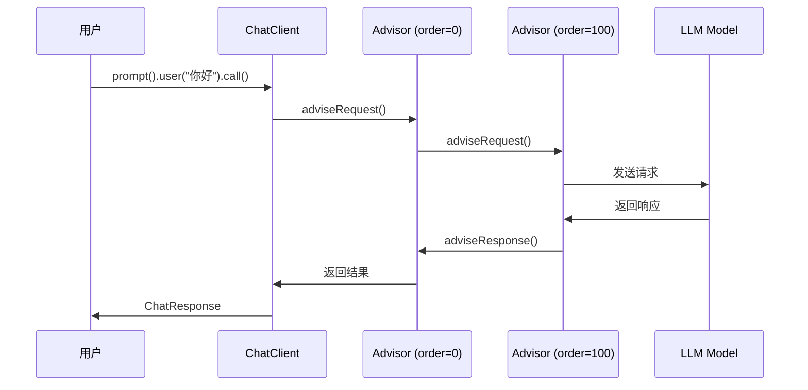

# Spring AI Advisor 使用指南与 ThinkingModel 问题解决方案

## 目录

- [一、Spring AI Advisor 核心概念](#一spring-ai-advisor-核心概念)
- [二、Advisor 使用方法](#二advisor-使用方法)
- [三、ThinkingModel 问题解决全过程](#三thinkingmodel-问题解决全过程)
- [四、技术原理深度解析](#四技术原理深度解析)
- [五、最佳实践与注意事项](#五最佳实践与注意事项)

---

## 一、Spring AI Advisor 核心概念

### 1.1 什么是 Advisor？

Advisor 是 Spring AI 提供的**拦截器模式**实现，允许在 LLM 调用前后执行自定义逻辑。

**核心接口**：
```java
public interface Advisor {
    String getName();               // Advisor 名称
    int getOrder();                 // 执行顺序（越小越先执行）

    // 请求前处理
    AdvisedRequest adviseRequest(AdvisedRequest request, Map<String, Object> context);

    // 响应后处理
    ChatResponse adviseResponse(ChatResponse response, Map<String, Object> context);
}
```

**常用基类**：`BaseAdvisor`（提供默认实现）

### 1.2 Advisor 的执行流程



### 1.3 内置 Advisor

| Advisor | 用途 | Order |
|---------|------|-------|
| **MessageChatMemoryAdvisor** | 管理对话历史 | 0 |
| **QuestionAnswerAdvisor** | RAG 检索增强 | 100 |
| **SimpleLoggerAdvisor** | 日志记录 | 200 |

---

## 二、Advisor 使用方法

### 2.1 使用内置 Advisor

#### 示例 1：对话历史管理

```java
@Configuration
public class ChatMemoryConfig {

    @Bean
    public ChatMemory chatMemory() {
        return new InMemoryChatMemory();
    }

    @Bean
    public MessageChatMemoryAdvisor memoryAdvisor(ChatMemory chatMemory) {
        return new MessageChatMemoryAdvisor(chatMemory);
    }
}
```

**使用方式**：
```java
chatClient.prompt()
    .user("你好，我是张三")
    .advisors(a -> a.param(ChatMemory.CONVERSATION_ID, "conv-123"))
    .call()
    .content();

// 第二次对话，带历史
chatClient.prompt()
    .user("我叫什么名字？")
    .advisors(a -> a.param(ChatMemory.CONVERSATION_ID, "conv-123"))
    .call()
    .content();
// 输出：你叫张三
```

#### 示例 2：RAG 检索增强

```java
@Bean
public QuestionAnswerAdvisor ragAdvisor(VectorStore vectorStore) {
    return new QuestionAnswerAdvisor(vectorStore, SearchRequest.defaults());
}
```

**使用方式**：
```java
chatClient.prompt()
    .user("公司的退款政策是什么？")
    .call()
    .content();
// Advisor 会自动检索 vectorStore 并注入上下文
```

### 2.2 自定义 Advisor

#### 场景：自动添加系统提示词

```java
@Component
public class SystemPromptAdvisor implements BaseAdvisor {

    @Override
    public String getName() {
        return "SystemPromptAdvisor";
    }

    @Override
    public int getOrder() {
        return 50;  // 在 Memory 之后，RAG 之前
    }

    @Override
    public AdvisedRequest adviseRequest(AdvisedRequest request, Map<String, Object> context) {
        // 从上下文获取参数
        String role = (String) context.get("user_role");

        if (role != null) {
            String systemPrompt = switch (role) {
                case "translator" -> "你是一个专业的翻译助手";
                case "coder" -> "你是一个资深的编程专家";
                default -> "你是一个有帮助的助手";
            };

            // 修改请求，添加系统提示词
            Prompt modifiedPrompt = request.prompt().mutate()
                .systemText(systemPrompt)
                .build();

            return AdvisedRequest.from(request).prompt(modifiedPrompt).build();
        }

        return request;
    }

    @Override
    public ChatResponse adviseResponse(ChatResponse response, Map<String, Object> context) {
        // 响应后处理（如果需要）
        return response;
    }
}
```

**使用方式**：
```java
chatClient.prompt()
    .user("翻译：Hello World")
    .advisors(a -> a.param("user_role", "translator"))
    .call()
    .content();
```

### 2.3 Advisor 管理策略

LLM Manager 采用**分层管理**策略：

#### 全局 Advisor（通过 AdvisorManager）

```java
@Component
public class AdvisorManager {
    private final List<Advisor> advisors = new ArrayList<>();

    public void registerAdvisor(Advisor advisor) {
        advisors.add(advisor);
    }

    public List<Advisor> getAllAdvisors() {
        return new ArrayList<>(advisors);
    }
}
```

**使用场景**：日志记录、监控统计等所有请求都需要的功能。

#### 条件 Advisor（按需添加）

```java
private ChatClient createChatClient(ChatRequest request, String conversationId) {
    List<Advisor> advisors = new ArrayList<>();

    // 只有需要历史时才添加
    if (conversationId != null && memoryAdvisor != null) {
        advisors.add(memoryAdvisor);
    }

    // 只有需要思考模式时才添加
    if (thinkingAdvisor != null && request.getThinkingMode() != null) {
        advisors.add(thinkingAdvisor);
    }

    return ChatClient.builder(chatModel)
        .defaultAdvisors(advisors.toArray(new Advisor[0]))
        .build();
}
```

**使用场景**：对话历史、思考模式等需要运行时参数的功能。

**设计理由**：
1. 条件是请求级别的，无法在全局注册时判断
2. 按需添加避免不必要的性能开销
3. 保持 AdvisorManager 简单，不耦合业务参数

---

## 三、ThinkingModel 问题解决全过程

### 3.1 问题背景

**需求**：支持豆包/火山引擎等国内模型的思考模式（Reasoning）

**API 要求**：`thinking` 参数必须在 JSON 根层级
```json
{
  "model": "doubao-pro",
  "temperature": 0.7,
  "thinking": {"type": "enabled"}  // ✅ 必须在根层级
}
```

**错误示例**：
```json
{
  "model": "doubao-pro",
  "extra_body": {                   // ❌ 被嵌套了
    "thinking": {"type": "enabled"}
  }
}
```

### 3.2 问题发现：尝试 1 - 使用 OpenAiChatOptions.extraBody

**尝试代码**：
```java
OpenAiChatOptions options = OpenAiChatOptions.builder()
    .model("doubao-pro")
    .temperature(0.7)
    .extraBody(Map.of("thinking", Map.of("type", "enabled")))
    .build();
```

**结果**：HTTP 请求中没有 `thinking` 参数（参数丢失）

**问题定位**：
1. 通过日志发现 `OpenAiChatOptions.extraBody` 有值
2. 但发送 HTTP 请求时 `thinking` 参数消失了

### 3.3 问题分析：定位丢失位置

#### 步骤 1：检查 Spring AI 源码

读取 `OpenAiChatModel.java` 源码，发现关键流程：

```java
// OpenAiChatModel.java:185-187
public ChatResponse internalCall(Prompt prompt, ...) {
    ChatCompletionRequest request = createRequest(prompt, false);
    // ↑ extraBody 在这里被丢弃
}

// OpenAiChatModel.java:630-631
ChatCompletionRequest createRequest(Prompt prompt, boolean stream) {
    ChatCompletionRequest request = new ChatCompletionRequest(...);

    OpenAiChatOptions requestOptions = (OpenAiChatOptions) prompt.getOptions();
    request = ModelOptionsUtils.merge(requestOptions, request, ChatCompletionRequest.class);
    // ↑ 问题根源！
}
```

#### 步骤 2：分析 ModelOptionsUtils.merge()

**merge 的逻辑**：
```java
public static <T> T merge(Object source, T target, Class<T> targetClass) {
    for (Field field : targetClass.getDeclaredFields()) {
        JsonProperty annotation = field.getAnnotation(JsonProperty.class);
        if (annotation != null) {  // ← 只处理有 @JsonProperty 的字段
            // 从 source 复制到 target
        }
        // 无注解的字段被忽略！
    }
    return target;
}
```

**检查 ChatCompletionRequest 定义**：
```java
public record ChatCompletionRequest(
    @JsonProperty("model") String model,           // ✅ 有注解
    @JsonProperty("temperature") Double temperature, // ✅ 有注解
    Map<String, Object> extraBody                    // ❌ 无注解，被过滤！
) {
    @JsonAnyGetter  // ← 注解在 getter 方法上
    public Map<String, Object> extraBody() {
        return this.extraBody;
    }
}
```

**问题根源确认**：
- `extraBody` 字段没有 `@JsonProperty` 注解
- `ModelOptionsUtils.merge()` 会过滤掉无注解的字段
- 即使 getter 方法有 `@JsonAnyGetter`，也没有机会生效（因为字段已经是 null）

### 3.4 解决方案演进

#### 尝试 2：使用拦截器（已废弃）

**思路**：在 HTTP 请求发送前拦截，手动修改 JSON

**实现**：
```java
public class ExtraBodyFlattenInterceptor implements ClientHttpRequestInterceptor {
    @Override
    public ClientHttpResponse intercept(HttpRequest request, byte[] body,
                                       ClientHttpRequestExecution execution) {
        // 解析 body JSON
        // 提取 extra_body 内容
        // 打平到根层级
        // 修改 body
        return execution.execute(request, modifiedBody);
    }
}
```

**问题**：
1. ❌ 需要修改 Spring AI 的 RestClient 配置
2. ❌ 侵入性强，违反 Spring AI 的设计
3. ❌ JSON 序列化/反序列化性能损耗

**结论**：方案被废弃

#### 尝试 3：Advisor + ThinkingChatModel（最终方案）

**核心思路**：
1. 在 `merge()` 之前提取 `thinking` 参数
2. 允许 `merge()` 丢弃 `extraBody`
3. 在 `merge()` 之后手动注入回去
4. 直接调用 `OpenAiApi`，让 `@JsonAnyGetter` 生效

**实现架构**：

```
┌─────────────────────┐
│  ThinkingAdvisor    │  数据转换器
│                     │  thinkingMode → extraBody
└─────────┬───────────┘
          ↓
┌─────────────────────┐
│ ThinkingChatModel   │  核心方案
│                     │  在 merge 前提取
│                     │  在 merge 后恢复
└─────────┬───────────┘
          ↓
┌─────────────────────┐
│    OpenAiApi        │  @JsonAnyGetter 打平
└─────────────────────┘
```

### 3.5 最终实现

#### 组件 1：ThinkingAdvisor（数据转换器）

```java
@Component
public class ThinkingAdvisor implements BaseAdvisor {

    public static final String THINKING_MODE = "thinking_mode";
    public static final String REASONING_FORMAT = "reasoning_format";

    @Override
    public int getOrder() {
        return 100;  // 在 Memory 之后
    }

    @Override
    public ChatClientRequest before(ChatClientRequest request, AdvisorChain chain) {
        // 1. 从上下文获取参数
        String thinkingMode = getContextParam(request, THINKING_MODE, String.class);
        String formatStr = getContextParam(request, REASONING_FORMAT, String.class);

        if (thinkingMode == null || "auto".equalsIgnoreCase(thinkingMode)) {
            return request;
        }

        // 2. 解析格式（DOUBAO/OPENAI/DEEPSEEK）
        ReasoningFormat format = parseFormat(formatStr, ...);

        // 3. 构建 OpenAiChatOptions.extraBody
        OpenAiChatOptions newOptions = buildOpenAiOptionsWithExtraBody(
            originalOptions, thinkingMode, format
        );

        // 4. 替换 ChatOptions
        Prompt modifiedPrompt = originalPrompt.mutate()
            .chatOptions(newOptions)
            .build();

        return ChatClientRequest.builder()
            .prompt(modifiedPrompt)
            .context(request.context())
            .build();
    }

    private OpenAiChatOptions buildOpenAiOptionsWithExtraBody(...) {
        Map<String, Object> extraBody = new HashMap<>();

        switch (format) {
            case DOUBAO -> {
                // {"thinking": {"type": "enabled"}}
                extraBody.put("thinking", Map.of("type", thinkingMode));
            }
            case OPENAI -> {
                // {"reasoning_effort": "medium"}
                extraBody.put("reasoning_effort", thinkingMode);
            }
            case DEEPSEEK -> {
                // DeepSeek R1 自动启用，无需参数
            }
        }

        return OpenAiChatOptions.builder()
            .model(originalOptions.getModel())
            .temperature(originalOptions.getTemperature())
            .extraBody(extraBody)
            .build();
    }
}
```

**职责**：
- ✅ 从 Advisor 上下文读取 `thinkingMode` 和 `reasoningFormat`
- ✅ 根据不同格式构建 `extraBody`（DOUBAO/OPENAI/DEEPSEEK）
- ✅ 将 `extraBody` 设置到 `OpenAiChatOptions`

#### 组件 2：ThinkingChatModel（核心绕过方案）

```java
@Slf4j
public class ThinkingChatModel implements ChatModel {

    private final OpenAiChatModel delegate;
    private final OpenAiApi openAiApi;
    private final Method createRequestMethod;

    public ThinkingChatModel(OpenAiChatModel delegate) {
        this.delegate = delegate;
        this.openAiApi = extractOpenAiApi(delegate);      // 反射提取
        this.createRequestMethod = getCreateRequestMethod(); // 反射获取
    }

    @Override
    public ChatResponse call(Prompt prompt) {
        // 步骤 1：提取 thinking 参数（在 merge 之前）
        Map<String, Object> thinkingParams = extractThinkingParams(prompt);

        if (thinkingParams == null || thinkingParams.isEmpty()) {
            return delegate.call(prompt);  // 无 thinking，走原生流程
        }

        try {
            // 步骤 2：反射调用 createRequest（允许 merge 丢失 extraBody）
            ChatCompletionRequest request = invokeCreateRequest(prompt, false);

            // 步骤 3：手动注入 thinking 到 extraBody（恢复！）
            ChatCompletionRequest modifiedRequest = injectThinkingParams(request, thinkingParams);

            // 步骤 4：直接调用 OpenAiApi（绕过 Spring AI 的 call()）
            var response = openAiApi.chatCompletionEntity(modifiedRequest);

            return convertToChatResponse(response.getBody());
        } catch (Exception e) {
            log.error("处理 thinking 参数失败，回退到默认实现", e);
            return delegate.call(prompt);
        }
    }

    @Override
    public Flux<ChatResponse> stream(Prompt prompt) {
        // 流式实现，逻辑同上
        Map<String, Object> thinkingParams = extractThinkingParams(prompt);

        if (thinkingParams == null || thinkingParams.isEmpty()) {
            return delegate.stream(prompt);
        }

        try {
            ChatCompletionRequest request = invokeCreateRequest(prompt, true);
            ChatCompletionRequest modifiedRequest = injectThinkingParams(request, thinkingParams);

            return openAiApi.chatCompletionStream(modifiedRequest)
                .map(this::convertChunkToChatResponse);
        } catch (Exception e) {
            return delegate.stream(prompt);
        }
    }

    // ==================== 核心方法 ====================

    /**
     * 提取 thinking 参数（从 OpenAiChatOptions.extraBody）
     */
    private Map<String, Object> extractThinkingParams(Prompt prompt) {
        if (prompt.getOptions() instanceof OpenAiChatOptions openAiOptions) {
            Map<String, Object> extraBody = openAiOptions.getExtraBody();
            if (extraBody != null &&
                (extraBody.containsKey("thinking") || extraBody.containsKey("reasoning_effort"))) {
                return extraBody;
            }
        }
        return null;
    }

    /**
     * 通过反射调用 createRequest
     */
    private ChatCompletionRequest invokeCreateRequest(Prompt prompt, boolean stream) throws Exception {
        return (ChatCompletionRequest) createRequestMethod.invoke(delegate, prompt, stream);
    }

    /**
     * 手动注入 thinking 参数到 ChatCompletionRequest.extraBody
     */
    private ChatCompletionRequest injectThinkingParams(
            ChatCompletionRequest request, Map<String, Object> thinkingParams) {
        // ChatCompletionRequest.extraBody 是 mutable HashMap
        Map<String, Object> extraBody = request.extraBody();
        extraBody.putAll(thinkingParams);  // ← 直接注入！

        log.info("已注入 thinking 参数到 extraBody: {}", extraBody);
        return request;
    }

    /**
     * 反射提取 OpenAiApi
     */
    private OpenAiApi extractOpenAiApi(OpenAiChatModel model) {
        try {
            Field field = OpenAiChatModel.class.getDeclaredField("openAiApi");
            field.setAccessible(true);
            return (OpenAiApi) field.get(model);
        } catch (Exception e) {
            throw new IllegalStateException("无法提取 OpenAiApi", e);
        }
    }

    /**
     * 获取 createRequest 方法
     */
    private Method getCreateRequestMethod() {
        try {
            Method method = OpenAiChatModel.class.getDeclaredMethod(
                "createRequest", Prompt.class, boolean.class
            );
            method.setAccessible(true);
            return method;
        } catch (Exception e) {
            throw new IllegalStateException("无法获取 createRequest 方法", e);
        }
    }
}
```

**职责**：
- ✅ 在 `merge()` 前提取 `thinking` 参数
- ✅ 调用 `createRequest()` 让 Spring AI 正常处理（extraBody 会丢失）
- ✅ 在 `merge()` 后手动注入 `thinking` 到 `extraBody`
- ✅ 直接调用 `OpenAiApi`，让 `@JsonAnyGetter` 生效

#### 组件 3：LlmChatAgent 集成

```java
@Component
public class LlmChatAgent {

    @Resource
    private ThinkingAdvisor thinkingAdvisor;

    /**
     * 创建 ChatClient（按需添加 Advisor）
     */
    private ChatClient createChatClient(ChatRequest request, String conversationId) {
        ChatModel chatModel = getOrCreateChatModel(request);

        List<Advisor> advisors = new ArrayList<>();

        // 1. MemoryAdvisor（需要 conversationId）
        if (conversationId != null && memoryAdvisor != null) {
            advisors.add(memoryAdvisor);
        }

        // 2. ThinkingAdvisor（需要 thinkingMode）
        if (thinkingAdvisor != null && request.getThinkingMode() != null
                && !"auto".equalsIgnoreCase(request.getThinkingMode())) {
            advisors.add(thinkingAdvisor);
        }

        return ChatClient.builder(chatModel)
            .defaultAdvisors(advisors.toArray(new Advisor[0]))
            .build();
    }

    /**
     * 获取或创建 ChatModel（使用 ThinkingChatModel 包装）
     */
    private ChatModel getOrCreateChatModel(ChatRequest request) {
        return chatModelCache.computeIfAbsent(cacheKey, k -> {
            OpenAiApi openAiApi = OpenAiApi.builder()
                .baseUrl(request.getBaseUrl())
                .apiKey(request.getApiKey())
                .build();

            OpenAiChatModel baseModel = OpenAiChatModel.builder()
                .openAiApi(openAiApi)
                .build();

            // 使用 ThinkingChatModel 包装
            return new ThinkingChatModel(baseModel);
        });
    }

    /**
     * 流式对话（传递 Advisor 参数）
     */
    public Flux<ChatResponse> stream(ChatRequest request, String conversationId) {
        ChatClient chatClient = createChatClient(request, conversationId);

        return chatClient.prompt()
            .user(request.getUserMessage())
            .advisors(advisor -> {
                // Memory Advisor 参数
                if (conversationId != null) {
                    advisor.param(ChatMemory.CONVERSATION_ID, conversationId);
                }
                // Thinking Advisor 参数
                if (request.getThinkingMode() != null) {
                    advisor.param(ThinkingAdvisor.THINKING_MODE, request.getThinkingMode());
                    if (request.getReasoningFormat() != null) {
                        advisor.param(ThinkingAdvisor.REASONING_FORMAT,
                                     request.getReasoningFormat().name());
                    }
                }
            })
            .stream()
            .chatResponse();
    }
}
```

### 3.6 完整数据流

```
Controller 传入 ChatRequest
    ├─ thinkingMode: "enabled"
    └─ reasoningFormat: DOUBAO
        ↓
LlmChatAgent.stream()
    ├─ createChatClient() - 添加 ThinkingAdvisor
    └─ advisors(a -> a.param("thinking_mode", "enabled"))
        ↓
ThinkingAdvisor.before()
    ├─ 从上下文读取 "thinking_mode"
    ├─ 构建 extraBody = {"thinking": {"type": "enabled"}}
    └─ 设置到 OpenAiChatOptions.extraBody
        ↓
ThinkingChatModel.stream()
    ├─ extractThinkingParams() - 提取 extraBody
    ├─ invokeCreateRequest() - 调用 Spring AI（merge 丢弃 extraBody）
    ├─ injectThinkingParams() - 手动恢复 extraBody
    └─ openAiApi.chatCompletionStream()
        ↓
OpenAiApi 序列化
    ├─ ChatCompletionRequest.extraBody() 有 @JsonAnyGetter
    ├─ Jackson 调用 getter 方法
    └─ 将 extraBody 打平到 JSON 根层级
        ↓
HTTP 请求 JSON
{
  "model": "doubao-pro",
  "temperature": 0.7,
  "messages": [...],
  "thinking": {"type": "enabled"}  // ✅ 成功出现在根层级
}
```

### 3.7 验证测试

#### 测试代码

```java
@Test
public void testThinkingMode() {
    ChatRequest request = ChatRequest.builder()
        .apiKey("your-api-key")
        .baseUrl("https://ark.cn-beijing.volces.com/api/v3")
        .modelIdentifier("doubao-pro")
        .thinkingMode("enabled")
        .reasoningFormat(ChatRequest.ReasoningFormat.DOUBAO)
        .userMessage("解释量子纠缠现象")
        .build();

    Flux<ChatResponse> stream = llmChatAgent.stream(request, null);

    stream.subscribe(
        response -> {
            String reasoning = response.getMetadata().get("reasoningContent");
            String content = response.getResult().getOutput().getText();

            if (reasoning != null) {
                System.out.println("[思考] " + reasoning);
            }
            if (content != null) {
                System.out.println("[回答] " + content);
            }
        }
    );
}
```

#### 日志输出

```
[ThinkingAdvisor] 检测到 thinking 参数: {thinking={type=enabled}}
[ThinkingAdvisor] 已注入 thinking 参数到 extraBody
[ThinkingChatModel] 最终 HTTP 请求体:
{
  "model": "doubao-pro",
  "temperature": 0.7,
  "messages": [
    {"role": "user", "content": "解释量子纠缠现象"}
  ],
  "thinking": {
    "type": "enabled"
  }
}
[思考] 首先，我需要理解量子纠缠的基本概念...
[思考] 从量子力学的角度来看...
[回答] 量子纠缠是指两个或多个粒子...
```

### 3.8 解决方案总结

| 组件 | 职责 | 关键代码 |
|------|------|---------|
| **ThinkingAdvisor** | 数据转换器：`thinkingMode` → `extraBody` | `buildOpenAiOptionsWithExtraBody()` |
| **ThinkingChatModel** | 核心方案：在 merge 前提取、merge 后恢复 | `injectThinkingParams()` |
| **LlmChatAgent** | 集成协调：按需添加 Advisor、传递参数 | `createChatClient()` |

**为什么需要两个组件？**

1. **ThinkingAdvisor**：
   - 遵循 Spring AI 的 Advisor 设计模式
   - 支持不同格式（DOUBAO/OPENAI/DEEPSEEK）
   - 可以通过 Advisor 上下文传递参数

2. **ThinkingChatModel**：
   - 绕过 Spring AI 的 `ModelOptionsUtils.merge()` 限制
   - 在 merge 丢失后手动恢复 extraBody
   - 让 `@JsonAnyGetter` 有机会生效

**核心技巧**：
- 利用 `ChatCompletionRequest.extraBody` 是 mutable HashMap
- 通过反射在 merge 后修改 extraBody
- 直接调用 `OpenAiApi`，绕过 Spring AI 的后续处理

---

## 四、技术原理深度解析

### 4.1 为什么 Spring AI 会丢弃 extraBody？

**设计矛盾**：

| 需求 | 解决方案 | 副作用 |
|------|---------|--------|
| merge 时复制字段 | 字段需要 `@JsonProperty` | extraBody 无注解，被过滤 |
| 序列化时打平 Map | getter 需要 `@JsonAnyGetter` | merge 时无法识别 |

**Spring AI 的选择**：
- `extraBody` 字段：无 `@JsonProperty` 注解（避免序列化时嵌套）
- `extraBody()` getter：有 `@JsonAnyGetter` 注解（序列化时打平）
- **代价**：merge 时会被过滤掉

### 4.2 @JsonAnyGetter 的工作原理

**定义位置**：
```java
public record ChatCompletionRequest(..., Map<String, Object> extraBody) {
    @JsonAnyGetter  // ← 在 getter 方法上
    public Map<String, Object> extraBody() {
        return this.extraBody;
    }
}
```

**Jackson 序列化流程**：

```java
// 1. 遍历所有字段和方法
for (Method method : clazz.getMethods()) {
    if (method.isAnnotationPresent(JsonAnyGetter.class)) {
        // 2. 调用方法获取 Map
        Map<String, Object> extraProps = (Map) method.invoke(obj);

        // 3. 将 Map 的内容打平到 JSON 根层级
        for (Map.Entry<String, Object> entry : extraProps.entrySet()) {
            jsonGenerator.writeFieldName(entry.getKey());
            jsonGenerator.writeObject(entry.getValue());
        }
    }
}
```

**最终效果**：
```java
ChatCompletionRequest request = new ChatCompletionRequest(
    "doubao-pro",
    Map.of("thinking", Map.of("type", "enabled"))
);

// 序列化后：
{
  "model": "doubao-pro",
  "thinking": {"type": "enabled"}  // ← Map 的内容被打平
}
```

### 4.3 反射的必要性

**为什么需要反射？**

1. **createRequest 方法是 package-private**：
   ```java
   ChatCompletionRequest createRequest(Prompt prompt, boolean stream) {
       // 外部无法直接调用
   }
   ```

2. **openAiApi 字段是 private**：
   ```java
   private final OpenAiApi openAiApi;
   ```

3. **我们需要的操作**：
   - 调用 `createRequest()` 获取 request
   - 修改 request.extraBody
   - 调用 `openAiApi.chatCompletionStream(request)`

**反射实现**：
```java
// 获取 createRequest 方法
Method method = OpenAiChatModel.class.getDeclaredMethod(
    "createRequest", Prompt.class, boolean.class
);
method.setAccessible(true);

// 提取 openAiApi 字段
Field field = OpenAiChatModel.class.getDeclaredField("openAiApi");
field.setAccessible(true);
OpenAiApi openAiApi = (OpenAiApi) field.get(model);

// 调用
ChatCompletionRequest request = (ChatCompletionRequest) method.invoke(model, prompt, true);
openAiApi.chatCompletionStream(request);
```

### 4.4 为什么不能直接修改 Spring AI？

**方案 1**：给 extraBody 字段加 `@JsonProperty`

```java
public record ChatCompletionRequest(
    @JsonProperty("model") String model,
    @JsonProperty("extra_body") Map<String, Object> extraBody  // ← 加注解
) { ... }
```

**问题**：序列化时会嵌套
```json
{
  "model": "doubao-pro",
  "extra_body": {           // ❌ 被嵌套了
    "thinking": {"type": "enabled"}
  }
}
```

**方案 2**：修改 ModelOptionsUtils.merge()

```java
// 特殊处理 extraBody
if (field.getName().equals("extraBody")) {
    // 手动复制
}
```

**问题**：
- 需要修改 Spring AI 源码
- 破坏了通用性
- 不适合作为第三方库

**结论**：只能通过包装器绕过

---

## 五、最佳实践与注意事项

### 5.1 Advisor 使用最佳实践

#### 1. 合理设置 Order

```java
@Override
public int getOrder() {
    // 0-100: 预处理（Memory, Logging）
    // 100-200: 数据增强（RAG, Thinking）
    // 200+: 后处理（Metrics, Cleanup）
    return 100;
}
```

#### 2. 避免在 Advisor 中执行重操作

❌ **错误示例**：
```java
@Override
public AdvisedRequest adviseRequest(AdvisedRequest request, Map<String, Object> context) {
    // 不要在这里执行数据库查询
    List<Document> docs = vectorStore.similaritySearch(query, 10);  // 阻塞！
    return request;
}
```

✅ **正确做法**：
```java
@Override
public AdvisedRequest adviseRequest(AdvisedRequest request, Map<String, Object> context) {
    // 使用懒加载或异步查询
    context.put("query", query);  // 只传递参数，实际查询由 RAG Advisor 处理
    return request;
}
```

#### 3. 谨慎修改 Prompt

```java
// 使用 mutate() 而不是创建新对象
Prompt modifiedPrompt = request.prompt().mutate()
    .systemText("新的系统提示词")
    .build();
```

### 5.2 ThinkingModel 使用注意事项

#### 1. 支持的模型

| 模型 | 格式 | 参数 |
|------|------|------|
| 豆包/火山引擎 | DOUBAO | `{"thinking": {"type": "enabled"}}` |
| OpenAI o1/o3 | OPENAI | `{"reasoning_effort": "medium"}` |
| DeepSeek R1 | DEEPSEEK | 无需参数，自动启用 |

#### 2. 性能考虑

- ThinkingChatModel 使用反射，有一定性能开销
- 建议缓存 ChatModel 实例：
  ```java
  private static final Map<String, ChatModel> chatModelCache = new ConcurrentHashMap<>();
  ```

#### 3. 错误处理

```java
try {
    return injectThinkingParams(request, thinkingParams);
} catch (Exception e) {
    log.error("处理 thinking 参数失败，回退到默认实现", e);
    return delegate.call(prompt);  // 降级处理
}
```

### 5.3 常见问题排查

#### 问题 1：thinking 参数没有生效

**检查清单**：
1. ✅ `thinkingMode` 是否传入且不为 "auto"
2. ✅ `ThinkingAdvisor` 是否添加到 Advisor 列表
3. ✅ `ThinkingChatModel` 是否包装了 `OpenAiChatModel`
4. ✅ Advisor 参数是否正确传递

**日志验证**：
```
[ThinkingAdvisor] 检测到 thinking 参数: {thinking={type=enabled}}
[ThinkingChatModel] 已注入 thinking 参数到 extraBody: {thinking={type=enabled}}
```

#### 问题 2：反射调用失败

**可能原因**：
- Spring AI 版本不兼容（测试版本：1.1.0）
- `createRequest` 方法签名变化

**解决方案**：
```java
try {
    Method method = OpenAiChatModel.class.getDeclaredMethod(
        "createRequest", Prompt.class, boolean.class
    );
} catch (NoSuchMethodException e) {
    // 尝试其他签名
    log.warn("createRequest 方法签名可能变化，尝试备用方案");
}
```

#### 问题 3：extraBody 被覆盖

**原因**：多个 Advisor 同时修改 extraBody

**解决方案**：
```java
// 复制现有 extraBody 再添加新参数
Map<String, Object> extraBody = new HashMap<>();
if (originalOptions.getExtraBody() != null) {
    extraBody.putAll(originalOptions.getExtraBody());
}
extraBody.put("thinking", Map.of("type", "enabled"));
```

### 5.4 监控与日志

#### 启用详细日志

```yaml
logging:
  level:
    com.llmmanager.agent.advisor: DEBUG
    com.llmmanager.agent.model: DEBUG
```

#### 关键日志点

```java
log.info("[ThinkingAdvisor] 检测到 thinking 参数: {}", thinkingParams);
log.info("[ThinkingChatModel] 已注入 thinking 参数到 extraBody: {}", extraBody);
log.info("[ThinkingChatModel] 最终 HTTP 请求体:\n{}", json);
```

---

## 总结

### 核心要点

1. **Advisor 是 Spring AI 的拦截器模式**，用于请求前后处理
2. **条件 Advisor 按需添加**，避免性能损耗
3. **Spring AI 的 merge() 会丢弃 extraBody**（无 `@JsonProperty` 注解）
4. **ThinkingChatModel 通过反射绕过限制**，在 merge 后手动恢复
5. **@JsonAnyGetter 在 getter 方法上**，序列化时打平 Map

### 技术亮点

- ✅ 遵循 Spring AI 设计模式（Advisor）
- ✅ 最小侵入性（无需修改 Spring AI 源码）
- ✅ 优雅降级（反射失败时回退到默认实现）
- ✅ 支持多种格式（DOUBAO/OPENAI/DEEPSEEK）
- ✅ 性能优化（ChatModel 缓存、按需启用）

### 参考资料

- [Spring AI Documentation](https://docs.spring.io/spring-ai/reference/)
- [Spring AI Advisor API](https://docs.spring.io/spring-ai/reference/api/advisors.html)
- [Jackson @JsonAnyGetter](https://github.com/FasterXML/jackson-annotations)
- [豆包 API 文档](https://www.volcengine.com/docs/82379/1263279)
- [OpenAI o1 API](https://platform.openai.com/docs/guides/reasoning)

---

**文档版本**：v1.0
**最后更新**：2025-12-04
**作者**：LLM Manager Team
**使用模型**：claude-sonnet-4-5-20250929
