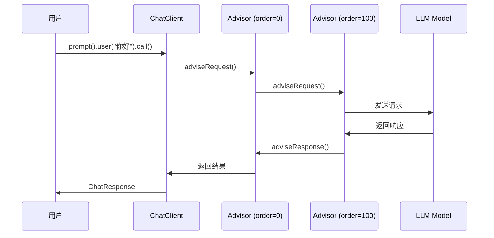

# Spring AI Advisor 使用指南与 ThinkingModel 问题解决方案

## 目录

- [一、Spring AI Advisor 核心概念](#一spring-ai-advisor-核心概念)
- [二、Advisor 使用方法](#二advisor-使用方法)
- [三、ThinkingModel 问题解决全过程](#三thinkingmodel-问题解决全过程)
- [四、技术原理深度解析](#四技术原理深度解析)
- [五、最佳实践与注意事项](#五最佳实践与注意事项)

---

## 一、Spring AI Advisor 核心概念

### 1.1 什么是 Advisor？

Advisor 是 Spring AI 提供的**拦截器模式**实现，允许在 LLM 调用前后执行自定义逻辑。

**核心接口**：
```java
public interface Advisor {
    String getName();               // Advisor 名称
    int getOrder();                 // 执行顺序（越小越先执行）

    // 请求前处理
    AdvisedRequest adviseRequest(AdvisedRequest request, Map<String, Object> context);

    // 响应后处理
    ChatResponse adviseResponse(ChatResponse response, Map<String, Object> context);
}
```

**常用基类**：`BaseAdvisor`（提供默认实现）

### 1.2 Advisor 的执行流程



### 1.3 内置 Advisor

| Advisor | 用途 | Order |
|---------|------|-------|
| **MessageChatMemoryAdvisor** | 管理对话历史 | 0 |
| **QuestionAnswerAdvisor** | RAG 检索增强 | 100 |
| **SimpleLoggerAdvisor** | 日志记录 | 200 |

---

## 二、Advisor 使用方法

### 2.1 使用内置 Advisor

#### 示例 1：对话历史管理

```java
@Configuration
public class ChatMemoryConfig {

    @Bean
    public ChatMemory chatMemory() {
        return new InMemoryChatMemory();
    }

    @Bean
    public MessageChatMemoryAdvisor memoryAdvisor(ChatMemory chatMemory) {
        return new MessageChatMemoryAdvisor(chatMemory);
    }
}
```

**使用方式**：
```java
chatClient.prompt()
    .user("你好，我是张三")
    .advisors(a -> a.param(ChatMemory.CONVERSATION_ID, "conv-123"))
    .call()
    .content();

// 第二次对话，带历史
chatClient.prompt()
    .user("我叫什么名字？")
    .advisors(a -> a.param(ChatMemory.CONVERSATION_ID, "conv-123"))
    .call()
    .content();
// 输出：你叫张三
```

#### 示例 2：RAG 检索增强

```java
@Bean
public QuestionAnswerAdvisor ragAdvisor(VectorStore vectorStore) {
    return new QuestionAnswerAdvisor(vectorStore, SearchRequest.defaults());
}
```

**使用方式**：
```java
chatClient.prompt()
    .user("公司的退款政策是什么？")
    .call()
    .content();
// Advisor 会自动检索 vectorStore 并注入上下文
```

### 2.2 自定义 Advisor

#### 场景：自动添加系统提示词

```java
@Component
public class SystemPromptAdvisor implements BaseAdvisor {

    @Override
    public String getName() {
        return "SystemPromptAdvisor";
    }

    @Override
    public int getOrder() {
        return 50;  // 在 Memory 之后，RAG 之前
    }

    @Override
    public AdvisedRequest adviseRequest(AdvisedRequest request, Map<String, Object> context) {
        // 从上下文获取参数
        String role = (String) context.get("user_role");

        if (role != null) {
            String systemPrompt = switch (role) {
                case "translator" -> "你是一个专业的翻译助手";
                case "coder" -> "你是一个资深的编程专家";
                default -> "你是一个有帮助的助手";
            };

            // 修改请求，添加系统提示词
            Prompt modifiedPrompt = request.prompt().mutate()
                .systemText(systemPrompt)
                .build();

            return AdvisedRequest.from(request).prompt(modifiedPrompt).build();
        }

        return request;
    }

    @Override
    public ChatResponse adviseResponse(ChatResponse response, Map<String, Object> context) {
        // 响应后处理（如果需要）
        return response;
    }
}
```

**使用方式**：
```java
chatClient.prompt()
    .user("翻译：Hello World")
    .advisors(a -> a.param("user_role", "translator"))
    .call()
    .content();
```

### 2.3 Advisor 管理策略

LLM Manager 采用**分层管理**策略：

#### 全局 Advisor（通过 AdvisorManager）

```java
@Component
public class AdvisorManager {
    private final List<Advisor> advisors = new ArrayList<>();

    public void registerAdvisor(Advisor advisor) {
        advisors.add(advisor);
    }

    public List<Advisor> getAllAdvisors() {
        return new ArrayList<>(advisors);
    }
}
```

**使用场景**：日志记录、监控统计等所有请求都需要的功能。

#### 条件 Advisor（按需添加）

```java
private ChatClient createChatClient(ChatRequest request, String conversationId) {
    List<Advisor> advisors = new ArrayList<>();

    // 只有需要历史时才添加
    if (conversationId != null && memoryAdvisor != null) {
        advisors.add(memoryAdvisor);
    }

    // 只有需要思考模式时才添加
    if (thinkingAdvisor != null && request.getThinkingMode() != null) {
        advisors.add(thinkingAdvisor);
    }

    return ChatClient.builder(chatModel)
        .defaultAdvisors(advisors.toArray(new Advisor[0]))
        .build();
}
```

**使用场景**：对话历史、思考模式等需要运行时参数的功能。

**设计理由**：
1. 条件是请求级别的，无法在全局注册时判断
2. 按需添加避免不必要的性能开销
3. 保持 AdvisorManager 简单，不耦合业务参数

---

## 三、ThinkingModel 问题解决全过程

### 3.1 问题背景

**需求**：支持豆包/火山引擎等国内模型的思考模式（Reasoning）

**API 要求**：`thinking` 参数必须在 JSON 根层级
```json
{
  "model": "doubao-pro",
  "temperature": 0.7,
  "thinking": {"type": "enabled"}  // ✅ 必须在根层级
}
```

**错误示例**：
```json
{
  "model": "doubao-pro",
  "extra_body": {                   // ❌ 被嵌套了
    "thinking": {"type": "enabled"}
  }
}
```

### 3.2 问题发现：尝试 1 - 使用 OpenAiChatOptions.extraBody

**尝试代码**：
```java
OpenAiChatOptions options = OpenAiChatOptions.builder()
    .model("doubao-pro")
    .temperature(0.7)
    .extraBody(Map.of("thinking", Map.of("type", "enabled")))
    .build();
```

**结果**：HTTP 请求中没有 `thinking` 参数（参数丢失）

**问题定位**：
1. 通过日志发现 `OpenAiChatOptions.extraBody` 有值
2. 但发送 HTTP 请求时 `thinking` 参数消失了

### 3.3 问题分析：定位丢失位置

#### 步骤 1：检查 Spring AI 源码

读取 `OpenAiChatModel.java` 源码，发现关键流程：

```java
// OpenAiChatModel.java:185-187
public ChatResponse internalCall(Prompt prompt, ...) {
    ChatCompletionRequest request = createRequest(prompt, false);
    // ↑ extraBody 在这里被丢弃
}

// OpenAiChatModel.java:630-631
ChatCompletionRequest createRequest(Prompt prompt, boolean stream) {
    ChatCompletionRequest request = new ChatCompletionRequest(...);

    OpenAiChatOptions requestOptions = (OpenAiChatOptions) prompt.getOptions();
    request = ModelOptionsUtils.merge(requestOptions, request, ChatCompletionRequest.class);
    // ↑ 问题根源！
}
```

#### 步骤 2：分析 ModelOptionsUtils.merge()

**merge 的逻辑**：
```java
public static <T> T merge(Object source, T target, Class<T> targetClass) {
    for (Field field : targetClass.getDeclaredFields()) {
        JsonProperty annotation = field.getAnnotation(JsonProperty.class);
        if (annotation != null) {  // ← 只处理有 @JsonProperty 的字段
            // 从 source 复制到 target
        }
        // 无注解的字段被忽略！
    }
    return target;
}
```

**检查 ChatCompletionRequest 定义**：
```java
public record ChatCompletionRequest(
    @JsonProperty("model") String model,           // ✅ 有注解
    @JsonProperty("temperature") Double temperature, // ✅ 有注解
    Map<String, Object> extraBody                    // ❌ 无注解，被过滤！
) {
    @JsonAnyGetter  // ← 注解在 getter 方法上
    public Map<String, Object> extraBody() {
        return this.extraBody;
    }
}
```

**问题根源确认**：
- `extraBody` 字段没有 `@JsonProperty` 注解
- `ModelOptionsUtils.merge()` 会过滤掉无注解的字段
- 即使 getter 方法有 `@JsonAnyGetter`，也没有机会生效（因为字段已经是 null）

### 3.4 解决方案演进

#### 尝试 2：使用拦截器（已废弃）

**思路**：在 HTTP 请求发送前拦截，手动修改 JSON

**实现**：
```java
public class ExtraBodyFlattenInterceptor implements ClientHttpRequestInterceptor {
    @Override
    public ClientHttpResponse intercept(HttpRequest request, byte[] body,
                                       ClientHttpRequestExecution execution) {
        // 解析 body JSON
        // 提取 extra_body 内容
        // 打平到根层级
        // 修改 body
        return execution.execute(request, modifiedBody);
    }
}
```

**问题**：
1. ❌ 需要修改 Spring AI 的 RestClient 配置
2. ❌ 侵入性强，违反 Spring AI 的设计
3. ❌ JSON 序列化/反序列化性能损耗

**结论**：方案被废弃

#### 尝试 3：Advisor + ThinkingChatModel（已废弃）

**思路**：使用 ThinkingChatModel 包装 OpenAiChatModel，通过反射在 merge 后恢复 extraBody

**问题**：
1. ❌ 过于复杂，需要反射调用 `createRequest()` 和 `openAiApi`
2. ❌ 直接调用 `openAiApi.chatCompletionStream()` 绕过了 Spring AI 的工具调用逻辑
3. ❌ 导致 `enableTools=true` 时工具无法被调用
4. ❌ 需要维护 ThinkingContext ThreadLocal

**结论**：方案被废弃（2025-12-25）

#### 最终方案：Advisor + ThinkingAwareOpenAiApi（metadata 传递）

**核心思路**：
1. `metadata` 在 Spring AI 的 `merge()` 过程中会被保留（不像 `extraBody` 会丢失）
2. ThinkingAdvisor 将 thinking 参数放入 `OpenAiChatOptions.metadata`
3. ThinkingAwareOpenAiApi 在 HTTP 请求发送前从 `chatRequest.metadata()` 读取并展开到 `extraBody`
4. 不再需要 ThinkingChatModel 包装器，直接使用 OpenAiChatModel

**参考**：https://github.com/spring-projects/spring-ai/issues/4879

**实现架构**：

```
┌─────────────────────┐
│  ThinkingAdvisor    │  数据转换器
│                     │  thinkingMode → metadata
└─────────┬───────────┘
          ↓
┌─────────────────────┐
│  OpenAiChatModel    │  Spring AI 原生模型
│                     │  正常执行（含工具调用）
└─────────┬───────────┘
          ↓
┌─────────────────────┐
│ThinkingAwareOpenAiApi│ 核心方案
│                     │  从 metadata 读取
│                     │  展开到 extraBody
└─────────┬───────────┘
          ↓
┌─────────────────────┐
│  HTTP 请求          │  @JsonAnyGetter 打平
└─────────────────────┘
```

**关键优势**：
1. ✅ 不绕过 Spring AI 的工具调用逻辑
2. ✅ 代码简洁，无需反射
3. ✅ 工具调用和 thinking 参数可以同时生效

### 3.5 最终实现

#### 组件 1：ThinkingAdvisor（数据转换器 - metadata 方案）

**核心变更**：将 thinking 参数放入 `metadata` 而不是 `extraBody`，因为 `metadata` 在 Spring AI 的 merge 过程中会被保留。

```java
@Slf4j
@Component
public class ThinkingAdvisor implements BaseAdvisor {

    public static final String THINKING_MODE = "thinking_mode";
    public static final String REASONING_FORMAT = "reasoning_format";

    @Override
    public int getOrder() {
        return 100;  // 在 Memory 之后
    }

    @Override
    public ChatClientRequest before(ChatClientRequest request, AdvisorChain chain) {
        // 1. 从上下文获取参数
        String thinkingMode = getContextParam(request, THINKING_MODE, String.class);
        String formatStr = getContextParam(request, REASONING_FORMAT, String.class);

        if (thinkingMode == null || "auto".equalsIgnoreCase(thinkingMode)) {
            return request;
        }

        // 2. 解析格式（DOUBAO/OPENAI/DEEPSEEK）
        ReasoningFormat format = parseFormat(formatStr, originalOptions);

        // 3. 构建带 metadata 的 OpenAiChatOptions（关键变更！）
        OpenAiChatOptions newOptions = buildOpenAiOptionsWithMetadata(
            originalOptions, thinkingMode, format
        );

        // 4. 替换 ChatOptions
        Prompt modifiedPrompt = originalPrompt.mutate()
            .chatOptions(newOptions)
            .build();

        return ChatClientRequest.builder()
            .prompt(modifiedPrompt)
            .context(request.context())
            .build();
    }

    /**
     * 构建带 metadata 的 OpenAiChatOptions
     *
     * 关键：将 thinking 参数放入 metadata，而不是 extraBody
     * 因为 metadata 在 Spring AI 的 merge 过程中会被保留
     * ThinkingAwareOpenAiApi 会在 HTTP 层面将 metadata 展开到 extraBody
     */
    private OpenAiChatOptions buildOpenAiOptionsWithMetadata(
            ChatOptions originalOptions, String thinkingMode, ReasoningFormat format) {

        OpenAiChatOptions.Builder builder = OpenAiChatOptions.builder();

        // 复制原始 Options 的所有参数（包括工具配置！）
        if (originalOptions != null) {
            builder.model(originalOptions.getModel())
                   .temperature(originalOptions.getTemperature())
                   .topP(originalOptions.getTopP())
                   .maxTokens(originalOptions.getMaxTokens());

            // 复制 OpenAI 特有参数
            if (originalOptions instanceof OpenAiChatOptions openAiOptions) {
                if (openAiOptions.getTools() != null) {
                    builder.tools(openAiOptions.getTools());
                }
                if (openAiOptions.getToolChoice() != null) {
                    builder.toolChoice(openAiOptions.getToolChoice());
                }
            }

            // 复制 Spring AI ToolCallingChatOptions 参数（关键！工具回调在这里）
            if (originalOptions instanceof ToolCallingChatOptions toolOptions) {
                if (!CollectionUtils.isEmpty(toolOptions.getToolCallbacks())) {
                    builder.toolCallbacks(toolOptions.getToolCallbacks());
                }
                if (!CollectionUtils.isEmpty(toolOptions.getToolNames())) {
                    builder.toolNames(toolOptions.getToolNames());
                }
            }
        }

        // 构建 metadata（用于传递 thinking 参数）
        Map<String, String> metadata = new HashMap<>();

        // 根据格式添加 thinking 参数到 metadata
        switch (format) {
            case DOUBAO -> {
                // ThinkingAwareOpenAiApi 会转换为 {"thinking": {"type": "enabled/disabled"}}
                metadata.put("thinking_mode", thinkingMode);
                log.debug("[ThinkingAdvisor] 设置豆包格式 thinking_mode 到 metadata: {}", thinkingMode);
            }
            case OPENAI -> {
                // ThinkingAwareOpenAiApi 会转换为 {"reasoning_effort": "low/medium/high"}
                metadata.put("reasoning_effort", thinkingMode);
                log.debug("[ThinkingAdvisor] 设置 OpenAI 格式 reasoning_effort 到 metadata: {}", thinkingMode);
            }
            case DEEPSEEK -> {
                // DeepSeek R1 自动启用，不需要额外参数
                log.debug("[ThinkingAdvisor] DeepSeek 格式，不设置额外参数");
            }
        }

        if (!metadata.isEmpty()) {
            builder.metadata(metadata);
        }

        return builder.build();
    }
}
```

**职责**：
- ✅ 从 Advisor 上下文读取 `thinkingMode` 和 `reasoningFormat`
- ✅ 根据不同格式将参数放入 `metadata`（不是 extraBody！）
- ✅ 完整复制原有 Options 参数（**包括工具配置**）

#### 组件 2：ThinkingAwareOpenAiApi（metadata 展开器）

**核心方案**：在 HTTP 请求发送前，从 `chatRequest.metadata()` 读取参数并展开到 `extraBody`。

```java
@Slf4j
public class ThinkingAwareOpenAiApi extends OpenAiApi {

    public ThinkingAwareOpenAiApi(String baseUrl, String apiKey) {
        super(
            baseUrl,
            new SimpleApiKey(apiKey),
            new LinkedMultiValueMap<>(),
            "/v1/chat/completions",
            "/v1/embeddings",
            RestClient.builder(),
            WebClient.builder(),
            RetryUtils.DEFAULT_RESPONSE_ERROR_HANDLER  // 重要：不能为 null
        );
    }

    @Override
    public ResponseEntity<ChatCompletion> chatCompletionEntity(ChatCompletionRequest chatRequest) {
        expandMetadataToExtraBody(chatRequest);
        return super.chatCompletionEntity(chatRequest);
    }

    @Override
    public Flux<ChatCompletionChunk> chatCompletionStream(ChatCompletionRequest chatRequest) {
        expandMetadataToExtraBody(chatRequest);
        return super.chatCompletionStream(chatRequest);
    }

    /**
     * 将 metadata 中的参数展开到 extraBody
     *
     * 解决 Spring AI 的 bug：OpenAiChatOptions.extraBody 在 merge 过程中丢失。
     * 通过 metadata 传递参数，然后在这里展开到 extraBody。
     */
    private void expandMetadataToExtraBody(ChatCompletionRequest chatRequest) {
        Map<String, Object> extraBody = chatRequest.extraBody();
        Map<String, String> metadata = chatRequest.metadata();

        if (CollectionUtils.isEmpty(metadata)) {
            return;
        }

        metadata.forEach((key, value) -> {
            if (key.equalsIgnoreCase("thinking_mode")) {
                // 豆包/火山格式: {"thinking": {"type": "enabled/disabled"}}
                Map<String, Object> thinking = new HashMap<>();
                thinking.put("type", value);
                extraBody.put("thinking", thinking);
                log.debug("[ThinkingAwareOpenAiApi] 设置 thinking: {}", thinking);
            } else if (key.equalsIgnoreCase("reasoning_effort")) {
                // OpenAI 格式: {"reasoning_effort": "low/medium/high"}
                extraBody.put("reasoning_effort", value);
                log.debug("[ThinkingAwareOpenAiApi] 设置 reasoning_effort: {}", value);
            } else if (key.equalsIgnoreCase("enable_thinking")) {
                // 兼容其他格式
                boolean enabled = "1".equals(value) || "true".equalsIgnoreCase(value);
                extraBody.put("enable_thinking", enabled);
            }
            // 忽略其他 metadata 参数
        });
    }
}
```

**职责**：
- ✅ 继承 `OpenAiApi`，在 HTTP 层拦截请求
- ✅ 从 `chatRequest.metadata()` 读取 thinking 参数
- ✅ 将参数展开到 `extraBody`（最终通过 `@JsonAnyGetter` 打平到 JSON 根层级）

#### 组件 3：LlmChatAgent 集成（简化版）

**核心变更**：直接使用 `OpenAiChatModel`，不再需要 `ThinkingChatModel` 包装器。

```java
@Slf4j
@Component
public class LlmChatAgent {

    @Autowired(required = false)
    private ThinkingAdvisor thinkingAdvisor;

    /**
     * 创建 ChatClient（按需添加 Advisor）
     */
    private ChatClient createChatClient(ChatRequest request, String conversationCode) {
        ChatModel chatModel = getOrCreateChatModel(request);

        List<Advisor> advisors = new ArrayList<>();

        // 1. MemoryAdvisor（需要 conversationCode）
        if (conversationCode != null && memoryAdvisor != null) {
            advisors.add(memoryAdvisor);
        }

        // 2. RagAdvisor（需要 enableRag=true）
        if (Boolean.TRUE.equals(request.getEnableRag()) && ragAdvisorBuilder != null) {
            Advisor ragAdvisor = buildRagAdvisor(request);
            if (ragAdvisor != null) {
                advisors.add(ragAdvisor);
            }
        }

        // 3. ThinkingAdvisor（需要 thinkingMode）
        if (thinkingAdvisor != null && StringUtils.hasText(request.getThinkingMode())
                && !"auto".equalsIgnoreCase(request.getThinkingMode())) {
            advisors.add(thinkingAdvisor);
        }

        return ChatClient.builder(chatModel)
            .defaultAdvisors(advisors.toArray(new Advisor[0]))
            .build();
    }

    /**
     * 获取或创建 ChatModel
     *
     * 使用 ThinkingAwareOpenAiApi 实现 thinking 参数注入：
     * 1. ThinkingAdvisor 将 thinking 参数放入 OpenAiChatOptions.metadata
     * 2. metadata 在 Spring AI 的 merge 过程中被保留（不像 extraBody 会丢失）
     * 3. ThinkingAwareOpenAiApi 在 HTTP 请求发送前从 chatRequest.metadata() 读取并展开到 extraBody
     *
     * 参考：https://github.com/spring-projects/spring-ai/issues/4879
     */
    private ChatModel getOrCreateChatModel(ChatRequest request) {
        String cacheKey = buildCacheKey(request);

        return chatModelCache.computeIfAbsent(cacheKey, k -> {
            // 使用 ThinkingAwareOpenAiApi 替代普通的 OpenAiApi
            ThinkingAwareOpenAiApi openAiApi = new ThinkingAwareOpenAiApi(
                request.getBaseUrl(),
                request.getApiKey()
            );

            // 直接使用 OpenAiChatModel，不需要 ThinkingChatModel 包装
            // 因为 thinking 参数通过 metadata 传递，不再依赖反射
            return OpenAiChatModel.builder()
                .openAiApi(openAiApi)
                .build();
        });
    }

    /**
     * 流式对话（传递 Advisor 参数）
     */
    public Flux<ChatResponse> stream(ChatRequest request, String conversationCode) {
        ChatClient chatClient = createChatClient(request, conversationCode);

        return chatClient.prompt()
            .user(request.getUserMessage())
            .advisors(advisor -> {
                // Memory Advisor 参数
                if (conversationCode != null) {
                    advisor.param(ChatMemory.CONVERSATION_ID, conversationCode);
                }
                // Thinking Advisor 参数
                if (StringUtils.hasText(request.getThinkingMode())
                        && !"auto".equalsIgnoreCase(request.getThinkingMode())) {
                    advisor.param(ThinkingAdvisor.THINKING_MODE, request.getThinkingMode());
                    if (request.getReasoningFormat() != null) {
                        advisor.param(ThinkingAdvisor.REASONING_FORMAT,
                                     request.getReasoningFormat().name());
                    }
                }
            })
            .stream()
            .chatResponse();
    }
}
```

#### 已删除的组件

以下组件已被删除，不再需要：

| 组件 | 原因 |
|------|------|
| `ThinkingChatModel.java` | metadata 方案无需包装器，直接使用 OpenAiChatModel |
| `ThinkingContext.java` | 不再使用 ThreadLocal 传递参数 |

### 3.6 完整数据流（metadata 方案）

```
Controller 传入 ChatRequest
    ├─ thinkingMode: "enabled"
    └─ reasoningFormat: DOUBAO
        ↓
LlmChatAgent.stream()
    ├─ createChatClient() - 添加 ThinkingAdvisor
    └─ advisors(a -> a.param("thinking_mode", "enabled"))
        ↓
ThinkingAdvisor.before()
    ├─ 从上下文读取 "thinking_mode"
    ├─ 构建 metadata = {"thinking_mode": "enabled"}  ← 关键变更！
    └─ 设置到 OpenAiChatOptions.metadata
        ↓
OpenAiChatModel.stream()                            ← 直接使用，无包装器
    ├─ createRequest() - Spring AI 正常处理
    ├─ ModelOptionsUtils.merge() - metadata 被保留！
    └─ 调用 ThinkingAwareOpenAiApi
        ↓
ThinkingAwareOpenAiApi.chatCompletionStream()      ← 核心组件
    ├─ expandMetadataToExtraBody() - 从 metadata 读取
    ├─ 展开到 extraBody = {"thinking": {"type": "enabled"}}
    └─ 调用 super.chatCompletionStream()
        ↓
OpenAiApi 序列化
    ├─ ChatCompletionRequest.extraBody() 有 @JsonAnyGetter
    ├─ Jackson 调用 getter 方法
    └─ 将 extraBody 打平到 JSON 根层级
        ↓
HTTP 请求 JSON
{
  "model": "doubao-pro",
  "temperature": 0.7,
  "messages": [...],
  "tools": [...],                                   ← 工具正常传递！
  "thinking": {"type": "enabled"}                   ← 成功出现在根层级
}
```

**关键改进**：
- ✅ 使用 `metadata` 传递参数（不会在 merge 中丢失）
- ✅ 直接使用 `OpenAiChatModel`（不需要包装器）
- ✅ 工具配置正常传递（不绕过 Spring AI 流程）

### 3.7 验证测试

#### 测试代码

```java
@Test
public void testThinkingModeWithTools() {
    ChatRequest request = ChatRequest.builder()
        .apiKey("your-api-key")
        .baseUrl("https://ark.cn-beijing.volces.com/api/v3")
        .modelIdentifier("doubao-pro")
        .thinkingMode("disabled")           // ← 关闭思考模式
        .reasoningFormat(ChatRequest.ReasoningFormat.DOUBAO)
        .enableTools(true)                  // ← 同时启用工具
        .userMessage("北京今天天气怎么样？")
        .build();

    Flux<ChatResponse> stream = llmChatAgent.stream(request, null);

    stream.subscribe(
        response -> {
            // 工具调用结果会正常返回
            String content = response.getResult().getOutput().getText();
            if (content != null) {
                System.out.println("[回答] " + content);
            }
        }
    );
}
```

#### 日志输出

```
[ThinkingAdvisor] 设置豆包格式 thinking_mode 到 metadata: disabled
[ThinkingAdvisor] 设置 metadata: {thinking_mode=disabled}
[ThinkingAwareOpenAiApi] 设置 thinking: {type=disabled}
[LlmChatAgent] 启用工具调用，总工具数: 2
HTTP 请求体:
{
  "model": "doubao-pro",
  "messages": [...],
  "tools": [                                        ← 工具正常传递
    {"type": "function", "function": {...}},
    {"type": "function", "function": {...}}
  ],
  "thinking": {"type": "disabled"}                  ← thinking 参数正常传递
}
[回答] 根据查询结果，北京今天天气晴朗...           ← 工具调用成功！
```

### 3.8 解决方案总结

| 组件 | 职责 | 关键代码 |
|------|------|---------|
| **ThinkingAdvisor** | 数据转换器：`thinkingMode` → `metadata` | `buildOpenAiOptionsWithMetadata()` |
| **ThinkingAwareOpenAiApi** | metadata 展开器：`metadata` → `extraBody` | `expandMetadataToExtraBody()` |
| **LlmChatAgent** | 集成协调：使用 ThinkingAwareOpenAiApi | `getOrCreateChatModel()` |

**为什么使用 metadata 方案？**

1. **ThinkingAdvisor**：
   - 遵循 Spring AI 的 Advisor 设计模式
   - 将 thinking 参数放入 `metadata`（不是 `extraBody`）
   - 完整复制原有 Options 参数（**包括工具配置**）

2. **ThinkingAwareOpenAiApi**：
   - 在 HTTP 层面拦截请求
   - 从 `metadata` 读取 thinking 参数
   - 展开到 `extraBody`，让 `@JsonAnyGetter` 生效

**核心技巧**：
- `metadata` 在 Spring AI 的 merge 过程中被保留（与 `extraBody` 不同）
- 在 HTTP 层面展开，绕过了 merge 的限制
- 不需要包装器或反射，代码更简洁
- **工具调用和 thinking 参数可以同时生效**

**参考**：https://github.com/spring-projects/spring-ai/issues/4879

---

## 四、技术原理深度解析

### 4.1 为什么 Spring AI 会丢弃 extraBody？

**设计矛盾**：

| 需求 | 解决方案 | 副作用 |
|------|---------|--------|
| merge 时复制字段 | 字段需要 `@JsonProperty` | extraBody 无注解，被过滤 |
| 序列化时打平 Map | getter 需要 `@JsonAnyGetter` | merge 时无法识别 |

**Spring AI 的选择**：
- `extraBody` 字段：无 `@JsonProperty` 注解（避免序列化时嵌套）
- `extraBody()` getter：有 `@JsonAnyGetter` 注解（序列化时打平）
- **代价**：merge 时会被过滤掉

### 4.2 @JsonAnyGetter 的工作原理

**定义位置**：
```java
public record ChatCompletionRequest(..., Map<String, Object> extraBody) {
    @JsonAnyGetter  // ← 在 getter 方法上
    public Map<String, Object> extraBody() {
        return this.extraBody;
    }
}
```

**Jackson 序列化流程**：

```java
// 1. 遍历所有字段和方法
for (Method method : clazz.getMethods()) {
    if (method.isAnnotationPresent(JsonAnyGetter.class)) {
        // 2. 调用方法获取 Map
        Map<String, Object> extraProps = (Map) method.invoke(obj);

        // 3. 将 Map 的内容打平到 JSON 根层级
        for (Map.Entry<String, Object> entry : extraProps.entrySet()) {
            jsonGenerator.writeFieldName(entry.getKey());
            jsonGenerator.writeObject(entry.getValue());
        }
    }
}
```

**最终效果**：
```java
ChatCompletionRequest request = new ChatCompletionRequest(
    "doubao-pro",
    Map.of("thinking", Map.of("type", "enabled"))
);

// 序列化后：
{
  "model": "doubao-pro",
  "thinking": {"type": "enabled"}  // ← Map 的内容被打平
}
```

### 4.3 反射的必要性

**为什么需要反射？**

1. **createRequest 方法是 package-private**：
   ```java
   ChatCompletionRequest createRequest(Prompt prompt, boolean stream) {
       // 外部无法直接调用
   }
   ```

2. **openAiApi 字段是 private**：
   ```java
   private final OpenAiApi openAiApi;
   ```

3. **我们需要的操作**：
   - 调用 `createRequest()` 获取 request
   - 修改 request.extraBody
   - 调用 `openAiApi.chatCompletionStream(request)`

**反射实现**：
```java
// 获取 createRequest 方法
Method method = OpenAiChatModel.class.getDeclaredMethod(
    "createRequest", Prompt.class, boolean.class
);
method.setAccessible(true);

// 提取 openAiApi 字段
Field field = OpenAiChatModel.class.getDeclaredField("openAiApi");
field.setAccessible(true);
OpenAiApi openAiApi = (OpenAiApi) field.get(model);

// 调用
ChatCompletionRequest request = (ChatCompletionRequest) method.invoke(model, prompt, true);
openAiApi.chatCompletionStream(request);
```

### 4.4 为什么不能直接修改 Spring AI？

**方案 1**：给 extraBody 字段加 `@JsonProperty`

```java
public record ChatCompletionRequest(
    @JsonProperty("model") String model,
    @JsonProperty("extra_body") Map<String, Object> extraBody  // ← 加注解
) { ... }
```

**问题**：序列化时会嵌套
```json
{
  "model": "doubao-pro",
  "extra_body": {           // ❌ 被嵌套了
    "thinking": {"type": "enabled"}
  }
}
```

**方案 2**：修改 ModelOptionsUtils.merge()

```java
// 特殊处理 extraBody
if (field.getName().equals("extraBody")) {
    // 手动复制
}
```

**问题**：
- 需要修改 Spring AI 源码
- 破坏了通用性
- 不适合作为第三方库

**结论**：只能通过包装器绕过

---

## 五、最佳实践与注意事项

### 5.1 Advisor 使用最佳实践

#### 1. 合理设置 Order

```java
@Override
public int getOrder() {
    // 0-100: 预处理（Memory, Logging）
    // 100-200: 数据增强（RAG, Thinking）
    // 200+: 后处理（Metrics, Cleanup）
    return 100;
}
```

#### 2. 避免在 Advisor 中执行重操作

❌ **错误示例**：
```java
@Override
public AdvisedRequest adviseRequest(AdvisedRequest request, Map<String, Object> context) {
    // 不要在这里执行数据库查询
    List<Document> docs = vectorStore.similaritySearch(query, 10);  // 阻塞！
    return request;
}
```

✅ **正确做法**：
```java
@Override
public AdvisedRequest adviseRequest(AdvisedRequest request, Map<String, Object> context) {
    // 使用懒加载或异步查询
    context.put("query", query);  // 只传递参数，实际查询由 RAG Advisor 处理
    return request;
}
```

#### 3. 谨慎修改 Prompt

```java
// 使用 mutate() 而不是创建新对象
Prompt modifiedPrompt = request.prompt().mutate()
    .systemText("新的系统提示词")
    .build();
```

### 5.2 ThinkingModel 使用注意事项

#### 1. 支持的模型

| 模型 | 格式 | 参数 |
|------|------|------|
| 豆包/火山引擎 | DOUBAO | `{"thinking": {"type": "enabled"}}` |
| OpenAI o1/o3 | OPENAI | `{"reasoning_effort": "medium"}` |
| DeepSeek R1 | DEEPSEEK | 无需参数，自动启用 |

#### 2. 性能考虑

- ThinkingChatModel 使用反射，有一定性能开销
- 建议缓存 ChatModel 实例：
  ```java
  private static final Map<String, ChatModel> chatModelCache = new ConcurrentHashMap<>();
  ```

#### 3. 错误处理

```java
try {
    return injectThinkingParams(request, thinkingParams);
} catch (Exception e) {
    log.error("处理 thinking 参数失败，回退到默认实现", e);
    return delegate.call(prompt);  // 降级处理
}
```

### 5.3 常见问题排查

#### 问题 1：thinking 参数没有生效

**检查清单**：
1. ✅ `thinkingMode` 是否传入且不为 "auto"
2. ✅ `ThinkingAdvisor` 是否添加到 Advisor 列表
3. ✅ `ThinkingChatModel` 是否包装了 `OpenAiChatModel`
4. ✅ Advisor 参数是否正确传递

**日志验证**：
```
[ThinkingAdvisor] 检测到 thinking 参数: {thinking={type=enabled}}
[ThinkingChatModel] 已注入 thinking 参数到 extraBody: {thinking={type=enabled}}
```

#### 问题 2：反射调用失败

**可能原因**：
- Spring AI 版本不兼容（测试版本：1.1.0）
- `createRequest` 方法签名变化

**解决方案**：
```java
try {
    Method method = OpenAiChatModel.class.getDeclaredMethod(
        "createRequest", Prompt.class, boolean.class
    );
} catch (NoSuchMethodException e) {
    // 尝试其他签名
    log.warn("createRequest 方法签名可能变化，尝试备用方案");
}
```

#### 问题 3：extraBody 被覆盖

**原因**：多个 Advisor 同时修改 extraBody

**解决方案**：
```java
// 复制现有 extraBody 再添加新参数
Map<String, Object> extraBody = new HashMap<>();
if (originalOptions.getExtraBody() != null) {
    extraBody.putAll(originalOptions.getExtraBody());
}
extraBody.put("thinking", Map.of("type", "enabled"));
```

### 5.4 监控与日志

#### 启用详细日志

```yaml
logging:
  level:
    com.llmmanager.agent.advisor: DEBUG
    com.llmmanager.agent.model: DEBUG
```

#### 关键日志点

```java
log.debug("[ThinkingAdvisor] 设置豆包格式 thinking_mode 到 metadata: {}", thinkingMode);
log.debug("[ThinkingAdvisor] 设置 metadata: {}", metadata);
log.debug("[ThinkingAwareOpenAiApi] 设置 thinking: {}", thinking);
```

---

## 总结

### 核心要点

1. **Advisor 是 Spring AI 的拦截器模式**，用于请求前后处理
2. **条件 Advisor 按需添加**，避免性能损耗
3. **Spring AI 的 merge() 会丢弃 extraBody**（无 `@JsonProperty` 注解）
4. **metadata 在 merge 过程中被保留**（与 extraBody 不同）
5. **ThinkingAwareOpenAiApi 在 HTTP 层面展开 metadata 到 extraBody**
6. **@JsonAnyGetter 在 getter 方法上**，序列化时打平 Map

### 技术亮点

- ✅ 遵循 Spring AI 设计模式（Advisor）
- ✅ 最小侵入性（无需修改 Spring AI 源码）
- ✅ **metadata 方案无需反射**，代码更简洁
- ✅ 支持多种格式（DOUBAO/OPENAI/DEEPSEEK）
- ✅ 性能优化（ChatModel 缓存、按需启用）
- ✅ **工具调用和 thinking 参数可以同时生效**

### 方案演进历程

| 版本 | 方案 | 状态 | 问题 |
|------|------|------|------|
| v1.0 | extraBody 直接设置 | ❌ 失败 | merge 时丢失 |
| v1.1 | HTTP 拦截器 | ❌ 废弃 | 侵入性强 |
| v1.2 | ThinkingChatModel + 反射 | ❌ 废弃 | 绕过工具调用逻辑 |
| **v2.0** | **metadata + ThinkingAwareOpenAiApi** | ✅ 采用 | 完美解决 |

### 参考资料

- [Spring AI Documentation](https://docs.spring.io/spring-ai/reference/)
- [Spring AI Advisor API](https://docs.spring.io/spring-ai/reference/api/advisors.html)
- [Jackson @JsonAnyGetter](https://github.com/FasterXML/jackson-annotations)
- [GitHub Issue #4879 - metadata 方案参考](https://github.com/spring-projects/spring-ai/issues/4879)
- [豆包 API 文档](https://www.volcengine.com/docs/82379/1263279)
- [OpenAI o1 API](https://platform.openai.com/docs/guides/reasoning)

---

**文档版本**：v2.0
**最后更新**：2025-12-25
**作者**：LLM Manager Team
**使用模型**：claude-opus-4-5-20251101
